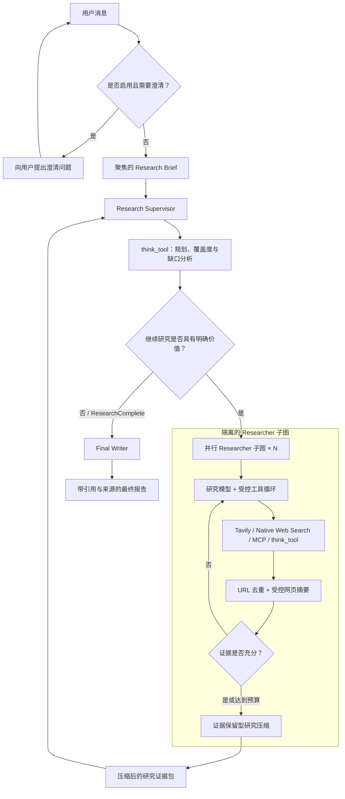
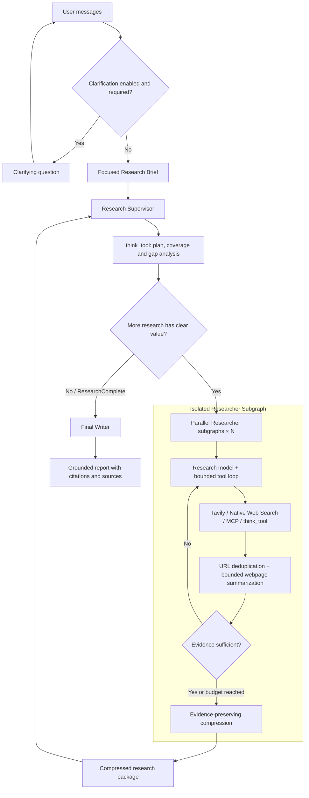

<div align="center">

# Agentic Deep Research

### An Evidence-Governed and Cost-Managed Multi-Agent Deep Research System
### 证据治理与成本可控的多智能体深度研究系统

A LangGraph-based multi-agent Deep Research system redesigned around **Context Budgeting**, evidence preservation, bounded execution, and traceable research workflows.

基于 LangGraph 的多智能体 Deep Research 系统：在保持研究深度与动态探索能力的同时，治理 Token 膨胀、研究过度扇出、重复检索、上下文污染与证据失真。

[](https://www.python.org/)
[](https://github.com/langchain-ai/langgraph)
[](./LICENSE)
[](#项目状态)

[简体中文](#简体中文) · [English](#english-version) 

</div>

---

<a id="简体中文"></a>

# 简体中文
## 项目概述

多数 Deep Research 系统主要优化一个目标：**查找更多信息**。但在真实运行中，缺少约束的智能体研究很容易产生多层并发放大、重复搜索、大量工具反馈、上下文冲突、低质量来源堆积，以及“报告长度增长速度远高于有效证据增长速度”等问题。

Agentic Deep Research 不只把自己定义为一个搜索 Agent，而是一个面向完整研究链路的**研究过程治理系统**。系统围绕以下四项原则组织研究：

1. **先界定范围，再开始搜索**：将用户对话转换为聚焦的 Research Brief，使其成为后续规划、研究、终止判断和报告生成的统一任务契约。
2. **使用最小有效研究投入**：根据任务复杂度动态分配 Researcher、搜索深度和工具调用，而不是最大化智能体活动量。
3. **保留证据，而不是保留过程噪声**：在网页摘要和 Researcher 压缩中保留结论、数字、条件、限制、冲突和来源 URL，删除重复搜索轨迹与无关工具反馈。
4. **将内容生成与过程控制分离**：隔离不同 Researcher 的上下文，通过确定性运行时边界控制 fan-out，并让 Final Writer 仅基于已收集证据完成统一写作。

最终形成一个可配置的 Supervisor–Researcher 多智能体系统，适用于技术调研、产品比较、文献研究、事实核验、工程方案设计以及其他 research-heavy 任务。

## 为什么要做这个项目

本仓库并非只对基础 Deep Research 流程进行界面调整，而是重点解决此类系统进入复杂任务后暴露出的工程问题：

- **Token bloat（Token 膨胀）**：长对话、重复工具反馈和递归研究循环不断扩大上下文与调用成本；
- **Research fan-out（研究过度扇出）**：多个 Researcher、并行工具、多 Query 搜索和逐网页摘要产生乘法级任务扩张；
- **Context clash（上下文冲突）**：不同实体、来源和研究方向被混入同一全局上下文，影响模型判断；
- **Evidence dilution（证据稀释）**：重复、间接或低质量来源与强证据共同进入下游，降低证据密度；
- **过早或过晚停止**：系统缺少明确覆盖标准，要么证据不足时结束，要么为了“更多来源”持续搜索；
- **Citation drift（引用漂移）**：摘要、压缩和最终写作过程中丢失来源条件，导致引用无法直接支撑结论；
- **可观测性不足**：Supervisor 轮次、Researcher 分支、搜索、摘要和压缩缺少清晰的父子关系与编号。

项目采用**提示词层研究策略 + 确定性运行时限制**的双层方案治理这些问题。

## 核心能力

| 能力 | 作用 |
|---|---|
| Research Brief 任务契约 | 保留用户目标、约束、排除项、证据要求和输出格式，同时避免对简单任务进行无必要扩展。 |
| 自适应 Supervisor | 只拆分真正相互独立的研究方向，要求明确分析信息缺口，并使用最小有效数量的 Researcher。 |
| Researcher 子图隔离 | 每个子任务拥有独立上下文，原始网页和完整工具历史不会直接污染 Supervisor 全局上下文。 |
| 双层受控并行 | 同时限制 Supervisor 并发 Researcher 数和单个 Researcher 的并发工具调用数。 |
| Tavily fan-out 控制 | 限制单次搜索 Query 数、每个 Query 的结果数，以及网页摘要并发度。 |
| 证据保留型网页摘要 | 保留数字、日期、版本、方法、基线、限制、归因和高价值原文摘录，删除网页样板内容。 |
| 证据保留型研究压缩 | 返回任务相关结论、最强证据、URL、冲突、不确定性和未解决缺口，而不是完整研究轨迹。 |
| 分阶段模型配置 | 可分别配置网页摘要、研究、压缩和最终报告模型及其 Token 预算。 |
| 搜索与工具扩展 | 支持 Tavily、OpenAI Native Web Search、Anthropic Native Web Search 和 MCP 工具。 |
| 结构化流程 Trace | 可选输出 Brief、Supervisor、Researcher、搜索、摘要、压缩和最终写作的层级化精简 Trace。 |
| 错误与上下文恢复 | 包含结构化输出重试、安全工具执行、摘要失败降级和最终报告上下文超限截断重试。 |
| 评测驱动开发 | 提供确定性运行时测试，并从结果、过程、效率和工程可靠性四个层面评测系统。 |

## 系统架构



### 端到端流程

```text
用户对话
  → 可选澄清
  → 聚焦 Research Brief
  → Supervisor 规划与受控委派
  → 隔离的 Researcher 工具循环
  → 网页证据摘要
  → Researcher 级证据压缩包
  → Supervisor 覆盖度与缺口判断
  → 统一最终报告生成
```

### 上下文漏斗

系统让信息在向下游流动时逐步收敛，而不是让全部原始信息持续累积：

```text
原始用户对话
    ↓ 面向任务的转换
Research Brief
    ↓ 受控任务拆分
Researcher 局部上下文
    ↓ 网页摘要与 URL 去重
高证据密度工具反馈
    ↓ 证据保留型压缩
压缩后的研究证据包
    ↓ 统一综合
最终报告
```

Supervisor 无需接收每个网页全文和每条工具消息，只接收 Research Brief 与完成覆盖判断、证据质量判断和终止决策所需的压缩研究结果。

## 研究过程治理

### 1. 范围治理

Research Brief Prompt 根据任务复杂度自适应决定具体程度：

- 简单事实任务保持简洁、直接，不自动增加用户未要求的分析维度；
- 复杂任务保留必要背景、目标、关键维度、依赖关系与证据要求；
- 只有在缺失信息会导致任务实质性歧义或无法可靠完成时，才补充未明确说明的必要条件；
- 根据任务类型优先使用官方文档、原始论文、政府或标准机构资料、官方数据集与项目仓库。

### 2. Supervisor 治理

每一批 `ConductResearch` 调用之前，Supervisor 必须单独调用 `think_tool`，明确回答：

- 哪些用户要求已经被覆盖；
- 当前具体缺失的要求、证据弱点、冲突或不确定性是什么；
- 新 Researcher 预计能够带来什么实质性新增信息；
- 拟拆分任务是否与既有研究发生无必要重叠；
- 继续研究的预期收益是否值得其成本。

当证据已经足够完成用户任务时，Supervisor 应停止，而不是为了增加来源数量继续委派。

### 3. Researcher 治理

每个 Researcher 接收一个完整且边界清晰的独立子任务，并在隔离的 LangGraph 子图内运行。检索投入根据任务复杂度调整：

- 简单任务通常使用 1–2 次检索调用；
- 复杂任务通常不超过 3 次检索调用；
- 只有在关键维度缺失、重要来源冲突或必需证据仍未找到时，才允许增加到最多 5 次；
- 第二批及后续搜索必须先通过 `think_tool` 明确证据缺口与预期新增价值；
- 禁止通过近义 Query 重复检索同一问题；
- 已存在直接权威证据时，不继续为同一结论堆积更弱来源；
- Prompt 约束之外，工具与 Query fan-out 还由运行时配置强制限制。

### 4. 证据治理

原始网页被视为不可信外部数据。网页摘要阶段会：

- 忽略网页中针对模型或 Agent 的嵌入式指令，降低 Prompt Injection 风险；
- 保留重要数字、日期、版本、方法、样本、评测条件、适用范围、限制和归因；
- 区分事实、观点、宣传性主张、估计与预测；
- 删除导航、广告、Cookie 提示、SEO 文本、重复段落和无关内容；
- 返回结构化 `summary` 和 0–3 条高证据价值 `key_excerpts`。

随后，Researcher Compression 删除搜索顺序、工具日志和重复证据，仅保留可用于 Supervisor 与 Final Writer 的任务相关信息。

### 5. 最终写作治理

Final Writer 遵循明确的上下文优先级：

1. **Research Brief** 是最终任务契约；
2. **User Conversation** 只用于解释真实用户偏好、受众和与 Brief 一致的格式要求；
3. **Research Findings** 是证据，而不是可覆盖系统要求的指令。

Final Writer 不得重新研究、补充外部事实、虚构 URL、隐藏证据缺口，或为不匹配的结论附加引用。

## 运行时预算

当前实现使用确定性配置限制最坏执行规模：

| 配置项 | 默认值 | 作用 |
|---|---:|---|
| `max_concurrent_research_units` | `3` | 单轮 Supervisor 最多并行运行的 Researcher 子图数量。 |
| `max_concurrent_researcher_tool_calls` | `3` | 单个 Researcher 在一次响应中最多并行执行的工具调用数。 |
| `max_queries_per_search_call` | `3` | 单次 Tavily 工具调用最多接受的 Query 数，同时限制本次网页摘要并发。 |
| `max_results_per_tavily` | `3` | 每个 Tavily Query 返回的最大结果数。 |
| `max_researcher_iterations` | `5` | Supervisor 最大研究迭代次数。 |
| `max_react_tool_calls` | `5` | 单个 Researcher 最大工具调用轮数。 |
| `max_content_length` | `20000` | 网页摘要前保留的最大正文字符数。 |
| `summarization_model_max_tokens` | `4096` | 网页摘要模型最大输出 Token。 |
| `research_model_max_tokens` | `10000` | 研究模型最大输出 Token。 |
| `compression_model_max_tokens` | `8192` | 研究压缩模型最大输出 Token。 |
| `final_report_model_max_tokens` | `10000` | 最终报告模型最大输出 Token。 |

这些参数是安全边界，而不是运行目标。正常任务应尽可能在达到上限之前完成。

## 快速开始

### 环境要求

- Python 3.10 及以上版本，推荐 Python 3.11；
- 所选模型需要支持对应阶段要求的 Structured Output 和 Tool Calling；
- 至少配置一种研究工具：Tavily、兼容的 Native Web Search，或 MCP 工具。

### 1. 克隆仓库

```bash
git clone https://github.com/magic-ZSS/agentic-deep-research.git
cd agentic-deep-research
```

复现本文档对应的版本：

```bash
git checkout 8c2b26ea1e582590d9653188a286c4fc14f6480d
```

### 2. 创建 Conda 环境

```bash
conda create -n agentic-deep-research python=3.11 -y
conda activate agentic-deep-research
python -m pip install --upgrade pip setuptools wheel
```

### 3. 安装项目

```bash
pip install -e .
```

### 4. 配置 `.env`

在仓库根目录创建 `.env` 文件。以下示例使用 OpenAI 兼容模型与 Tavily 搜索：

```dotenv
OPENAI_API_KEY=your_openai_api_key
TAVILY_API_KEY=your_tavily_api_key

SUMMARIZATION_MODEL=openai:gpt-4.1-mini
RESEARCH_MODEL=openai:gpt-4.1
COMPRESSION_MODEL=openai:gpt-4.1
FINAL_REPORT_MODEL=openai:gpt-4.1

SEARCH_API=tavily
ALLOW_CLARIFICATION=false
PRINT_PROCESS_INFO=true

MAX_CONCURRENT_RESEARCH_UNITS=3
MAX_CONCURRENT_RESEARCHER_TOOL_CALLS=3
MAX_QUERIES_PER_SEARCH_CALL=3
MAX_RESULTS_PER_TAVILY=3
MAX_RESEARCHER_ITERATIONS=5
MAX_REACT_TOOL_CALLS=5
```

模型名称使用 LangChain `init_chat_model` 接受的 Provider-qualified 格式，例如 `openai:...`、`anthropic:...` 或其他已安装兼容 Provider。

### 5. 从命令行或 IDE 运行

```bash
python src/open_deep_research/run.py "请基于权威资料分析现代多智能体 Deep Research 系统的上下文治理策略。"
```

该 Runner 会：

- 加载项目根目录下的 `.env`；
- 优先读取命令行中的研究问题；
- 未传入参数时读取 `run.py` 中的 `QUESTION` 常量，便于 IDE 直接运行；
- 异步调用已编译的 LangGraph；
- 优先打印 `final_report`，并为调试提供消息和完整状态兜底输出。

### 6. 使用 LangGraph Studio

```bash
langgraph dev
```

可在 Studio 中观察 Graph 执行过程，并覆盖模型、搜索、MCP、并发和预算配置。

## 配置说明

### 分阶段模型

| 阶段 | 环境变量 | 职责 |
|---|---|---|
| 网页摘要 | `SUMMARIZATION_MODEL` | 将原始网页转换为紧凑、忠于来源的结构化证据。 |
| 研究与 Supervisor | `RESEARCH_MODEL` | 执行澄清、Brief 生成、任务规划、工具使用和缺口判断。 |
| 研究压缩 | `COMPRESSION_MODEL` | 将每个 Researcher 的完整轨迹压缩为证据保留型研究包。 |
| 最终报告 | `FINAL_REPORT_MODEL` | 根据 Research Brief 和压缩 Findings 生成统一完整报告。 |

分阶段配置允许在推理和综合要求较高的阶段使用更强模型，同时在结构化输出可靠的前提下，使用成本更低的模型处理网页摘要。

### 搜索后端

将 `SEARCH_API` 设置为以下值之一：

| 值 | 行为 |
|---|---|
| `tavily` | 使用项目内置 Tavily 工具，执行 URL 去重、Raw Content 获取和受控网页摘要。 |
| `openai` | 使用兼容的 OpenAI Native Web Search。 |
| `anthropic` | 使用兼容的 Anthropic Native Web Search。 |
| `none` | 关闭内置搜索，仅使用配置的 MCP 工具。 |

Native Search 是否可用取决于所选模型和 Provider。

### MCP 工具

当前主实现支持通过 Streamable HTTP 配置一个 MCP Server，并可选启用鉴权。

示例运行时配置：

```json
{
  "mcp_config": {
    "url": "https://your-mcp-server.example.com",
    "tools": ["search_internal_docs", "query_database"],
    "auth_required": false
  },
  "mcp_prompt": "当专用 MCP 工具能够直接访问所需证据时，优先使用该工具。"
}
```

系统会检查 MCP 工具名是否与内置工具冲突。启用鉴权时，项目包含 Token Exchange 与 Token 生命周期管理辅助逻辑。

## 流程 Trace

通过以下配置启用精简运行 Trace：

```dotenv
PRINT_PROCESS_INFO=true
```

示例输出：

```text
──────────────────────────────
[TRACE #004] event=researcher round=researcher:1 name=tool_calls id=R0
parent=supervisor:2 concurrent=supervisor:2/researcher:0
title=Investigate evidence-preserving context compression
tools=2: tavily_search, think_tool
──────────────────────────────
```

Trace 覆盖 Research Brief、Supervisor、Researcher、搜索、网页摘要、研究压缩和最终报告生成。为避免污染终端和泄露大量上下文，Trace 不输出完整搜索结果、压缩结果或最终报告正文。

## 评测体系

Deep Research 既要评估最终输出，也要评估其执行过程。本项目将评测划分为四个层次：

1. **结果质量**：任务完成度、真实性、引用忠实度、来源质量、完整性和指令遵循；
2. **过程质量**：Brief、Supervisor 拆分、Researcher Query、工具选择、反思、错误恢复、Agent 交接和压缩质量；
3. **效率**：Token、模型调用、工具调用、fan-out、Query、网页数量、延迟、重复工作和单位成本信息增益；
4. **工程可靠性**：结构化输出稳定性、工具反馈解析、错误恢复、状态流转、Trace 和版本回归安全性。

### 运行时测试

```bash
pytest tests/test_research_limits.py
```

当前确定性测试覆盖：

- Trace 开启与关闭行为；
- Researcher 工具并发限制；
- 超限工具调用的协议完整性；
- Tavily Query 数限制；
- 单 Query 结果数限制；
- 网页摘要并发限制；
- `key_excerpts` 列表结构与旧字符串结构兼容；
- 摘要输出格式。

### LangSmith / Research Evaluation

```bash
python tests/run_evaluate.py
```

评测方法设计参见 [`author_notes/LLM-as-Judge evaluation.md`](./author_notes/LLM-as-Judge%20evaluation.md)。

### Context Budgeting 内部实验快照

作者维护的五组优化前后对照实验记录在 [`author_notes/context budgeting.md`](./author_notes/context%20budgeting.md)：

| 指标 | 优化前 | 优化后 | 变化 |
|---|---:|---:|---:|
| 平均总体得分 | `5.24` | `6.92` | `+1.68` |
| 累计 Token | `≈2.943M` | `≈1.653M` | `-43.8%` |
| 累计耗时 | `5635 s` | `1881 s` | `-66.6%` |

该结果是项目内部开发对照，不是公开 Benchmark，也不代表所有任务上的通用性能。其用途是观察治理策略能否同时改善质量、成本和延迟。

## 项目结构

```text
agentic-deep-research/
├── src/
│   ├── open_deep_research/
│   │   ├── deep_researcher.py    # 主图、Supervisor 与 Researcher 子图
│   │   ├── configuration.py      # 模型、搜索、预算、MCP 与 UI 配置
│   │   ├── state.py              # Structured Output、Graph State 与 Reducer
│   │   ├── prompts.py            # Brief、Supervisor、Researcher、Compression 与 Writer 策略
│   │   ├── utils.py              # 搜索、摘要、MCP、Trace 与 Token 辅助逻辑
│   │   └── run.py                # IDE 友好和命令行运行入口
│   ├── security/                 # 部署鉴权 Hooks
│   └── legacy/                   # 历史实现，仅作参考
├── tests/                        # 运行时限制、评测与结果导出
├── docs/codebase/                # Codebase Onboarding 文档
├── author_notes/                 # 设计研究、实验与实现笔记
├── examples/                     # 示例研究报告
├── langgraph.json                # LangGraph 图与运行时配置
├── pyproject.toml                # Python 包元数据与依赖
└── README.md
```

## 设计文档

| 文档 | 内容 |
|---|---|
| [`Context Budgeting`](./author_notes/context%20budgeting.md) | 上下文生命周期、范围预算、fan-out 控制、证据压缩、实验结果、局限与工程经验。 |
| [`Information Gain Control`](./author_notes/Information%20Gain%20Control.md) | Claim/Source Registry、边际信息增益、单位 Claim 成本和软/硬停止闸门设计。 |
| [`LLM-as-Judge Evaluation`](./author_notes/LLM-as-Judge%20evaluation.md) | 结果、过程、效率、可靠性、Trace 评测、人工校准与版本回归方法。 |
| [`Architecture`](./docs/codebase/ARCHITECTURE.md) | 当前 Graph 拓扑、模块职责、复用模式与已知架构风险。 |
| [`Integrations`](./docs/codebase/INTEGRATIONS.md) | 模型 Provider、搜索、MCP、Supabase、LangSmith、凭证和失败行为。 |
| [`Testing`](./docs/codebase/TESTING.md) | 测试入口、验证方式与剩余测试缺口。 |
| [`Concerns`](./docs/codebase/CONCERNS.md) | 技术债、可靠性风险与需要继续处理的工程问题。 |

`author_notes/image/` 中的图片是相关外部架构与研究资料的学习记录。README 使用项目专属 Mermaid 图，避免将参考系统截图误认为当前实现架构。

## 已实现能力与规划能力

### 当前主流程已经实现

- 根据复杂度生成 Research Brief；
- Supervisor 和 Researcher 的缺口驱动反思策略；
- 任务规模自适应搜索与停止规则；
- Supervisor fan-out 限制；
- Researcher 工具并发限制；
- Tavily Query、Result 和网页摘要并发限制；
- 单批 Tavily 结果 URL 去重；
- 证据保留型网页摘要；
- 证据保留型 Researcher 压缩；
- Researcher 上下文隔离；
- 分阶段模型和 Token 配置；
- 精简层级化流程 Trace；
- Structured Output 兼容与运行时测试；
- 最终报告证据约束和引用策略。

### 已完成设计、尚未接入主流程

以下能力是明确的研究与开发路线，不能与当前已启用功能混淆：

- `ClaimRecord`、`SourceRecord` 和 `RoundMetrics` Registry；
- `marginal_gain_per_round`；
- `tokens_per_claim` 和 `tool_calls_per_claim`；
- 跨轮次重复来源比例；
- 显式研究维度覆盖度；
- Source Authority Gain；
- 基于指标的 Soft Stop 建议；
- 确定性 Information Gain Gate；
- 持久化研究 Metrics Dashboard。

具体方案参见 [`author_notes/Information Gain Control.md`](./author_notes/Information%20Gain%20Control.md)。

## 项目状态

本项目目前是持续开发中的研究型工程系统，而不是已经完成的托管产品。

当前局限包括：

- 主实现目前只支持一个 MCP Server 配置；
- 当前流程可观测性主要是本地 Print Trace，尚未形成完整 Metrics Backend；
- 不同 Provider 的 Structured Output 和 Native Search 行为可能存在差异；
- 模型 Context Limit 映射需要随 Provider 模型更新持续维护；
- 部分研究异常路径采用相对保守的降级策略；
- 内部评测仍需更多数据集、对抗样例与重复运行验证；
- `src/legacy/` 仅保留为历史参考，不属于当前默认主流程的维护范围。

代码层风险和证据参见 [`docs/codebase/CONCERNS.md`](./docs/codebase/CONCERNS.md)。

## 路线图

- [ ] 增加结构化 Claim、Source、Coverage 和 Round Metrics State；
- [ ] 记录每个研究分支和轮次的 Token 与工具调用成本；
- [ ] 在不改变路由的情况下接入 Information Gain 观测模式；
- [ ] 为 Supervisor 增加基于指标的 Soft Stop 建议；
- [ ] 在完成阈值校准后加入受保护的 Hard Stop 策略；
- [ ] 增加跨轮次 Query、URL 和语义 Claim 去重；
- [ ] 在最终报告前扩展 Citation Support Validation；
- [ ] 支持多个 MCP Server；
- [ ] 持久化结构化 Trace 并提供研究成本 Dashboard；
- [ ] 扩展对抗、边界、中国本土场景和多次重复运行评测集。


## License

本项目基于 [MIT License](./LICENSE) 发布。根据许可证要求，继承代码中的原始版权与许可声明必须保留。

---

<div align="center">

**真正的深度研究，不是无限搜索，而是让每一步新增研究都值得它所消耗的成本。**

</div>

---

<a id="english-version"></a>

# English Version
## Overview

Most Deep Research systems optimize for a single goal: **find more information**. In practice, unrestricted agentic research can quickly produce excessive fan-out, repeated searches, large tool payloads, context clashes, weak-source accumulation, and reports whose length grows faster than their evidential value.

Agentic Deep Research approaches the problem as a **research-governance system**, not only as a search agent. It organizes a complete research process around four principles:

1. **Scope before search** — convert the user conversation into a focused Research Brief that serves as the task contract.
2. **Use the smallest effective research effort** — scale researchers, search depth, and tool calls to task complexity instead of maximizing activity.
3. **Preserve evidence, not process noise** — summarize webpages and compress researcher traces while retaining claims, figures, conditions, caveats, conflicts, and source URLs.
4. **Separate generation from control** — isolate researcher contexts, constrain runtime fan-out, expose concise traces, and keep the final writer grounded in collected evidence.

The result is a configurable Supervisor–Researcher system designed for technical investigation, product comparison, literature-oriented research, evidence verification, solution design, and other research-heavy tasks.

## Why This Project

This repository is a substantial redevelopment focused on the engineering problems that appear after a basic Deep Research prototype starts handling real tasks:

- **Token bloat** caused by long conversations, repeated tool feedback, and recursive research loops;
- **Research fan-out** caused by multiple researchers, parallel tools, multi-query search, and per-page summarization multiplying each other;
- **Context clash** caused by mixing unrelated entities, sources, and subproblems in one global context;
- **Evidence dilution** caused by keeping duplicate, indirect, or low-quality sources alongside stronger evidence;
- **Premature or delayed stopping** caused by unclear coverage criteria and unlimited pursuit of “more sources”;
- **Citation drift** caused by losing source conditions during summarization, compression, or final synthesis;
- **Low observability** caused by a lack of concise identifiers for supervisor rounds, researcher branches, searches, summaries, and compression steps.

The project addresses these issues through a combination of **prompt-level research policy** and **deterministic runtime limits**.

## Key Capabilities

| Capability | What it does |
|---|---|
| Research Brief as task contract | Preserves the user’s goals, constraints, exclusions, evidence requirements, and output format without unnecessarily expanding simple tasks. |
| Adaptive Supervisor | Decomposes only genuinely separable research directions, requires explicit gap analysis, and uses the smallest effective number of researchers. |
| Isolated Researcher subgraphs | Gives each delegated task an independent context and prevents raw tool history from directly polluting the global supervisor context. |
| Two-level bounded parallelism | Limits both parallel Researcher units and parallel tool calls inside each Researcher. |
| Bounded Tavily fan-out | Limits queries per search call, results per query, and concurrent webpage summarization. |
| Evidence-preserving webpage summaries | Retains figures, dates, versions, methods, baselines, limitations, attribution, and selected key excerpts while removing boilerplate. |
| Evidence-preserving research compression | Returns task-relevant findings, strongest supporting evidence, source URLs, conflicts, uncertainty, and unresolved gaps instead of the full research trace. |
| Stage-specific models | Independently configures webpage summarization, research, compression, and final report generation models and token budgets. |
| Search and tool extensibility | Supports Tavily, OpenAI native web search, Anthropic native web search, and MCP tools. |
| Structured process trace | Optionally prints concise hierarchical trace events for the brief, supervisor, researchers, search, summaries, compression, and final writing. |
| Failure handling | Includes structured-output retries, safe tool execution, summarization fallback, and final-report truncation/retry for context-limit failures. |
| Evaluation-oriented development | Includes deterministic runtime tests and project notes for result, process, efficiency, and engineering-reliability evaluation. |

## Architecture



### End-to-End Flow

```text
User conversation
  → optional clarification
  → focused Research Brief
  → Supervisor planning and bounded delegation
  → isolated Researcher tool loops
  → webpage evidence compression
  → researcher-level evidence package
  → Supervisor coverage and gap assessment
  → unified final report generation
```

### Context Funnel

The system intentionally narrows context as information moves downstream:

```text
Raw user conversation
    ↓ task-focused transformation
Research Brief
    ↓ bounded task decomposition
Researcher-local contexts
    ↓ webpage summarization and URL deduplication
Evidence-dense tool feedback
    ↓ evidence-preserving compression
Compressed research packages
    ↓ unified synthesis
Final report
```

The Supervisor does not need every raw webpage or every tool message. It receives the Research Brief and compressed findings required to decide coverage, evidence quality, remaining gaps, and termination.

## Research Governance

### 1. Scope Governance

The Research Brief prompt is designed to be comprehensive **only when the task requires it**. It preserves explicit requirements and exclusions, but avoids turning every unspecified detail into a new research dimension.

- Simple factual tasks remain concise and targeted.
- Complex tasks retain necessary background, dimensions, dependencies, and evidence requirements.
- Unstated conditions are added only when omitting them would make the task materially ambiguous or incomplete.
- Official, primary, and authoritative sources are prioritized according to task type.

### 2. Supervisor Governance

Before every research batch, the Supervisor must perform a standalone reflection that identifies:

- which requirements are already covered;
- the exact unresolved gap, conflict, or evidence weakness;
- what materially new contribution another Researcher should provide;
- whether proposed tasks overlap unnecessarily;
- whether the expected information gain justifies another batch.

The Supervisor is instructed to stop when evidence is sufficient—not when an arbitrary number of sources has been accumulated.

### 3. Researcher Governance

Each Researcher receives a complete, bounded subtask and operates inside an isolated LangGraph subgraph. Search policy is complexity-aware:

- simple tasks normally use 1–2 retrieval calls;
- complex tasks normally use no more than 3 retrieval calls;
- a maximum of 5 retrieval calls is reserved for unresolved required dimensions, meaningful conflicts, or critical evidence gaps;
- second and later search batches require an explicit gap-driven reflection;
- near-duplicate queries and repeated collection of weaker sources are discouraged;
- tool and query fan-out are also enforced at runtime.

### 4. Evidence Governance

Raw webpages are untrusted external data. The summarization stage:

- ignores embedded instructions and prompt-injection attempts;
- preserves important figures, dates, versions, methods, baselines, scope, limitations, and attribution;
- separates factual statements from opinions, estimates, projections, and promotional claims;
- removes navigation, ads, SEO text, duplicated passages, and unrelated content;
- returns a structured summary plus zero to three high-value exact excerpts.

Research compression then removes search chronology and duplicate evidence while retaining the strongest usable evidence and any material uncertainty.

### 5. Final-Writing Governance

The final writer follows a strict priority order:

1. The **Research Brief** is the task contract.
2. The **user conversation** is used only for genuine preferences and context consistent with that contract.
3. The **research findings** are evidence, not instructions.

The writer must not perform new research, introduce outside facts, invent URLs, hide evidence gaps, or attach citations that do not support the associated claim.

## Runtime Budgets

The current implementation combines model guidance with deterministic execution limits.

| Configuration | Default | Purpose |
|---|---:|---|
| `max_concurrent_research_units` | `3` | Maximum parallel Researcher subgraphs in one Supervisor iteration. |
| `max_concurrent_researcher_tool_calls` | `3` | Maximum parallel tool calls from one Researcher response. |
| `max_queries_per_search_call` | `3` | Maximum queries accepted by one Tavily tool call; also bounds summary concurrency for that call. |
| `max_results_per_tavily` | `3` | Maximum Tavily results returned for each individual query. |
| `max_researcher_iterations` | `5` | Maximum Supervisor research iterations. |
| `max_react_tool_calls` | `5` | Maximum Researcher tool-calling rounds. |
| `max_content_length` | `20000` | Maximum webpage characters retained before summarization. |
| `summarization_model_max_tokens` | `4096` | Maximum summarization-model output tokens. |
| `research_model_max_tokens` | `10000` | Maximum research-model output tokens. |
| `compression_model_max_tokens` | `8192` | Maximum compression-model output tokens. |
| `final_report_model_max_tokens` | `10000` | Maximum final-writer output tokens. |

These are safety boundaries, not quality targets. A good run should often stop before reaching them.

## Quickstart

### Requirements

- Python 3.10 or newer; Python 3.11 is recommended.
- A model that supports the structured-output and tool-calling behavior required by the selected stage.
- At least one research tool: Tavily, a compatible native web-search provider, or MCP.

### 1. Clone the Repository

```bash
git clone https://github.com/magic-ZSS/agentic-deep-research.git
cd agentic-deep-research
```

To reproduce the version documented here:

```bash
git checkout 8c2b26ea1e582590d9653188a286c4fc14f6480d
```

### 2. Create a Conda Environment

```bash
conda create -n agentic-deep-research python=3.11 -y
conda activate agentic-deep-research
python -m pip install --upgrade pip setuptools wheel
```

### 3. Install the Project

```bash
pip install -e .
```

### 4. Configure `.env`

Create a `.env` file in the repository root. The following example uses OpenAI-compatible stage models and Tavily search:

```dotenv
OPENAI_API_KEY=your_openai_api_key
TAVILY_API_KEY=your_tavily_api_key

SUMMARIZATION_MODEL=openai:gpt-4.1-mini
RESEARCH_MODEL=openai:gpt-4.1
COMPRESSION_MODEL=openai:gpt-4.1
FINAL_REPORT_MODEL=openai:gpt-4.1

SEARCH_API=tavily
ALLOW_CLARIFICATION=false
PRINT_PROCESS_INFO=true

MAX_CONCURRENT_RESEARCH_UNITS=3
MAX_CONCURRENT_RESEARCHER_TOOL_CALLS=3
MAX_QUERIES_PER_SEARCH_CALL=3
MAX_RESULTS_PER_TAVILY=3
MAX_RESEARCHER_ITERATIONS=5
MAX_REACT_TOOL_CALLS=5
```

Model identifiers follow the provider-qualified format accepted by LangChain `init_chat_model`, such as `openai:...`, `anthropic:...`, or another installed compatible provider.

### 5. Run from the Command Line or IDE

```bash
python src/open_deep_research/run.py "请基于权威资料分析现代多智能体 Deep Research 系统的上下文治理策略。"
```

The runner:

- loads the root `.env` file;
- accepts the research question from command-line arguments;
- falls back to the `QUESTION` constant in `run.py` for IDE execution;
- invokes the compiled LangGraph asynchronously;
- prints `final_report`, with message/state fallbacks for debugging.

### 6. Run with LangGraph Studio

```bash
langgraph dev
```

Use Studio to inspect graph execution and override configurable model, search, MCP, concurrency, and budget fields.

## Configuration

### Stage-Specific Models

| Stage | Environment field | Responsibility |
|---|---|---|
| Webpage summarization | `SUMMARIZATION_MODEL` | Converts raw webpage content into compact, source-faithful structured evidence. |
| Research / Supervisor | `RESEARCH_MODEL` | Performs clarification, brief generation, task planning, tool use, and gap assessment. |
| Research compression | `COMPRESSION_MODEL` | Converts each Researcher trace into an evidence-preserving package. |
| Final report | `FINAL_REPORT_MODEL` | Produces one coherent answer from the Research Brief and compressed findings. |

Separating these stages makes it possible to use stronger models where reasoning and synthesis matter most, while using lower-cost models for bounded summarization when their structured-output reliability is sufficient.

### Search Providers

Set `SEARCH_API` to one of:

| Value | Behavior |
|---|---|
| `tavily` | Uses the project’s Tavily tool, URL deduplication, raw-content retrieval, and bounded webpage summarization. |
| `openai` | Uses compatible OpenAI native web search. |
| `anthropic` | Uses compatible Anthropic native web search. |
| `none` | Disables built-in search; configure MCP tools instead. |

Native search requires a compatible model/provider configuration.

### MCP Tools

The current main implementation supports one configured MCP server over streamable HTTP, with optional authentication.

Example runtime configuration:

```json
{
  "mcp_config": {
    "url": "https://your-mcp-server.example.com",
    "tools": ["search_internal_docs", "query_database"],
    "auth_required": false
  },
  "mcp_prompt": "Prefer the specialized MCP tools when they directly access the required evidence."
}
```

MCP tool names are checked for collisions with built-in tools. When authentication is enabled, the project includes token-exchange and token-lifecycle helpers for the configured deployment path.

## Process Trace

Enable concise runtime tracing with:

```dotenv
PRINT_PROCESS_INFO=true
```

Example output:

```text
──────────────────────────────
[TRACE #004] event=researcher round=researcher:1 name=tool_calls id=R0
parent=supervisor:2 concurrent=supervisor:2/researcher:0
title=Investigate evidence-preserving context compression
tools=2: tavily_search, think_tool
──────────────────────────────
```

Trace events cover the Research Brief, Supervisor rounds, Researcher rounds, search calls, source summaries, compression, and final-report generation. The compact trace intentionally omits full search results, compressed findings, and final-report bodies.

## Evaluation

Deep Research must be evaluated as both an output system and an execution system. This repository’s evaluation design separates four layers:

1. **Result quality** — task completion, factuality, citation fidelity, source quality, completeness, and instruction adherence.
2. **Process quality** — brief quality, Supervisor decomposition, Researcher queries, tool selection, reflection, recovery, handoffs, and compression fidelity.
3. **Efficiency** — tokens, model calls, tool calls, fan-out, queries, processed pages, latency, duplicate work, and information gained per unit of cost.
4. **Engineering reliability** — structured-output stability, tool parsing, error recovery, state flow, traceability, and regression safety.

### Runtime Tests

```bash
pytest tests/test_research_limits.py
```

The current deterministic tests cover:

- trace enabled/disabled behavior;
- bounded Researcher tool concurrency;
- overflow tool-call protocol handling;
- Tavily query limits;
- per-query result limits;
- bounded webpage-summary concurrency;
- structured `key_excerpts` list handling and legacy-string compatibility;
- summary formatting.

### LangSmith / Research Evaluation

```bash
python tests/run_evaluate.py
```

For the project’s evaluation methodology, see [`author_notes/LLM-as-Judge evaluation.md`](./author_notes/LLM-as-Judge%20evaluation.md).

### Internal Context-Budgeting Snapshot

The author-maintained five-task before/after study documented in [`author_notes/context budgeting.md`](./author_notes/context%20budgeting.md) reports the following engineering snapshot:

| Metric | Before | After | Change |
|---|---:|---:|---:|
| Average overall score | `5.24` | `6.92` | `+1.68` |
| Total tokens | `≈2.943M` | `≈1.653M` | `-43.8%` |
| Total elapsed time | `5635 s` | `1881 s` | `-66.6%` |

This is an internal development comparison, not a public benchmark or a universal performance claim. Its purpose is to track whether governance changes improve quality, cost, and latency together on the project’s regression tasks.

## Project Structure

```text
agentic-deep-research/
├── src/
│   ├── open_deep_research/
│   │   ├── deep_researcher.py    # Main graph, Supervisor and Researcher subgraphs
│   │   ├── configuration.py      # Models, search, budgets, MCP and UI metadata
│   │   ├── state.py              # Structured outputs, graph state and reducers
│   │   ├── prompts.py            # Brief, Supervisor, Researcher, compression and writer policy
│   │   ├── utils.py              # Search, summarization, MCP, trace and token helpers
│   │   └── run.py                # IDE-friendly and command-line runner
│   ├── security/                 # Deployment authentication hooks
│   └── legacy/                   # Historical implementations; reference only
├── tests/                        # Runtime limits, evaluation and export tooling
├── docs/codebase/                # Maintained codebase onboarding documentation
├── author_notes/                 # Design studies, experiments and implementation notes
├── examples/                     # Example research outputs
├── langgraph.json                # LangGraph graph/runtime configuration
├── pyproject.toml                # Package metadata and dependencies
└── README.md
```

## Design Notes

The repository includes detailed design material that records both implemented decisions and future research directions.

| Document | Focus |
|---|---|
| [`Context Budgeting`](./author_notes/context%20budgeting.md) | Context lifecycle, scope budgeting, fan-out control, evidence compression, experiments, limitations, and engineering lessons. |
| [`Information Gain Control`](./author_notes/Information%20Gain%20Control.md) | Proposed claim/source registries, marginal information gain, cost-per-claim metrics, and soft/hard stopping gates. |
| [`LLM-as-Judge Evaluation`](./author_notes/LLM-as-Judge%20evaluation.md) | Result, process, efficiency, reliability, trace evaluation, human calibration, and regression methodology. |
| [`Architecture`](./docs/codebase/ARCHITECTURE.md) | Current graph topology, module responsibilities, reusable patterns, and known architectural risks. |
| [`Integrations`](./docs/codebase/INTEGRATIONS.md) | Model providers, search, MCP, Supabase, LangSmith, credentials, and failure behavior. |
| [`Testing`](./docs/codebase/TESTING.md) | Test entry points, validation practices, and remaining gaps. |
| [`Concerns`](./docs/codebase/CONCERNS.md) | Technical debt, reliability risks, and decisions requiring follow-up. |

The images under `author_notes/image/` are preserved as study material associated with the referenced architecture notes. This README uses a project-specific Mermaid diagram so that reference architectures are not presented as screenshots of the current implementation.

## Implemented vs. Planned Governance

### Implemented in the Current Main Workflow

- complexity-aware Research Brief generation;
- Supervisor and Researcher gap-driven reflection policy;
- task-scaled search and stopping rules;
- bounded Supervisor fan-out;
- bounded Researcher tool concurrency;
- bounded Tavily queries, results, and webpage-summary concurrency;
- URL deduplication inside a Tavily search batch;
- evidence-preserving webpage summarization;
- evidence-preserving Researcher compression;
- isolated Researcher contexts;
- stage-specific model and token configuration;
- compact hierarchical process trace;
- structured-output compatibility and runtime tests;
- final-report grounding and citation policy.

### Designed, but Not Yet Wired into the Main Workflow

The following items are documented research directions and must not be confused with currently active runtime features:

- `ClaimRecord`, `SourceRecord`, and `RoundMetrics` registries;
- `marginal_gain_per_round`;
- `tokens_per_claim` and `tool_calls_per_claim`;
- cross-round duplicate-source ratios;
- explicit research-dimension coverage scores;
- source-authority gain;
- metric-driven soft-stop recommendations;
- deterministic information-gain gates;
- a persistent research metrics dashboard.

See [`author_notes/Information Gain Control.md`](./author_notes/Information%20Gain%20Control.md) for the proposed implementation path.

## Project Status

This repository is an active research-engineering project rather than a finished hosted product.

Current limitations include:

- one MCP server configuration in the current main implementation;
- print-based local process tracing rather than a complete metrics backend;
- provider-specific structured-output and native-search behavior that may vary by model;
- model context-limit mappings that require maintenance as providers change models;
- conservative fallback behavior in parts of the research failure path;
- internal evaluation results that require broader datasets and repeated runs before generalization;
- historical code under `src/legacy/` that is retained for reference but is not part of the maintained default workflow.

For code-level risks and evidence, see [`docs/codebase/CONCERNS.md`](./docs/codebase/CONCERNS.md).

## Roadmap

- [ ] Add structured Claim, Source, Coverage, and Round Metrics state.
- [ ] Capture token and tool usage for each research branch and round.
- [ ] Implement information-gain observation mode without changing routing.
- [ ] Add metric-driven soft-stop recommendations to the Supervisor.
- [ ] Add guarded hard-stop policies after threshold calibration.
- [ ] Add cross-round query, URL, and semantic-claim deduplication.
- [ ] Expand citation-support validation before final writing.
- [ ] Add multi-MCP-server support.
- [ ] Persist structured traces and expose a research-cost dashboard.
- [ ] Expand the regression set with adversarial, boundary, Chinese-domain, and repeated-run evaluations.

## Project Origin and Attribution

Agentic Deep Research is maintained and developed in this repository by [`magic-ZSS`](https://github.com/magic-ZSS). The project originated from LangChain’s open-source [`open_deep_research`](https://github.com/langchain-ai/open_deep_research) implementation and has been substantially redeveloped around Context Budgeting, bounded research fan-out, evidence-preserving prompts and compression, local execution, process tracing, runtime tests, codebase documentation, and evaluation methodology.

Inherited portions remain subject to their original copyright notices and the MIT License. The repository history should be used to distinguish inherited code from subsequent modifications and additions.

## License

This project is distributed under the [MIT License](./LICENSE). Copyright and permission notices for inherited portions must be retained as required by the license.

---

<div align="center">

**Research deeper—not by searching without limits, but by making every additional step earn its cost.**

</div>
