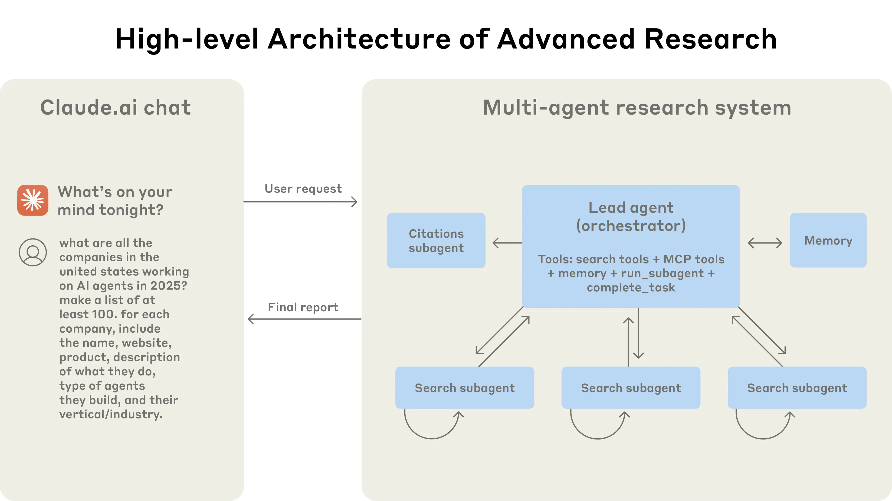
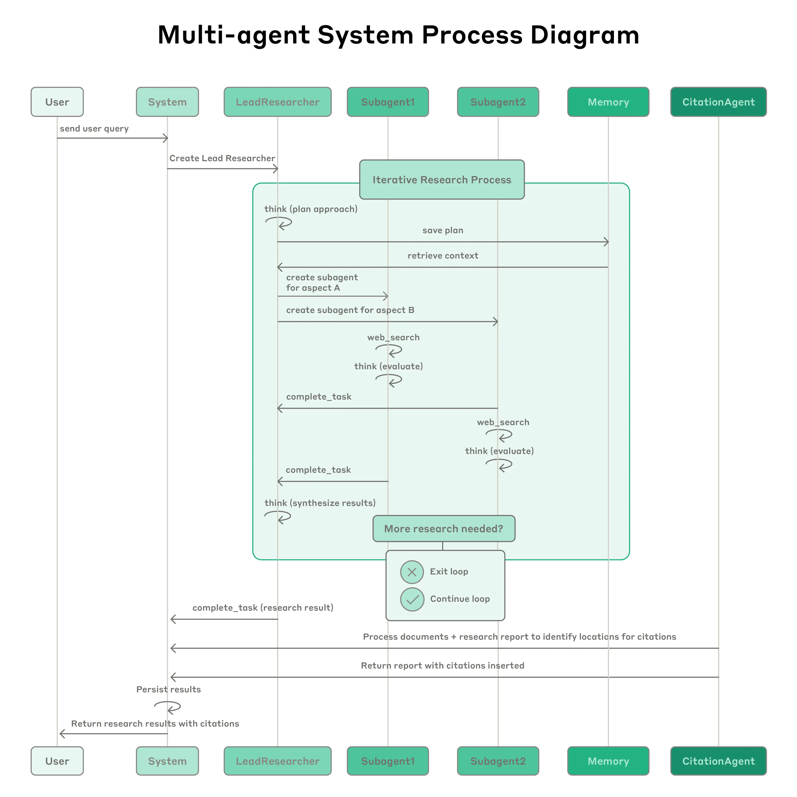
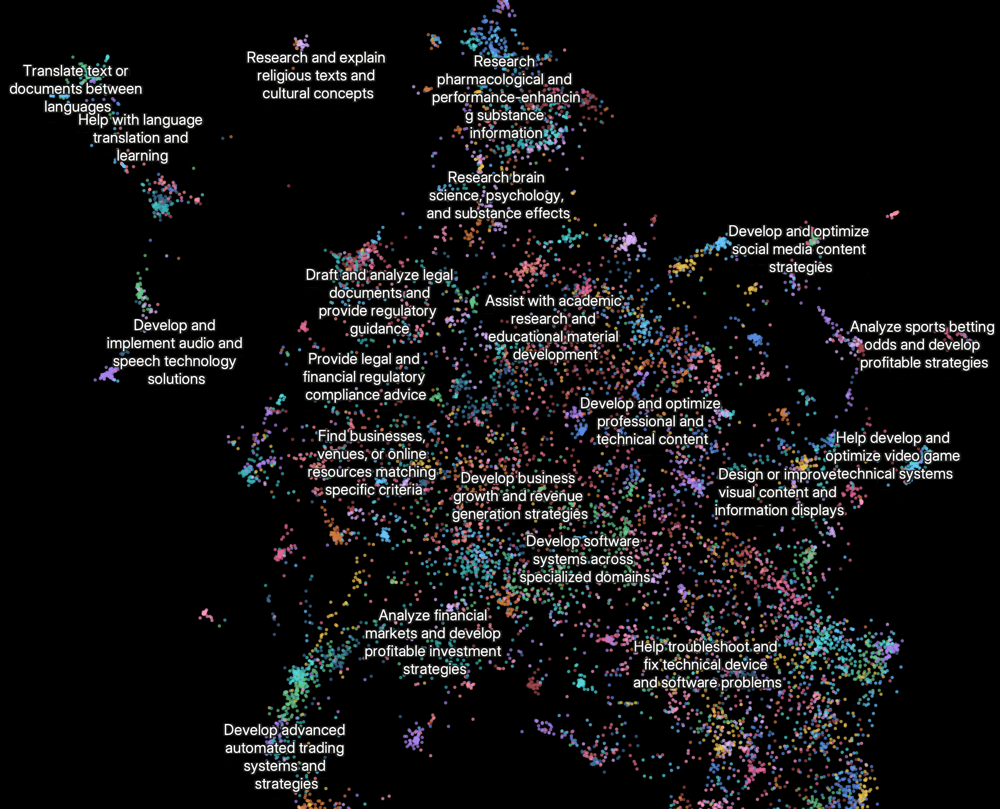

# How we built our multi-agent research system---Anthropic

---Jun 13, 2025 我们的 **Research**（研究）功能使用多个 Claude 智能体（Claude agents）来更**高效地探索复杂主题**。本文将分享我们在构建这一系统过程中遇到的工程挑战，以及从中总结出的经验教训。

Claude 现在具备 **Research**（研究）能力，可以**跨 Web、Google Workspace 以及各种集成工具进行搜索**，从而完成复杂任务。

从原型到生产环境，这一多智能体系统（**multi-agent system**）的构建过程让我们获得了许多关键经验，尤其涉及**系统架构、工具设计和提示词工程**（prompt engineering）等方面。多智能体系统由多个智能体组成，这些智能体**本质上是能够在循环中自主使用工具的大语言模型（LLMs）**，并共同协作完成任务。

我们的 Research 功能包含一个**监督智能体**，它会根据用户查询规划研究流程，然后使用工具创建多个**并行子智能体**，使它们能够同时搜索信息。相比单智能体系统，多智能体系统会引入新的挑战，例如智能体之间的**协调**、系统**评估**以及**可靠性**保障。

本文将拆解那些在实践中对我们有效的原则。我们希望这些经验能帮助你在构建自己的多智能体系统时加以借鉴。

## 多智能体系统的优势

研究工作通常涉及**开放式问题**，很难提前预测完成任务所需的具体步骤。面对复杂主题，无法通过硬编码预设一条固定探索路径，因为研究过程**本质上是动态**的，并且**高度依赖前序发现**。当人类进行研究时，往往会根据新的发现**不断调整方法**，并沿着调查过程中出现的线索**继续深入**。

这种**不可预测性使 AI 智能体特别适合**研究任务。

**研究工作要求系统具备灵活性**：随着调查逐步展开，它需要能够**调整方向**，或者**探索**与主题相关的旁支联系。模型必须在**多个轮次**中自主运行，并根据中间发现来决定接下来应该继续**追踪**哪些方向。线性的、一次性完成的流程无法处理这类任务。

**搜索的本质是压缩**：从庞大的语料中提炼洞见。子智能体（subagents）通过并行运行来促进这种压缩。它们各自拥有**独立的上下文窗口**，可以同时探索问题的不同方面，然后将最重要的 token 压缩后传递给主研究智能体。每个子智能体还实现了**关注点分离**：它们可以拥有不同的工具、提示词和探索路径，从而降低路径依赖，并支持更彻底、更独立的调查。

当智能水平达到一定阈值后，多智能体系统会成为扩展性能的重要方式。例如，尽管单个人类在过去 10 万年中变得更加聪明，但人类社会在信息时代之所以能力呈指数级提升，主要依赖的是**集体智能与协作能力**。即使是具备通用智能的智能体，在单独运行时也会面临限制；而一组智能体能够完成更多任务。

我们的内部评估显示，多智能体研究系统尤其擅长处理**广度优先型查询**，即那些需要**同时沿多个独立方向展开探索**的问题。我们发现，在内部研究评测中，由 Claude Opus 4 担任主智能体、Claude Sonnet 4 担任子智能体的多智能体系统，相比单智能体 Claude Opus 4，性能提升了 90.2%。例如，当任务要求识别信息技术类 S&P 500 公司中的所有董事会成员时，多智能体系统能够将任务拆解给多个子智能体并找到正确答案；而单智能体系统由于只能进行缓慢的顺序搜索，最终未能找到答案。

多智能体系统之所以有效，主要是因为它们能够**投入足够多的 token** 来解决问题。在我们的分析中，有三个因素解释了 BrowseComp 评测中 95% 的性能差异。BrowseComp 用于测试浏览型智能体定位难以找到的信息的能力。我们发现，仅 token 使用量本身就解释了 80% 的性能差异，另外两个解释因素是**工具调用次数和模型选择**。这一发现验证了我们的系统架构：将工作分配给拥有**独立上下文窗口**的不同智能体，从而**为并行推理增加更多容量**。最新的 Claude 模型能够显著提升 token 使用效率，例如升级到 Claude Sonnet 4 带来的性能增益，大于将 Claude Sonnet 3.7 的 token 预算翻倍。对于那些超出单智能体能力边界的任务，多智能体架构能够有效扩展 token 使用规模。

不过，这种架构也有代价：在实践中，它会**快速消耗大量 token**。根据我们的数据，智能体通常比普通聊天交互多使用约 4 倍 token，而多智能体系统比普通聊天多使用**约 15 倍** token。为了具备经济可行性，多智能体系统需要应用在任务价值足够高、能够支撑额外性能成本的场景中。此外，某些领域并不适合当前的多智能体系统，尤其是那些**要求所有智能体共享同一上下文**，或**智能体之间存在大量依赖关系的任务**。例如，大多数编程任务相比研究任务，真正可以并行化的部分更少；而且当前 LLM 智能体还不擅长实时协调并委派任务给其他智能体。我们的经验表明，多智能体系统最适合**高价值任务**，尤其是那些**具有高度并行性、信息量超过单一上下文窗口，并且需要与大量复杂工具交互的任务**。

## Research 的架构概览

我们的 Research 系统采用一种多智能体架构，其中使用了 orchestrator-worker（编排者-工作者）模式：主智能体负责协调整个过程，同时将任务委派给并行运行的专门子智能体。

---多智能体架构的实际运行方式：用户查询首先流向主智能体，主智能体会创建专门的子智能体，让它们并行搜索问题的不同方面。

当用户提交一个查询时，**主智能体会分析该查询，制定策略，并生成多个子智能体**，让它们同时探索问题的不同方面。如上图所示，子智能体会充当智能过滤器：它们**通过迭代使用搜索工具来收集信息**。在这个例子中，子智能体搜索的是 2025 年的 AI agent 公司，然后将公司列表返回给主智能体，由主智能体汇总生成最终答案。

使用 **Retrieval Augmented Generation**（**RAG，检索增强生成**）的传统方法通常采用**静态检索**。也就是说，它们会获取一组与输入查询最相似的文本块（chunks），并使用这些文本块生成回答。相比之下，我们的架构使用的是**多步骤动态搜索**：它能够动态查找相关信息，适应新的发现，并分析结果，从而形成高质量答案。

---完整流程图展示了我们的多智能体 Research 系统的整体工作流。

当用户提交查询时，系统会创建一个 LeadResearcher（主研究员）智能体，并使其进入迭代式研究过程。LeadResearcher 首先会思考研究方法，并将计划保存到 Memory（记忆）中，以便持久化上下文；因为一旦上下文窗口超过 200,000 个 token，内容就会被截断，因此保留计划非常重要。

随后，LeadResearcher 会创建专门的 Subagents（子智能体），并为它们分配具体的研究任务。图中展示了两个子智能体，但实际数量可以是任意多个。每个 Subagent 会独立执行 Web 搜索，**使用 interleaved thinking（交错式思考）评估工具结果**，并将发现返回给 LeadResearcher。

LeadResearcher 会综合这些结果，并判断是否还需要更多研究。如果需要，它可以创建额外的子智能体，或者调整自身策略。当系统收集到足够信息后，就会退出研究循环，并将所有发现传递给 CitationAgent（引用智能体）。

CitationAgent 会处理文档和研究报告，以识别需要添加引用的具体位置。这可以确保所有论断都正确归因到对应来源。最后，带有完整引用的研究结果会返回给用户。

## 研究智能体的提示词工程与评估

多智能体系统与单智能体系统存在关键差异，其中之一是**协调复杂度会快速增长**。早期智能体会出现一些错误行为，例如：为简单查询创建 50 个子智能体、为了不存在的来源无休止地搜索 Web，或者因为过度更新而相互干扰。由于每个智能体都是由提示词引导的，因此**提示词工程（prompt engineering）成为我们改善这些行为的主要手段**。下面是我们在为智能体设计提示词时总结出的一些原则。

### 像智能体一样思考

要迭代提示词，就**必须理解提示词会产生什么影响**。为了做到这一点，我们使用 **Console** 构建了模拟环境，并在其中使用与真实系统完全相同的提示词和工具，然后逐步观察智能体的工作过程。

这种方式很快暴露出一些**失败模式：智能体在已经获得足够结果后仍继续搜索；使用过于冗长的搜索查询；或者选择了错误的工具**。有效的提示词设计依赖于对智能体形成准确的心智模型。只有理解智能体会如何行动，最关键的改进点才会变得明显。

### 教会编排者如何委派任务

在我们的系统中，主智能体会将用户查询拆解为子任务，并把这些子任务描述给子智能体。每个子智能体都需要**明确的目标、输出格式、工具与来源使用建议，以及清晰的任务边界**。

如果缺少详细的任务描述，智能体就可能**重复劳动、遗漏关键部分，或者找不到必要信息**。起初，我们允许主智能体给出简单、简短的指令，例如“研究半导体短缺”。但后来发现，这类指令往往过于模糊，导致子智能体误解任务，或者与其他智能体执行完全相同的搜索。

例如，在一次任务中，一个子智能体研究了 2021 年汽车芯片危机，而另外两个子智能体则重复调查当前 2025 年的供应链情况，整体上并没有形成有效分工。

### 根据查询复杂度分配投入

智能体很难自行判断不同任务应该投入多少工作量，因此我们在提示词中嵌入了**资源分配规则**。

**简单事实查询**通常只需要 1 个智能体和 3–10 次工具调用；**直接比较类任务**可能需要 2–4 个子智能体，每个子智能体执行 10–15 次调用；**复杂研究任务**则可能需要超过 10 个子智能体，并且每个子智能体都要有明确划分的职责。

这些显式规则可以帮助主智能体更高效地分配资源，并避免在简单查询上过度投入。**过度投入**是我们早期版本中非常常见的失败模式。

### 工具设计与工具选择至关重要

智能体与工具之间的接口，和人机交互界面一样关键。使用正确工具不仅更高效，很多时候甚至是完成任务的必要条件。例如，如果某些上下文只存在于 Slack 中，而智能体却在 Web 上搜索这些信息，那么任务从一开始就注定会失败。

随着 **MCP 服务器**让模型可以访问外部工具，这个问题会进一步放大，因为智能体会遇到此前从未见过的工具，而这些工具描述的质量差异可能非常大。为此，我们给智能体提供了**显式启发式规则**：例如，先检查所有可用工具；根据用户意图匹配工具用法；使用 Web 搜索进行广泛的外部探索；优先使用专门工具，而不是通用工具。

**糟糕的工具描述会把智能体引向完全错误的路径，因此每个工具都需要有明确且独特的用途，并配有清晰说明。**

### 让智能体改进自身

我们发现 Claude 4 系列模型可以成为优秀的提示词工程师。当给定一个提示词和一个失败模式时，它们能够**诊断智能体失败的原因，并提出改进建议**。

我们甚至创建了一个**工具测试智能体**。当它拿到一个存在缺陷的 MCP 工具时，会尝试使用该工具，然后**重写工具描**述，以避免未来出现类似失败。通过对工具进行**数十次测试**，这个智能体能够**发现关键细节和隐藏 bug**。

这种改善工具易用性的流程，使未来智能体在使用新描述时，任务完成时间减少了 40%，因为它们可以避开大多数常见错误。

### 先广泛探索，再逐步收窄

**搜索策略应该模仿专家型人类研究者**：先了解整体情况，再深入具体细节。智能体往往默认使用过长、过于具体的查询，导致返回结果很少。

为了解决这一问题，我们**通过提示词引导智能体先使用简短、宽泛的查询，评估当前可获得的信息，然后再逐步缩小关注范围**。

### 引导思考过程

**扩展思考模式**（**extended thinking mode**）会让 Claude 在可见的思考过程中输出额外 token，它可以作为一种可控的草稿空间。主智能体会使用思考过程来规划方法，包括判断哪些工具适合任务、评估查询复杂度和子智能体数量，以及定义每个子智能体的角色。

我们的测试表明，扩展思考能够改善指令遵循、推理能力和执行效率。子智能体也会先进行规划，然后在工具结果返回后使用**交错式思考**（**interleaved thinking**）来评估结果质量、识别信息缺口，并优化下一次查询。这使得子智能体在适应不同任务时更加有效。

### 并行工具调用会显著提升速度和性能

复杂研究任务天然需要探索大量信息来源。早期智能体会顺序执行搜索，这种方式非常缓慢。为了提升速度，我们引入了两类并行化：

1. **主智能体并行**启动 3–5 个子智能体，而不是串行启动；
2. **子智能体并行**使用 3 个以上工具。

这些改动使复杂查询的研究时间最多减少 90%，让 Research 能够在几分钟内完成原本可能需要数小时的工作，同时覆盖比其他系统更多的信息。

### 用启发式策略替代僵硬规则

我们的提示词策略重点不是灌输僵硬规则，而是让智能体掌握良好的启发式方法。我们研究了熟练的人类研究者如何处理研究任务，并将这些策略编码进提示词中。

这些策略包括：**将困难问题拆解为更小的任务；仔细评估来源质量；根据新信息调整搜索方法；以及判断何时应该追求深度，即深入调查某一个主题，何时应该追求广度，即并行探索多个主题。**

与此同时，我们也主动缓解潜在副作用，通过**设置明确的护栏，防止智能体失控式运行**。最后，我们将重点放在快速迭代循环上，并配合可观测性和测试用例来持续改进系统。

## 智能体的有效评估

**优秀的评估对于构建可靠的 AI 应用至关重要**，智能体也不例外。然而，评估多智能体系统会带来一些独特挑战。

传统评估通常假设 AI 每次都会遵循相同步骤：给定输入 X，系统应该沿着路径 Y 生成输出 Z。但多智能体系统并不是这样工作的。**即使起点完全相同，智能体也可能采取完全不同但同样有效的路径来达成目标**。一个智能体可能搜索 3 个来源，另一个智能体可能搜索 10 个来源；它们也可能使用不同工具找到同一个答案。

由于我们并不总是知道“正确步骤”是什么，因此通常不能只检查智能体是否遵循了我们预先规定的“正确”步骤。相反，我们需要更灵活的评估方法：**既判断智能体是否达成了正确结果，也判断它是否遵循了合理过程**。

### 立即从小样本开始评估

在智能体开发早期，系统改动往往会产生显著影响，因为还有大量容易改进的空间。一次提示词调整，可能就会让成功率从 30% 提升到 80%。在这种效果量很大的情况下，只用少量测试用例就能观察到变化。

我们一开始使用了大约 20 个查询，这些查询代表真实使用模式。反复测试这些查询，通常就能清楚看到系统改动带来的影响。我们经常听到 AI 开发团队推迟构建评估集，因为他们认为只有包含数百个测试用例的大规模评估才有价值。然而，更好的做法是**立即从少量样例开始小规模测试**，而不是等到能够构建更完整的评估集之后再行动。

### 做得好的 LLM-as-judge 评估可以规模化

研究输出很难用程序化方式评估，因为它们通常是自由形式文本，而且很少只有一个唯一正确答案。LLM 非常适合用于给输出打分。

我们使用了一个**LLM judge**（**LLM 裁判**），让它根据评分标准评估每个输出，标准包括：**事实准确性**，即论断是否与来源一致；**引用准确性**，即引用来源是否支持对应论断；**完整性**，即是否覆盖了用户要求的所有方面；**来源质量**，即是否优先使用一手来源而不是低质量二手来源；以及**工具效率**，即是否以合理次数使用了正确工具。

我们曾尝试使用多个 judge 分别评估不同组件，但最后发现，**使用一次 LLM 调用、一个提示词，并让它输出 0.0–1.0 的分数和通过/未通过等级，反而最稳定，也最符合人类判断**。

当评估用例本身有明确答案时，这种方法尤其有效。此时，我们可以让 LLM judge 直接检查答案是否正确，例如判断系统是否准确列出了研发预算排名前三的制药公司。使用 LLM 作为裁判，使我们能够以可扩展的方式评估数百个输出。

### 人类评估能够发现自动化遗漏的问题

测试智能体的人类评估者能够发现评估集遗漏的边界情况。这些问题包括：**面对异常查询时产生幻觉答案、系统失败，或者微妙的来源选择偏差**。

在我们的案例中，人类测试者注意到，早期智能体会持续选择经过 SEO 优化的内容农场，而不是更权威但排名不那么靠前的来源，例如学术 PDF 或个人博客。我们在提示词中加入来源质量**启发式规则**后，帮助解决了这一问题。

即使在自动化评估广泛使用的环境中，人工测试仍然必不可少。

### 多智能体系统具有涌现行为

多智能体系统会出现**涌现行为**，也就是并非由特定程序直接编码出来的行为。例如，**对主智能体做出一个很小的改动，都可能以不可预测的方式改变子智能体的行为**。

要让系统成功运行，不仅**需要理解单个智能体的行为，还需要理解智能体之间的交互模式**。因此，适用于这些智能体的最佳提示词，不只是严格指令，而是协作框架：它需要定义劳动分工、问题解决方法和投入预算。

要做好这一点，需要**细致的提示词设计和工具设计、可靠的启发式规则、良好的可观测性，以及紧密的反馈循环**。可以参考我们 Cookbook 中的开源提示词，了解我们系统中的示例提示词。

## 生产可靠性与工程挑战

在传统软件中，一个 bug 可能会破坏某个功能、降低性能，或者导致服务中断。而在智能体系统中，**微小改动可能级联放大为显著的行为变化，这使得为复杂智能体编写代码变得格外困难，尤其是这些智能体还必须在长时间运行的过程中维护状态。**

### 智能体具有状态性，错误会不断累积

智能体可能会长时间运行，并在许多次工具调用之间持续维护状态。这意味着我们需要让代码能够**持久可靠地执行**，并在**过程中处理错误**。

如果没有有效的缓解机制，轻微的系统故障也可能给智能体带来灾难性影响。当错误发生时，我们不能简单地从头重启：重启代价高昂，也会让用户感到沮丧。相反，我们构建了能够**从错误发生位置恢复执行的系统**。

我们还会利用模型本身的智能来优雅地处理问题。例如，当某个工具失败时，将失败情况告知智能体，并让它**自行适应**，实际效果出乎意料地好。我们将基于 Claude 的 AI 智能体所具备的适应能力，与确定性的**防护机制**结合起来，例如重试逻辑和定期检查点。

### 调试需要新的方法

智能体会动态做出决策，并且即使使用完全相同的提示词，不同运行之间也可能是不确定的。这让调试变得更加困难。

例如，用户可能会反馈智能体“没有找到显而易见的信息”，但我们无法直接看出原因：是因为智能体使用了糟糕的搜索查询？选择了低质量来源？还是遇到了工具故障？

加入**完整的生产环境追踪**后，我们能够诊断智能体失败的原因，并系统性地修复问题。除了标准可观测性之外，我们还会监控智能体的**决策模式和交互结构**，同时不会监控单个对话的具体内容，以维护用户隐私。

这种高层次的可观测性帮助我们诊断根本原因、发现意外行为，并修复常见失败模式。

### 部署需要谨慎协调

智能体系统是由提示词、工具和执行逻辑组成的高度有状态网络，并且几乎持续运行。这意味着每当我们部署更新时，智能体可能正处在执行过程中的任意位置。

因此，我们需要避免出于善意的代码改动破坏正在运行的智能体。我们不能同时把每个智能体都更新到新版本。相反，我们使用 **rainbow deployments**（**彩虹部署**）来避免干扰运行中的智能体：通过逐步将流量从旧版本迁移到新版本，并让两个版本同时运行，从而平滑完成更新。

### 同步执行会产生瓶颈

目前，我们的主智能体会同步执行子智能体，即等待每一组子智能体全部完成后，才继续推进。这简化了协调过程，但也会在智能体之间的信息流中产生瓶颈。

例如，**主智能体无法实时引导子智能体，子智能体之间也无法相互协调；整个系统甚至可能因为等待某一个子智能体完成搜索而被阻塞**。

异步执行可以带来额外的并行性：多个智能体能够同时工作，并在需要时创建新的子智能体。但这种异步性也会带来新的挑战，包括**结果协调、状态一致性，以及错误在子智能体之间的传播**。

随着模型能够处理更长、更复杂的研究任务，我们预计异步执行带来的性能收益将足以抵消其额外复杂性。

## 结论

在构建 AI 智能体时，“最后一公里”往往会变成整个旅程中最主要的部分。一个能在开发者本机上运行的代码库，要成为可靠的生产系统，还需要大量工程化工作。由于智能体系统中的错误具有复合性，传统软件中的小问题，也可能让智能体完全偏离轨道。某一步失败，就可能导致智能体探索完全不同的路径，并产生不可预测的结果。基于本文所描述的种种原因，原型与生产环境之间的差距，往往比预期更大。

尽管存在这些挑战，多智能体系统已经证明了其在开放式研究任务中的价值。用户反馈称，Claude 帮助他们发现了此前未曾考虑过的商业机会，理清了复杂的医疗选择，解决了棘手的技术 bug，并通过发现他们独自难以找到的研究关联，节省了多达数天的工作时间。

通过细致的工程设计、全面的测试、注重细节的提示词与工具设计、稳健的运维实践，以及对当前智能体能力有深刻理解的研究、产品和工程团队之间的紧密协作，多智能体研究系统可以在大规模场景下可靠运行。我们已经看到，这类系统正在改变人们解决复杂问题的方式。

一张 Clio embedding plot（Clio 嵌入图）展示了当前用户使用 Research 功能的最常见方式。

其中，排名靠前的使用场景包括：

| 使用场景类别             |  占比 |
| ------------------ | --: |
| 跨专业领域开发软件系统        | 10% |
| 开发并优化专业与技术内容       |  8% |
| 制定业务增长与收入生成策略      |  8% |
| 辅助学术研究与教育材料开发      |  7% |
| 研究并核实关于人物、地点或组织的信息 |  5% |

## 附录

下面是一些关于多智能体系统的补充性建议。

### 对多轮修改状态的智能体进行终态评估

评估那些会在多轮对话中修改持久状态的智能体，会带来独特挑战。不同于只读型研究任务，这类智能体的**每一个动作都可能改变后续步骤所处的环境，从而形成依赖关系**，而传统评估方法很难处理这种依赖。

我们发现，更有效的方法是**关注终态评估**，而不是逐轮分析。也就是说，不要判断智能体是否遵循了某个特定过程，而是评估它是否达成了正确的最终状态。

这种方法承认：**智能体可能通过不同路径到达同一目标，但仍然需要确保它交付了预期结果**。**对于复杂工作流，可以将评估拆分为若干离散检查点，在这些检查点上验证特定状态变化是否已经发生，而不是试图验证每一个中间步骤**。

### 长周期对话管理

生产环境中的智能体经常会参与持续数百轮的对话，因此需要谨慎的**上下文管理策略**。随着对话不断延长，标准上下文窗口会变得不够用，这就需要**智能压缩机制和记忆机制**。

我们实现了一些模式：智能体会**总结**已经完成的工作阶段，并在进入新任务之前，将**关键信息存储**到外部 Memory（记忆）中。当接近上下文限制时，智能体可以**创建新的子智能体**，让它们以**干净的上下文**继续工作，同时通过**细致的交接**来维持连续性。

此外，当上下文达到上限时，智能体可以从 Memory 中**重新检索已存储的上下文**，例如研究计划，而不是丢失之前的工作。这种分布式方法既能防止上下文溢出，又能在长时间交互中保持对话连贯性。

### 让子智能体输出到文件系统，减少“传话游戏”

对于某些类型的结果，**允许子智能体直接输出，可以绕过主协调者，从而同时提升保真度和性能。**

也就是说，不必要求子智能体把所有内容都通过主智能体传递，而是可以实现一种 **artifact system**（**产物系统**）：让专门智能体创建能够独立持久化的输出。子智能体调用工具，将自己的工作**存储**到外部系统中，然后只把**轻量级引用**返回给协调者。

这种方式可以**防止多阶段处理过程中的信息损失**，并减少由于在对话历史中**复制大段输出而产生的 token 开销**。该模式尤其适合**结构化输出**，例如代码、报告或数据可视化；在这些场景中，子智能体的专门提示词往往能够生成更好的结果，而不是让结果再经过通用协调者过滤。
