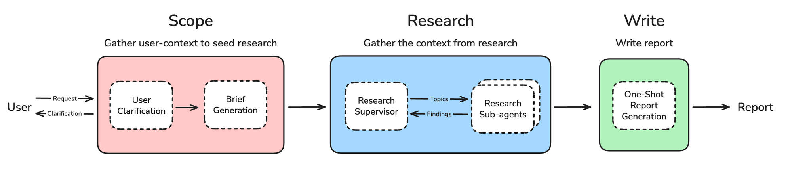
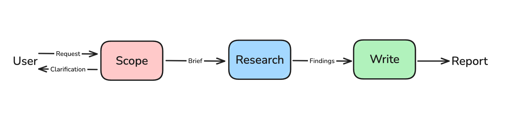
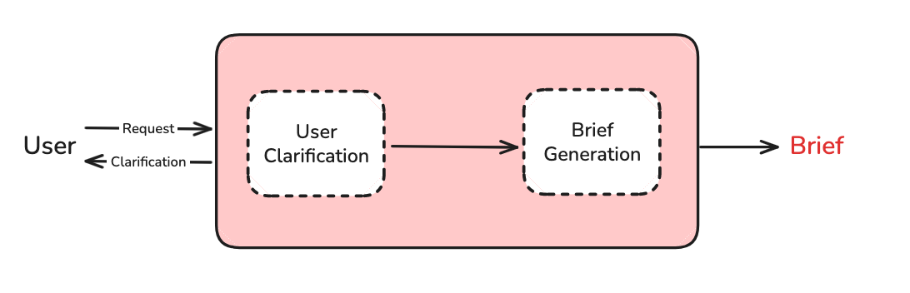
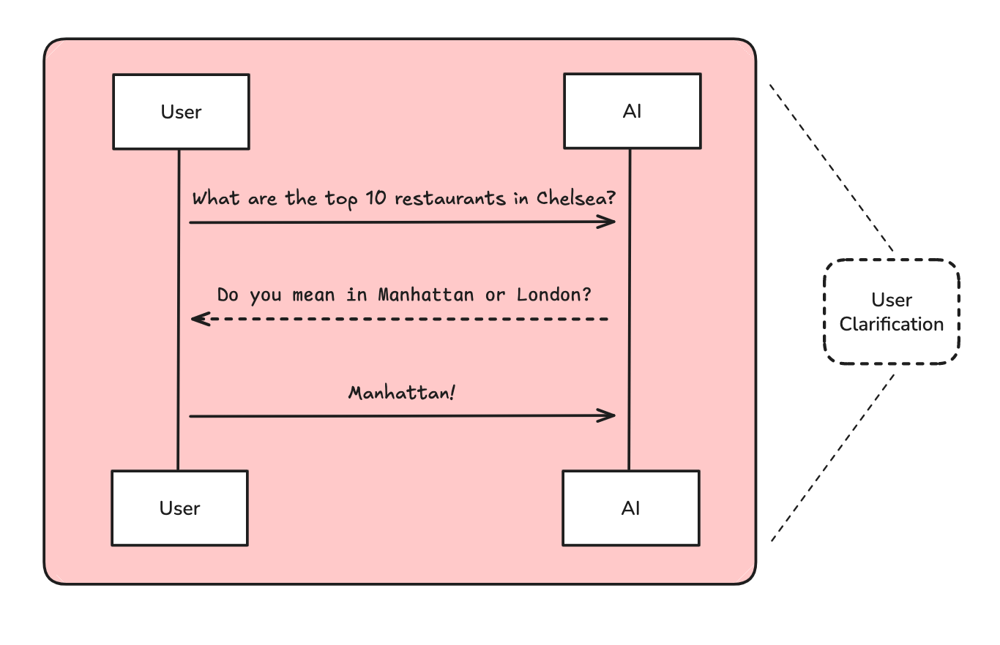
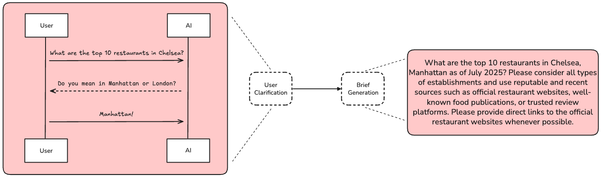
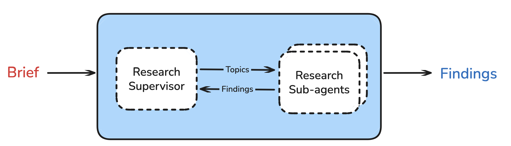
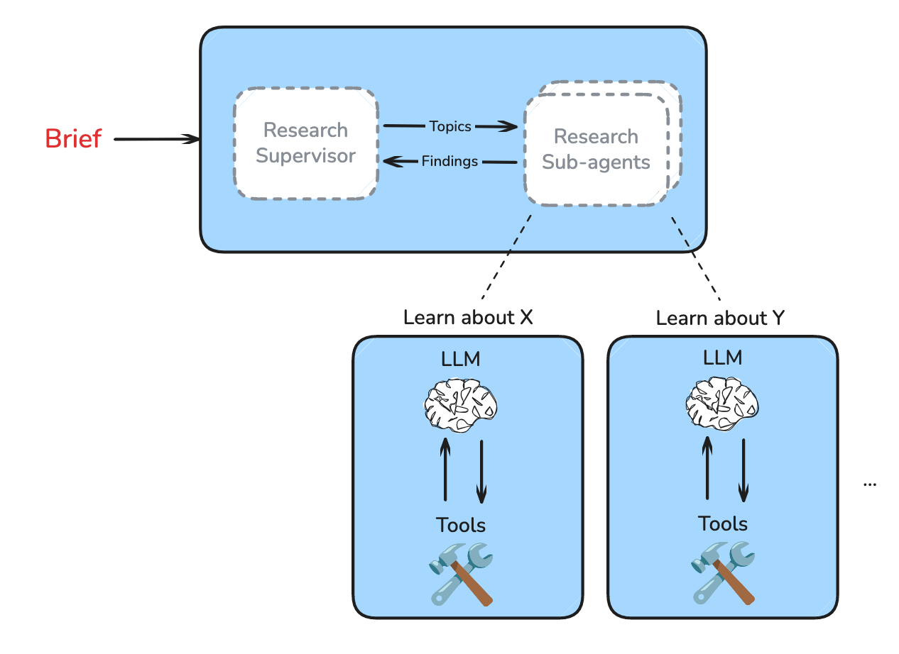
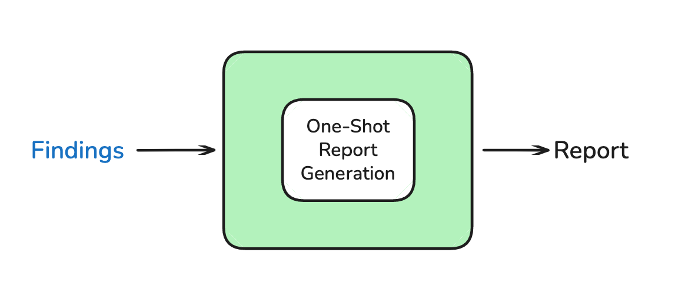
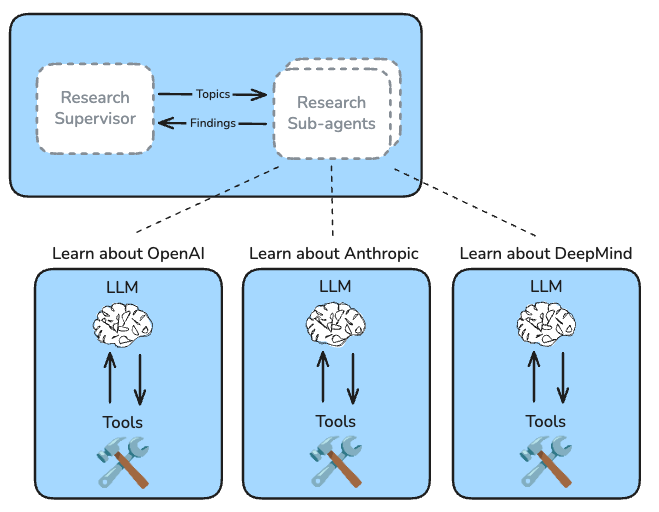

# Open Deep Research 
--- July 16, 2025

## TL;DR

Deep Research（深度研究）已经成为最受欢迎的智能体应用之一。OpenAI、Anthropic、Perplexity 和 Google 都推出了 Deep Research 产品，能够利用多种上下文来源生成全面的研究报告。与此同时，也已经出现了许多开源实现。

我们构建了一个开放式 Deep Research 系统，它简单且可配置，允许用户接入自己的模型、搜索工具和 MCP 服务器。

Open Deep Research 构建于 LangGraph 之上。点击这里查看代码！

也可以在 Open Agent Platform 上试用它。

## Challenge

Research（研究）是一项**开放式任务**；要回答用户请求，最佳策略往往无法提前轻易确定。**不同请求可能需要不同的研究策略，以及不同程度的搜索深度和广度**。

“比较这两个产品”

比较类问题通常适合先分别搜索每个产品，然后再通过综合步骤对它们进行对比。

“为这个职位找出前 20 名候选人”

列表与排名类请求通常需要开放式搜索，然后进行综合分析与排序。

“X 真的是真的吗？”

验证类问题可能需要在特定领域内进行迭代式深度研究。在这类任务中，信息来源的质量通常比搜索覆盖面的广度更重要。

基于以上几点，Open Deep Research（开放式深度研究）的一个关键设计原则是：**具备灵活性，能够根据不同请求探索不同的研究策略。**

## Architectural Overview

Agents（智能体）非常适合用于研究任务，因为**智能体能灵活应用不同策略，并利用中间结果来指导后续探索（但随之而来的是agentic research 中的路径依赖与累积偏差风险）**。Open Deep Research 使用一个智能体来执行研究，并将整个流程划分为三个步骤：

Scope（范围界定）——明确研究范围
Research（研究）——执行研究
Write（撰写）——生成最终报告

## Phase 1: Scope

Scoping（范围界定）的目的是收集研究所需的全部用户上下文。这是一个两步流水线，包含 User Clarification（用户澄清）和 Brief Generation（简报生成）。

### User Clarification

OpenAI 曾指出，**用户在提出研究请求时，很少会提供足够的上下文**。我们使用一个聊天模型在必要时向用户询问额外上下文。

### Brief Generation

聊天交互可以包括澄清问题、追问，或用户提供的示例，例如一份先前的 Deep Research 报告。由于这类交互可能非常冗长，并且消耗大量 token，我们会将其转化为一份**全面但聚焦的 research brief（研究简报）**。

- 明确研究目标
- 约束研究边界
- 指导 Supervisor 分配任务
- 判断研究是否充分
- 指导最终报告生成

这份研究简报将作为**判断研究是否成功的核心标准**。在后续的研究阶段和报告撰写阶段中，系统都会不断回到这份简报，对照其中的目标和要求开展工作。

💡**我们会把研究者与用户之间的聊天内容，转化为一份聚焦明确的研究简报，供研究监督者作为衡量研究过程和最终结果的依据。**

## Phase 2: Research

研究阶段的目标，是**收集研究简报所要求的全部背景信息与证据**。Open Deep Research 通过研究监督智能体Supervisor Agent 来组织管理这一过程。即**Supervisor–Worker / Supervisor–Researcher架构**。

### Research Supervisor

Supervisor 是整个 Deep Research 工作流的**调度中枢**，负责**研究规划、任务拆分、子研究员调度、过程反思与终止判断**，是系统中控制多智能体研究流程的核心节点。

监督智能体的任务比较简单：把用户研究需求转化为可执行的研究任务，将研究任务委派给数量适当的子智能体，协调 Researcher 子智能体完成信息收集，并判断何时停止研究、进入最终报告生成阶段。

监督智能体的关键：首先需要判断研究简报**能否被拆分为若干相互独立的子主题**。如果可以，就将这些子主题分别交给拥有**独立上下文窗口的子智能体**。这种设计能够让**系统并行**开展多项研究工作，从而更快地获取更多信息。

- 判断问题是否可以拆成相互独立的子主题；
- 决定需要多少个 Sub-Agent；
- 为每个 Sub-Agent 分配明确任务；
- 检查返回结果是否覆盖 Research Brief；
- 发现研究缺口；
- 必要时继续派生新的研究任务。

### Research Sub-Agents
每个研究子智能体都会接收到监督智能体分配的一个子主题。系统会要求子智能体只关注这一**特定主题**，而不必考虑研究简报的完整范围，因为统筹全局是监督智能体的职责。

每个子智能体通过一个**工具调用循环**开展研究，并使用用户配置的**搜索工具和MCP 工具**，如:
- 理解子问题
- 生成搜索请求
- 调用搜索工具或 MCP 工具
- 阅读结果
- 判断是否需要继续检索
- 汇总并引用有效来源
  

当子智能体完成研究后，它会再调用一次大语言模型，**对子智能体的研究结果进行清理和整理**，从而保证监督智能体收到的是经过处理的、较为干净的信息。即根据全部研究结果，对监督智能体提出的子问题撰写一份详细回答，并引用有帮助的信息来源。如：
- 删除无关内容
- 过滤失败结果
- 提取有效事实
- 保留重要来源
- 压缩为便于综合的研究发现。
  
这一处理十分重要，因为工具调用过程可能会产生**大量原始信息**，例如抓取下来的网页内容，也可能包含大量无关信息，例如失败的工具调用或与研究主题无关的网站。

💡 **我们会额外调用一次大语言模型，对子智能体的研究结果进行清理和整理，从而保证监督智能体收到的是经过处理的、较为干净的信息。**

如果将全部原始信息直接返回给监督智能体，**token 使用量会显著膨胀** 且会造成 **上下文污染和触及窗口限制**，监督智能体也不得不解析更多内容，才能从中提取真正有价值的信息。因此，子智能体会先整理自己的研究发现，再将其返回给监督智能体。

### Research Supervisor Iteration

监督智能体会判断各个子智能体返回的研究结果，**是否已经充分覆盖研究简报**所规定的工作范围。如果仍存在缺口，它可以：

- 增加研究深度
- 调整搜索方向
- 创建新的 Sub-Agent
- 对证据不足的部分开展补充研究
  
如果监督智能体认为当前研究深度仍然不足，它可以继续创建更多子智能体，执行进一步的研究任务。因此，**研究深度和广度不是固定的**，而是由任务难度和已获得结果动态决定。

在不断委派研究任务并反思研究结果的过程中，监督智能体能够灵活识别当前仍然缺失的信息，并通过后续研究填补这些空白。

## Phase 3: Report Writing

报告撰写阶段的目标，是利用各个研究子智能体收集到的背景信息和研究成果，完成研究简报中提出的任务。

当研究监督智能体判断当前收集到的研究发现已经足以回答研究简报中的请求时，系统便会进入报告撰写阶段。

在撰写报告时，我们会将以下两部分内容共同提供给一个大语言模型：
- 研究简报
- 所有研究子智能体返回的研究发现
- 相关来源和证据信息
  
随后，通过最后一次大语言模型调用，**一次性生成完整报告**。报告的目标、范围和写作要求由研究简报引导，其具体内容则由已经收集到的研究发现提供支撑。提高：

- 结构一致性
- 行文连贯性
- 观点统一性
- 跨章节综合能力

## Lessons

### Only use multi-agent for easily parallelized tasks

选择多智能体还是单智能体，是系统设计中的一个重要问题。Cognition 曾提出反对滥用多智能体的观点，因为**当多个输出必须共同组成一个紧密耦合的整体时，协调成本可能抵消并行收益甚至更多（那claude code和codex都是如何处理这个问题的呢？我就不信他们没用多智能体系统？）**。

如果一项任务要求多个智能体的输出最终能够共同组成一个可运行的整体，例如共同开发一个应用程序，那么协调问题就会构成明显风险。

我们也从实践中认识到了这一点。早期版本的研究智能体曾让多个子智能体并行撰写最终报告的不同章节。这种方式速度很快，但也出现了 Cognition 所指出的问题：由于负责各章节写作的智能体之间缺少良好协调，最终生成的报告**彼此割裂，缺乏整体连贯性**。

我们最终采取的解决办法是：只在研究阶段使用多智能体，等全部研究完成后，再统一撰写报告。

💡 **多智能体之间很难协调。如果让多个智能体并行撰写报告的不同章节，结果可能较差。因此，我们将多智能体限制在研究阶段，并通过一次模型调用统一生成完整报告**。

### Multi-agent is useful for isolating context across different sub-research topics

实验表明，当用户请求包含多个子主题时，例如比较 A、B 和 C，单智能体的回答质量会下降。

原因比较直观：

1.**单个上下文窗口需要同时保存并处理所有子主题产生的工具反馈，通常会占用大量 token**。

2.**随着多个不同子主题的工具调用不断累积，许多长上下文问题会变得更加突出，例如不同主题的信息相互干扰，即所谓的 context clash（上下文冲突）**。

下面来看一个具体例子：比较 OpenAI、Anthropic 和 Google DeepMind 在人工智能安全方面采取的不同方法。我希望了解它们不同的哲学框架、研究重点，以及它们如何看待对齐问题。在单智能体实现中，系统会同时使用搜索工具，分别针对三家前沿实验室发出查询：

- “OpenAI 在人工智能安全与对齐方面的哲学框架” 
- “Anthropic 在人工智能安全与对齐方面的哲学框架” 
- “Google DeepMind 在人工智能安全与对齐方面的哲学框架” 
  
搜索工具会把三家实验室的搜索结果合并成一段很长的字符串返回。单智能体需要同时分析三家实验室的资料，然后再次调用搜索工具，分别提出新的独立查询：

- “DeepMind 关于社会选择和政治哲学的观点” 
- “Anthropic 关于技术对齐挑战的观点” 
- “OpenAI 关于递归奖励建模的技术报告” 

在每一轮工具调用中，单智能体都必须同时处理三条相互独立的研究线索。从 token 消耗和响应延迟来看，这种方式效率很低。我们并不需要知道 OpenAI 的递归奖励建模方法，才能决定下一步应该如何搜索 DeepMind 的对齐哲学。

3.**当单个智能体同时处理多个主题时，它往往会在每个主题上进行较少轮次的搜索，随后便选择结束研究，因此各主题的研究深度都会受到限制**。

多智能体方法则允许多个子智能体并行运行，每个子智能体只负责一个独立、聚焦的任务，从而：
- 隔离工具反馈
- 减少上下文干扰
- 并行开展检索
- 提高每个子主题的研究深度

将多智能体用于研究阶段，既能够获得 Anthropic 所报告的优势，也与我们的评测结果一致：不同子主题的上下文可以被隔离在各自的子智能体中。

💡 **在研究过程中隔离各个子主题的上下文，可以避免多种长上下文失效问题。**

### Multi-agent supervisor enables the system to adjust required research depth and width for the task complexity

用户不会希望一个简单请求也需要十几分钟才能完成。但是，正如 Anthropic 所展示的，部分复杂请求确实需要更高的 token 消耗和更长的执行时间。

监督智能体可以同时适应这两类情况。它能够**通过有选择地创建子智能体，调整某个请求所需的研究深度**。

系统会在监督智能体的提示词中加入一些**启发式规则**，帮助它判断：

- 什么时候应该并行开展研究
- 什么时候只需要一条单独的研究线程
- 需要创建多少个子智能体
- 当前研究是否需要进一步深入

因此，Open Deep Research 可以灵活选择是否将研究过程并行化。

💡 **多智能体监督架构使系统能够灵活选择搜索策略**。

### Context Engineering is important to mitigate(控制) token bloat(膨胀) and steer(引导) behavior

研究是一项高度消耗 token 的任务。Anthropic 曾报告，其多智能体系统使用的 token 数量，是普通聊天应用的约 15 倍。

为了缓解这一问题，我们采用了上下文工程。

首先，我们会将用户与系统之间的聊天记录压缩成一份**研究简报**，从而避免之前的大量对话不断占据上下文。

其次，子智能体在将研究发现返回给监督智能体之前，会先删除无关的 token 和信息，只保留**有价值的研究结果**。

如果缺少充分的上下文工程，智能体很容易因为冗长、未经处理的工具调用结果而接近甚至超过上下文窗口限制。

从实际应用角度来看，上下文工程还能够

- 降低 token 使用成本
- 避免超过模型上下文窗口
- 降低触发 TPM，即每分钟 token 数量限制的风险
  
💡 **上下文工程具有多方面的实际价值：它可以节省 token、避免上下文窗口溢出，并帮助系统保持在模型速率限制以内**。

## Next Steps

Open Deep Research 是一个仍在持续演进的项目(到**2025年7-8月份**便不再频繁维护)，我们还有许多想要尝试的方向。以下是目前正在思考的一些开放性问题：

1.	**应当如何处理 token 占用量很大的工具返回结果？怎样才能更有效地过滤无关上下文，从而减少不必要的 token 消耗？ Context engineering**！

2.	**是否存在一些值得放在智能体关键执行路径（hot path）中实时运行的评测，以保证系统持续生成高质量回答？ Reflexion and Evaluation**！

3.	**深度研究报告具有较高价值，同时生成成本也相对较高。能否保存这些研究成果，并通过长期记忆在未来的任务中继续利用它们？ RAG**！

