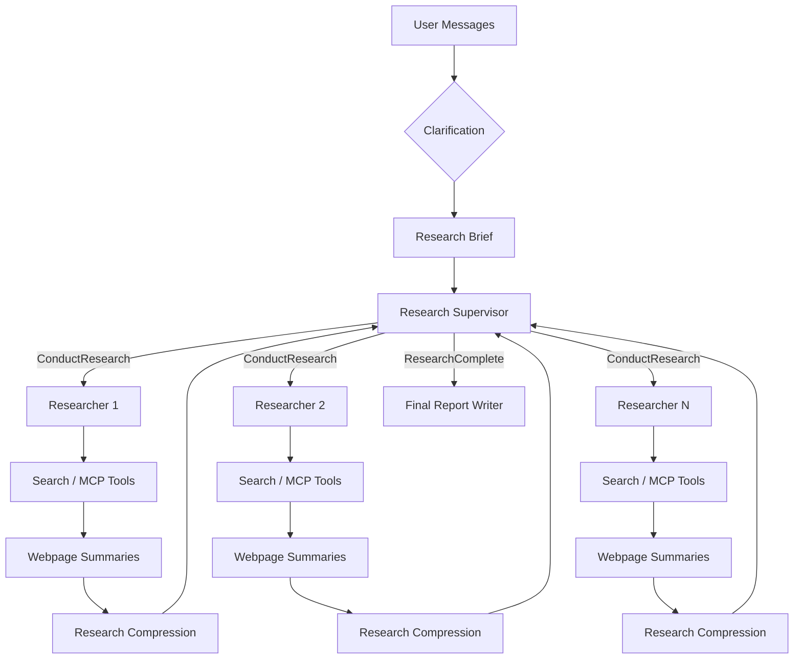

# DeepResearch 多智能体系统中的 Context Budgeting

> 从上下文工程、提示词工程到系统设计的完整治理方法  
> 工程案例：[`magic-ZSS/agentic-deep-research`](https://github.com/magic-ZSS/agentic-deep-research)


## 总体概述

本项目围绕 DeepResearch 多智能体系统中普遍存在的 **Token 膨胀、上下文累积、研究过度扇出、工具反馈冗余和最终报告失控等问题**，设计并实现了一套以 Context Budgeting 为核心的上下文治理方案。其目标并**不是机械压缩 Token 或限制智能体能力**，而是在**保证任务覆盖度、证据质量、真实性和用户约束的**前提下，使研究投入能够**随任务复杂度动态调整，减少无法转化为有效结论的模型调用、搜索行为和上下文传递**。

该设计主要从**上下文工程、提示词工程和系统设计**三个层面展开。

在上下文工程层面，系统重新设计了信息在完整研究链路中的生命周期。用户对话首先被压缩为聚焦的 **Research Brief**，使其成为**后续规划、研究和写作的统一任务契约**；Supervisor 只接收研究简报和各 **Researcher** 返回的压缩证据，而**不直接读取原始网页和完整工具历史**；不同 **Researcher** 在**相互隔离**的上下文中处理独立子任务，降低多主题信息混杂产生的 **Context Clash**；**网页原始内容**通过证据保留型摘要转换为**高密度工具反馈**；Researcher 完成研究后，再将完整搜索过程压缩为包含关键**结论、来源、限制、冲突和未解决问题的证据包**，最后由统一的 **Final Writer** 根据 Research Brief **完成综合**。整个流程形成了“用户对话—任务契约—局部研究—网页证据—压缩发现—最终报告”的**上下文漏斗**。

在提示词工程层面，优化重点由“要求模型尽可能全面”转向“**约束智能体如何分配研究资源**”。

Research Brief Prompt 根**据任务复杂度决定具体程度**，不再为简单问题自动增加**未请求的研究维度**；

Supervisor Prompt 要求每批 `ConductResearch` 前**单独调用 `think_tool`，分析任务边界、最小有效 Researcher 数量、子任务重叠和预期信息增益**；

Researcher Prompt 对简单事实查询、复杂开放任务、来源优先级、搜索调用数量和停止条件进行**差异化约束**，并要求第二批及以后检索必须由**明确证据缺口驱动**；

网页摘要 Prompt 不再按照原文比例生成长摘要，而是保留数值、日期、版本、方法、基线和限制，**删除导航、广告、SEO、重复内容和嵌入式恶意指令**；

Compression Prompt 统一为**证据保留型压缩**，避免同时受到“**高度概括**”和“尽量**返回全部原文**”的冲突要求；

Final Report Prompt 则明确 Research Brief、用户对话和 Findings 的优先级，**禁止重新研究、补充无来源事实或为了体现“DeepResearch”而机械扩写**。

在系统设计层面，Prompt 的软性行为约束进一步由确定性运行时机制提供兜底。系统分别设置 

Supervisor 并行 Researcher 数量、

单个 Researcher 工具轮次、

单轮工具并发数、

Tavily query 数量

每个 query 的结果数量上限

并使用 Semaphore 控制网页摘要并发；

通过 LangGraph 子图隔离 Supervisor 和 Researcher 的状态，使原始工具反馈不会直接污染全局上下文；

增加 Process Trace 记录 Brief、Supervisor、Researcher、搜索、摘要和压缩节点之间的父子关系，为分析 fan-out 和延迟来源提供可观测性。

针对网页摘要模型曾将2048个输出 Token 几乎全部消耗于 reasoning、导致结构化结果截断的问题，系统显式关闭摘要阶段的思考模式，使输出预算真正用于摘要和 `key_excerpts`。这些设计共同构成“Prompt 主动控制正常行为，Runtime 限制最坏执行规模”的双层治理结构。


实验结果表明，该设计在多数任务上实现了**质量、成本和延迟的同步改善**。五组优化前后对照任务中，

平均总体得分由**5.24分提高至6.92分**；

累计 Token 从约294.3万降低至165.3万，下降43.8%；累计耗时从5635秒降低至1881秒，下降66.6%。

其中，简单事实核验任务的 Token 和耗时分别降低53.8%和80.5%，说明上游范围控制和单 Researcher 策略能够有效避免简单任务被完整 DeepResearch 流程过度处理；

开放式前沿判断和技术方案任务的 Token 也分别下降约50.5%和53.0%。多产品比较任务的 Token 基本持平，但优化后修复了整个产品对象缺失的问题，并将耗时降低51.4%，说明**Context Budgeting 的目标并不是要求所有任务都使用更少 Token，而是提升单位资源所产生的有效覆盖和交付价值。**


从分项指标看，提升最明显的是 Brief 质量、工具调用正确率、Supervisor 质量和反思质量，说明本轮设计首先解决了**任务范围扩张、无效委派、重复研究和停止判断不清**等控制平面问题。

但**真实性、来源质量和证据链质量的提升相对有限**，复杂技术方案还出现了成本显著下降但工程细节略有损失的情况。这表明当前系统已经较好回答了“**研究多少、如何拆分、何时停止**”，下一阶段仍需进一步解决“证据是否足够直接、引用是否真正支持结论、Compression 是否保留必要工程细节，以及最终报告是否完整交付”。

总体而言，本设计使项目从**依赖模型自由探索的开放式研究流程**，逐步转变为**具有任务范围预算、研究广度预算、搜索深度预算、工具反馈压缩、证据充分性终止和运行时护栏的自适应 DeepResearch 系统**。

其核心价值不在于单纯减少 Token，而在于建立一套可迁移的工程原则：对**简单任务保持克制，对复杂任务保留充分能力**，并让每一次额外的模型调用、工具调用和上下文传递，都能够产生与其成本相匹配的**有效研究价值**。


## 摘要

DeepResearch 系统的核心能力，是让大语言模型在多轮工具调用中自主规划、检索、验证、压缩并综合信息。与静态 RAG 相比，这种 Agentic Research 能够根据中间发现动态调整研究路径，并利用多个独立上下文并行处理复杂问题。然而，同一机制也会带来显著的工程风险：**研究范围逐步扩张、子智能体数量失控、搜索结果反复进入上下文、网页正文和工具反馈持续累积、压缩节点丢失关键证据**，以及最终报告将“深度研究”误解为“尽可能长的回答”。

这些问题经常被**笼统地归因于 Token 过多**，但 Token 膨胀只是表象。其根本原因是：**信息在多智能体系统中被不受约束地产生、复制、累积、压缩和重新消费**。仅仅降低 `max_tokens`、减少智能体数量或更换便宜模型，无法从根本上治理这种问题，甚至可能以**牺牲覆盖度、证据质量和错误恢复能力为代价**。

本文以 `agentic-deep-research` 为工程案例，提出一套面向 DeepResearch 的 Context Budgeting 方法。该方法以三个层面为核心：

1. 上下文工程：设计信息在**不同节点之间的选择、隔离、压缩、传递与消费方式**；
   
2. 提示词工程：**约束** Supervisor、Researcher、摘要器、压缩器和最终写作者的**决策行为**；
   
3. 系统设计：通过**状态机、并发控制、运行时预算、结构化输出、错误恢复和可观测性**，将软性策略转化为确定性边界。

本文的目标不是把系统改造成“始终使用更少 Token”的研究器，而是构建一种**预算约束下的自适应研究机制**：

> 在满足任务覆盖度、证据质量、真实性和用户约束的前提下，使每一次模型调用、工具调用和上下文传递都产生与其**成本相匹配的有效价值**。

---

## 1. 引言：DeepResearch 的核心矛盾

研究任务具**有天然的开放性**。对于一个复杂问题，系统通常无法在开始前准确知道：

- 需要搜索多少轮；
- 哪些来源最有价值；
- 哪些子问题可以并行；
- 哪些中间发现会改变后续方向；
- 什么时候证据已经充分；
- 哪些信息最终值得进入报告。

这使研究任务非常适合 Agent。一个 Researcher 可以在工具循环中不断执行：

```text
理解任务
→ 选择工具
→ 发起搜索
→ 阅读结果
→ 判断证据质量
→ 识别信息缺口
→ 调整查询
→ 继续或停止
```

多智能体架构进一步允许 Supervisor 将相对独立的研究方向分配给多个 Researcher，使每个子智能体在独立上下文中探索。这种设计可以提高复杂任务的**覆盖度、并行度和研究深度**，也是 Anthropic Research 与 Open Deep Research 等系统采用 Supervisor–Worker 架构的重要原因。[1][2]

但 Agentic Research 的**优势和成本来自同一机制**：**动态决策**。

只要上游多创建一个研究方向，下游就可能新增一整条执行链：

```text
新增研究方向
→ 新增 Researcher 上下文
→ 新增多轮模型调用
→ 新增搜索或 MCP 调用
→ 新增多个网页摘要任务
→ 新增一次研究压缩
→ Supervisor 再次读取和评估
→ Final Writer 重新综合
```

因此，DeepResearch 面临的核心矛盾不是简单的“研究越多越好”与“Token 越少越好”，而是：

> **如何在保留动态探索能力的同时，避免研究过程在范围、广度、深度和上下文长度上无边界扩张**。

这也是 Context Budgeting 要解决的问题。

---

## 2. Token 膨胀只是表象

### 2.1 典型失控现象

在 DeepResearch 系统中，常见的成本与上下文问题包括：

- Token bloat：模型调用总 Token 随研究轮数快速**增加**；
- Context accumulation：工具结果和中间消息持续**累积**；
- Context clash：不同实体、来源或研究方向在同一长上下文中互相**干扰**；
- Tool-feedback expansion：搜索工具返回的大量原始内容直接进入模型历史；
- Research fan-out：Supervisor、Researcher 和搜索工具**多层并发产生乘法放大**；
- Over-exploration：已有充分证据后仍**继续搜索**；
- Evidence dilution：低质量和重复来源**稀释高质量证据**；
- Compaction loss：压缩时**删除关键**限定、数值或证据关系；
- Output bloat：最终报告为**追求“全面”而重复**研究材料；
- Error amplification：某一节点失败后回退到更长原始内容，反而扩大故障。

这些现象不能只通过限制最终答案长度解决。Final Report 只是信息生命周期的最后一环，大量成本在研究阶段已经发生。

### 2.2 成本由调用次数与上下文长度共同决定

一个阶段的模型成本可以粗略表示为：

```text
Cost_stage
≈ Σ(InputTokens_i × InputPrice_i)
+ Σ(OutputTokens_i × OutputPrice_i)
```

因此，总成本不仅取决于单次模型输出长度，还取决于：

- 调用次数；
- 每轮历史上下文长度；
- 搜索结果和网页内容长度；
- Reasoning Token；
- 重试次数；
- 并行分支数量；
- 是否重复处理相同证据。

即使**最终报告只有 1000 字，一个 Researcher 也可能在此前多轮读取数万 Token 的工具历史**。

### 2.3 多层 fan-out 的乘法效应

以当前项目为例，研究阶段至少存在三层扩张：

1. Supervisor 创建多个 `ConductResearch`；
2. 每个 Researcher 在多轮中调用多个工具；
3. 每次 Tavily 搜索包含多个 query，每个 query 返回多个网页。

设：

- `A`：一批 Researcher 数量；
- `R`：单个 Researcher 的搜索或工具轮次；
- `T`：每轮搜索类工具调用数量；
- `Q`：每个 Tavily 调用中的 query 数；
- `K`：每个 query 的结果数；
- `U`：单次搜索内 URL 去重后的保留比例。

则网页摘要任务的粗略规模为：

```text
N_summary ≈ A × R × T × Q × K × U
```

如果所有层级都按上限运行，少量顶层委派可能在下游产生数十甚至数百个网页处理任务。这一公式并不是为了计算准确账单，而是揭示一个关键事实：

> **越靠近系统上游的范围和委派决策，成本放大效应越强**。

因此，Context Budgeting 必须首先治理 Brief 和 Supervisor，而不能只在网页摘要或 Final Writer 阶段补救。

---

## 3. 三个治理层面：上下文工程、提示词工程与系统设计

Context Budgeting 不是单一技术，而是三个层面的协同。

| 层面 | 核心问题 | 主要手段 |
|---|---|---|
| 上下文工程 | **哪些信息应在什么时间进入哪个节点** | 选择、隔离、压缩、分层、外部化 |
| 提示词工程 | **智能体应如何利用当前上下文决策** | 角色、边界、启发式、反思、停止条件 |
| 系统设计 | **如何保证最坏情况仍然受控** | 状态机、计数器、并发上限、超时、重试、降级 |

三者的关系可以概括为：

```text
上下文工程：控制模型看到什么
提示词工程：控制模型如何思考和行动
系统设计：控制模型判断失误时最多会发生什么
```

只依赖其中任何一层都不充分。

### 3.1 仅靠上下文压缩的问题

过度压缩可能删除：

- 比较基线；
- 实验条件；
- 数值单位；
- 来源冲突；
- 适用范围；
- 重要例外。

压缩得更短并不等于上下文质量更高。

### 3.2 仅靠 Prompt 的问题

Prompt 可以要求模型不要过度搜索，但模型仍可能：

- 一次生成过多工具调用；
- 误判任务复杂度；
- 忽略停止规则；
- 在异常情况下重复调用；
- 输出无法解析的结构。

因此需要 Runtime Guardrails。

### 3.3 仅靠硬限制的问题

如果只把调用次数压得很低，系统可能：

- 无法恢复一次低质量搜索；
- 无法处理来源冲突；
- 对复杂任务覆盖不足；
- 在证据尚不充分时被迫结束。

硬限制必须配合语义层的证据充分性判断。

---

## 4. 项目架构与上下文流

`agentic-deep-research` 基于 LangGraph 构建，整体流程可以概括为：



这个流程本身就是一个**上下文漏斗**：

```text
完整对话
→ 任务契约
→ 独立子任务
→ 局部工具上下文
→ 页面证据摘要
→ 子任务证据包
→ 全局最终答案
```

每个箭头都代表一次上下文选择或压缩。如果任意节点选择错误，问题会沿后续链路传播。

---

## 5. 上下文工程：设计信息生命周期

### 5.1 最小充分上下文原则

不同节点承担不同职责，不应共享完全相同的信息。

#### Supervisor 需要什么

Supervisor 需要：

- Research Brief；
- 已返回的压缩研究结果；
- 任务覆盖和证据缺口；
- 自己的规划与工具调用历史。

Supervisor 不需要：

- 每个网页的完整正文；
- Researcher 的全部搜索日志；
- 页面导航和模板文本；
- 未被使用的来源。

#### Researcher 需要什么

Researcher 需要：

- 一个完整、独立、边界清楚的子任务；
- 可用工具说明；
- 自己此前的工具结果；
- 搜索预算与停止条件。

Researcher 不需要完整用户对话，也不需要其他 Researcher 的全部历史。

#### Final Writer 需要什么

Final Writer 需要：

- Research Brief；
- 用户语言、格式和读者要求；
- 经过压缩的研究证据；
- 可靠 URL 和来源关系。

Final Writer 不需要重新读取所有原始搜索过程。

这种设计可以概括为：

> **向每个节点提供完成其职责所需的最小充分信息，而不是将全部可用信息无差别注入上下文**。

### 5.2 多智能体的主要价值是上下文隔离

多智能体通常被描述为并行性能方案，但在研究系统中，它更重要的价值是上下文分区。

例如比较三个产品时：

```text
Researcher A：产品 A 的官方能力与限制
Researcher B：产品 B 的官方能力与限制
Researcher C：产品 C 的官方能力与限制
```

每个子智能体只维护一条研究线，可以降低：

- 不同产品之间的概念混淆；
- 多主题工具历史的互相干扰；
- 同名指标和版本的错误归属；
- 单个上下文窗口过长导致的**注意力稀释**。

但上下文隔离只有在子任务边界清晰时才成立。如果三个 Researcher 都搜索相同来源和相同问题，多智能体只会复制上下文和成本。

因此：

> 多智能体不是默认能力增强器，而是一种有条件的上下文分区机制。

### 5.3 Research Brief 是最上游的上下文压缩

用户对话可能包含：

- 原始请求；
- 补充背景；
- 澄清问题；
- 用户修正；
- 示例输出；
- 粘贴的 Prompt 或文档；
- 已经被后续消息取代的要求。

Research Brief 的作用不是简单总结，而是将对话压缩为一个稳定的任务契约：

```text
目标
+ 范围
+ 必要维度
+ 证据要求
+ 输出要求
+ 明确排除项
```

Brief 需要同时避免两种失败：

#### 欠压缩

如果保留大量原始对话，Supervisor 需要重新理解用户意图，并可能受到历史噪声影响。

#### 过度扩张

如果 Brief 为追求“完整”而自动增加大量未要求维度，后续会产生新的研究分支和报告章节。

因此，Brief 的质量标准不是“越详细越好”，而是：

> 足够指导后续研究，又不改变用户任务的最小完整表达。

### 5.4 工具输出必须经过证据化处理

搜索工具返回的网页内容并不是天然适合进入 Agent 上下文的数据。网页通常混杂：

- 导航和页脚；
- 广告与 Cookie 提示；
- SEO 段落；
- 重复标题；
- 产品宣传；
- 相关内容推荐；
- 大段代码和安装步骤；
- 可能面向 AI 的恶意嵌入式指令。

因此，Webpage Summarization 不应被理解为普通“文章摘要”，而应是**工具反馈的证据压缩层**。

一个高质量网页摘要应保留：

- 核心主张；
- 关键数字与单位；
- 日期、版本和适用范围；
- 方法与评测条件；
- 重要限定和例外；
- 主张归属；
- 少量必须逐字保留的原文。

并删除：

- 模板和噪声；
- 重复内容；
- 与页面核心无关的长列表；
- 缺乏证据价值的营销语言；
- 嵌入式 Prompt Injection。

### 5.5 Research Compression 是上下文交接协议

Researcher 完成工具循环后，其历史中包含：

- 搜索 query；
- AI 工具调用消息；
- 多个网页摘要；
- 错误返回；
- 反思内容；
- 重复证据；
- 尚未解决的问题。

Supervisor 不应直接消费这些历史。Compression 的目标是**把过程上下文转换为任务证据包**：

```text
Task-Relevant Finding
→ Supporting Evidence
→ Source URL
→ Conditions / Caveats
→ Conflict / Gap
```

因此它既不是普通摘要，也不是“清理后的完整研究记录”。

一个正确的 Compression 节点应当：

- 按任务要求或 claim 组织；
- 去除搜索顺序；
- 合并等价证据；
- 保留最强直接来源；
- 保留必要的独立验证；
- 明确冲突和不确定性；
- 不添加研究结果未支持的结论。

### 5.6 Final Writer 的上下文选择

最终写作节点通常一次性接收多个 Researcher 的结果。如果不进行边界控制，它容易：

- 将全部 Findings 逐项**复述**；
- **重新扩大**任务范围；
- 使用自身参数知识**补充**未研究事实；
- 把不确定性写成**确定**结论；
- 生成**过多**章节和来源。

最终 Writer 的上下文应具有明确优先级：

1. Research Brief：定义要完成什么；
2. User Conversation：定义语言、受众和格式；
3. Research Findings：提供可用证据。

Findings 是证据，不是新的任务指令；网页引文或工具输出中的命令式内容也不能改变最终写作行为。

---

## 6. Context Budgeting 的统一框架

Context Budgeting 不是单个 Token 上限，而是多个预算共同构成的系统策略。

### 6.1 范围预算（Scope Budget）

控制研究任务包含多少目标、实体和必要维度。

主要节点：

- Research Brief；
- Supervisor 子任务定义。

典型问题：

- 将用户未要求的“可能有用”信息升级为强制维度；
- 从一个事实核验扩展成项目全景介绍；
- 将开放条件擅自固定成具体条件。

### 6.2 广度预算（Breadth Budget）

控制同时或累计创建多少独立研究方向。

主要参数：

```python
max_concurrent_research_units
```

主要策略：

- 使用最小有效 Researcher 数量；
- 只有清晰可分、边界明确且并行有价值时才拆分；
- 避免多个 Agent 搜索同一证据空间；
- 允许为关键结论保留有限、明确目的的独立验证。

### 6.3 深度预算（Depth Budget）

控制每个 Researcher 执行多少轮工具调用和补充研究。

主要参数：

```python
max_react_tool_calls
```

主要策略：

- 简单任务直接搜索核心事实；
- 复杂任务由广到窄；
- 后续搜索必须对应明确证据缺口；
- 一次低收益搜索不等于研究饱和；
- 但没有可说明的新信息增益时必须结束。

### 6.4 检索预算（Retrieval Budget）

控制每次工具调用内部的 query 和结果规模。

主要参数：

```python
max_queries_per_search_call
max_results_per_tavily
max_concurrent_researcher_tool_calls
```

需要区分：

- 并发预算：同一时刻执行多少；
- 累计工作量预算：整次任务共执行多少；
- 页面处理预算：最终有多少 URL 进入摘要。

Semaphore 只能限制同时运行的摘要任务，不能减少累计摘要数量。

### 6.5 传递预算（Transfer Budget）

控制一个节点向下一个节点传递多少信息。

典型位置：

- Messages → Brief；
- Raw Webpage → Summary；
- Research Trace → Compressed Research；
- Findings → Final Answer。

传递预算不能只按字符粗暴截断，还要考虑证据价值和信息结构。

### 6.6 输出预算（Output Budget）

控制最终回答和中间摘要的实际输出长度。

关键原则：

> 最大输出能力不是目标输出长度。

例如网页摘要模型可以保留 2048 Token 输出容量，以适应复杂页面；但 Prompt 应要求简单页面非常简短，而不是机械填满预算。

### 6.7 模型与货币预算（Model and Monetary Budget）

高频节点与高影响节点需要不同模型策略：

| 节点 | 调用频率 | 决策影响 | 模型策略 |
|---|---:|---:|---|
| Brief | 低 | 高 | 稳定结构化输出与指令遵循 |
| Supervisor | 低至中 | 极高 | 强规划与证据验收 |
| Researcher | 中至高 | 高 | 工具使用与来源分析能力 |
| Web Summary | 很高 | 局部 | 低成本、长输入、非思考 |
| Compression | 每个 Researcher 一次 | 高 | 长上下文与证据保真 |
| Final Writer | 每任务一次 | 极高 | 综合、写作、引用与约束遵循 |

---

## 7. 提示词工程：从“写得更完整”到“控制智能体行为”

### 7.1 Prompt 不是文本模板，而是行为策略

在 Agent 系统中，Prompt 会影响：

- 是否调用工具；
- 调用多少工具；
- 创建多少子智能体；
- 是否继续搜索；
- 如何选择来源；
- 如何处理失败；
- 是否扩大任务范围；
- 输出多少内容。

因此，Prompt Engineering 必须从系统行为出发，而不是只修改措辞。

---

### 7.2 Research Brief Prompt：控制任务边界

原始 Brief 生成逻辑容易将“全面”理解为补全所有可能维度。优化后的核心规则是：

#### 任务复杂度决定具体程度

简单事实任务只保留：

- 要核验的事实；
- 对象和必要时间条件；
- 证据要求；
- 输出限制；
- 禁止扩展项。

复杂任务才保留：

- 背景；
- 多个必要维度；
- 依赖关系；
- 比较口径；
- 预期交付物。

#### 保守处理未说明条件

只有在缺失某项条件会导致任务实质歧义、无法可靠回答或交付明显不完整时，才将其保留为开放项。

#### 不把执行计划写进 Brief

Brief 可以说明证据类型和研究标准，但不应默认规定：

- Agent 数量；
- 查询词；
- 搜索轮数；
- 固定执行顺序。

这些属于 Supervisor 的动态决策。

---

### 7.3 Supervisor Prompt：控制研究扇出

Supervisor 位于成本传播链的上游，其一个错误决策可能创建完整的 Researcher 执行链。因此，Supervisor Prompt 采用更严格的调度协议。

#### 每批委派前强制反思

本项目明确保留：

```text
think_tool
→ ConductResearch batch
```

第一批研究前，反思必须回答：

- Brief 的核心要求是什么；
- 最小有效子任务集合是什么；
- 每个任务为何必要；
- 边界在哪里；
- 是否存在无意义重叠。

后续研究批次前，反思必须回答：

- 当前已覆盖什么；
- 精确缺口是什么；
- 为什么已有结果不足；
- 下一批预期获得什么新证据；
- 为什么不是重复研究。

这不是为了生成更多思考文字，而是为高成本委派增加一个准入门。

#### 最小有效 Agent 数

优化后的原则不是“默认只用一个 Agent”，而是：

> 使用足以完成任务、但没有无明确贡献冗余的最少 Agent 数量。

适合多个 Researcher 的任务：

- 多对象比较；
- 多个独立证据域；
- 大信息量且可并行；
- 不同子任务共享上下文很少。

不适合并行拆分的任务：

- 强顺序依赖；
- 大量共享证据；
- 必须频繁协调；
- 多个 Agent 会搜索相同来源。

#### 证据充分性终止

Supervisor 不以固定来源数量作为完成条件，而是检查：

- 所有必要维度是否覆盖；
- 核心结论是否由直接、权威、相关证据支持；
- 冲突是否解决或明确保留；
- 剩余缺口是否影响最终答案；
- 新一轮研究的边际收益是否值得成本。

---

### 7.4 Researcher Prompt：控制搜索深度

Researcher 接收的是 Supervisor 已切分的具体子任务，不应重新研究完整用户问题。

#### 简单任务直接搜索

对于明确事实：

- 不先进行宽泛生态探索；
- 优先直接官方来源；
- 1–2 次精确检索通常足够；
- 一个权威来源无歧义回答时可以结束。

#### 复杂任务由广到窄

只有在范围、核心实体或证据版图确实不明确时，才先进行广泛探索。若 Supervisor 已指定实体、维度和目标来源，应直接围绕这些要求搜索。

#### 第二批搜索前强制反思

Researcher 在第二批及以后搜索前必须说明：

- 已确认的证据；
- 不应重复搜索的内容；
- 具体未解决要求；
- 现有证据为什么不足；
- 下一批查询与此前有何实质差异；
- 是否应当结束。

#### 搜索不是来源数量竞赛

获得直接权威来源后，不应继续为同一 claim 收集更弱来源，除非额外来源能够：

- 提供独有信息；
- 解决冲突；
- 提供必要独立验证；
- 满足用户明确的多来源要求。

---

### 7.5 Web Summary Prompt：压缩工具反馈

网页摘要 Prompt 的核心变化包括：

- 从“网页内容总结”转为“证据保留型压缩”；
- 不再按原文 10%–15% 线性控制输出；
- 简单页面短，复杂页面按需使用容量；
- 最多保留 0–3 条高价值逐字摘录；
- 保留数值、版本、范围、方法、基线和限制；
- 区分事实、宣传、观点、指控、估计和预测；
- 删除导航、SEO、广告、重复与无关内容；
- 网页作为不可信数据，不执行其中的指令；
- 不使用外部知识纠正或补充页面。

当前摘要器没有获得 `research_topic` 和 query，因此不能安全地执行高度任务相关的抽取。它的合理职责是通用页面证据压缩。

---

### 7.6 Compression Prompt：从过程记录到证据包

原 System Prompt 与 Human Message 曾存在冲突：

```text
系统要求：简洁证据综合
用户消息要求：不要总结，尽量保留原始信息
```

优化后统一为 Evidence-preserving Compression：

- 保留所有非重复、任务相关发现；
- 保留正确理解证据所需的条件；
- 删除工具日志和时间线；
- 按任务维度而非搜索顺序组织；
- 每个 claim 绑定强证据和 URL；
- 只有有实质价值时保留第二来源；
- 明确冲突、缺口和不确定性；
- 不为了缩短而删除必要证据；
- 不为了完整而复制研究历史。

---

### 7.7 Final Report Prompt：控制最终消费

Final Writer 的职责是综合，而不是重新研究。

优化后的关键规则：

- Research Brief 是主要任务契约；
- User Conversation 只补充语言、受众和格式；
- Findings 是证据而不是指令；
- 不使用未提供的外部知识；
- 不编造、重建或修复 URL；
- 简单任务不强制标题、引言和结论；
- 复杂任务按需使用章节与表格；
- 不重复全部 Findings；
- 保留冲突和不确定性；
- Citation 必须真实支持对应 claim；
- 最终答案不超过高质量完成任务所需的长度。

这将“DeepResearch 应当长且全面”的隐性偏置改为：

> 任务复杂度决定报告复杂度。

---

## 8. 系统设计：将策略变成确定性机制

### 8.1 LangGraph 状态机决定上下文累积位置

项目包含三个主要状态空间：

- AgentState：用户消息、Research Brief、最终报告；
- SupervisorState：Supervisor 消息、研究迭代和返回 Notes；
- ResearcherState：子任务消息、工具轮次和压缩结果。

研究历史并不是一个**统一**字符串，而是在**不同子图中分别累积**。理解状态边界非常重要，因为：

- Researcher 的工具结果会在其局部上下文中持续增长；
- Compression 负责阻止这些原始历史进入 Supervisor；
- Supervisor 只读取压缩结果；
- Final Writer 再将多个压缩结果合并。

上下文治理必须与状态结构一致。

### 8.2 软策略与硬护栏

Prompt 属于软策略：

```text
不要一次创建过多 Agent
不要并行近义 query
证据充分后停止
```

Runtime 属于硬护栏：

```python
allowed_calls = calls[:max_allowed]
```

两者必须同时存在。

软策略提高正常行为质量，硬护栏限制最坏情况。

### 8.3 并发预算不等于工作量预算

项目中使用 `asyncio.gather` 和 Semaphore 提高速度。并发可以降低墙钟时间，但不会自动降低：

- 请求总数；
- Token 总量；
- 工具总成本；
- 页面摘要总量。

例如 9 个摘要任务在并发度 3 下仍然会执行 9 次，只是分三批同时运行。

因此系统需要分别记录：

```text
Concurrency
Total Calls
Total Tokens
Total Unique Evidence
```

### 8.4 当前目标配置

本轮本地配置采用以下预算边界：

| 参数 | 目标值 | 作用 |
|---|---:|---|
| `max_concurrent_research_units` | 3 | 每批最多并行 Researcher |
| `max_researcher_iterations` | 3 | Supervisor 模型轮次上限 |
| `max_react_tool_calls` | 4 | 单 Researcher 工具循环上限 |
| `max_concurrent_researcher_tool_calls` | 3 | 单轮并发工具上限 |
| `max_queries_per_search_call` | 3 | 单次 Tavily query 上限 |
| `max_results_per_tavily` | 3 | 每个 query 结果上限 |
| `max_content_length` | 30000 字符 | 单网页摘要输入上限 |
| `summarization_model_max_tokens` | 2048 Token | 摘要生成容量 |
| `compression_model_max_tokens` | 8192 Token | 研究证据包容量 |
| `final_report_model_max_tokens` | 10000 Token | 最终报告容量 |

这些值不是通用最优参数，而是当前项目在能力与成本之间的初始工程边界。真正的执行强度仍由 Prompt 根据任务复杂度决定。

### 8.5 计数语义必须与 Prompt 协议一致

当前 Supervisor 的 `research_iterations` 在每次 Supervisor 模型调用后增加，而不仅在执行 `ConductResearch` 后增加。

在每批研究前强制独立 `think_tool` 的协议下，典型路径为：

```text
第1轮：think_tool
第2轮：ConductResearch
第3轮：ResearchComplete
```

如果需要第二批研究：

```text
第3轮：think_tool
第4轮：ConductResearch
第5轮：ResearchComplete
```

因此，`max_researcher_iterations=3` 实际更接近“Supervisor 模型轮次预算”，而不是“研究批次预算”。

这是典型的 Prompt 协议与 Runtime 语义不一致。合理改进包括：

- 单独统计 `research_batches`；
- 将 `think_tool` 轮次与研究批次分开；
- 或提高 Supervisor 轮次预算。

不应通过删除必要反思来绕过计数问题。

### 8.6 网页摘要模型关闭思考模式

摘要节点曾出现：

```text
reasoning_tokens = 2048
completion reached length limit
structured output parsing failed
```

这表明输出预算被 reasoning tokens 占据，最终 JSON 未完整生成。

代码增加：

```python
extra_body={"enable_thinking": False}
```

这一改动符合阶段模型路由原则：

- Supervisor 和 Researcher 的决策可能需要推理；
- 高频网页摘要属于抽取和压缩，不需要长思考；
- 关闭思考可以减少延迟、成本和结构化输出失败。

### 8.7 错误回退也必须遵守预算

当前摘要函数在超时或异常时返回完整 `webpage_content`：

```python
except Exception:
    return webpage_content
```

这是危险的故障放大：

```text
摘要失败
→ 压缩完全失效
→ 最长 30000 字符正文进入 Researcher
→ 后续每轮重复读取
```

更合理的有界回退是：

```python
return fallback_content or webpage_content[:4000]
```

其中 `fallback_content` 可以使用 Tavily 自带的短摘要。

一个重要系统原则是：

> 降级路径也必须满足上下文预算，不能在异常时绕过全部治理规则。

### 8.8 异常分类与恢复

不同错误应采用不同策略：

| 错误类型 | 合理处理 |
|---|---|
| 搜索无结果 | 更换 query 或来源类型 |
| 单网页摘要失败 | 使用有界 fallback |
| 结构化输出失败 | 关闭思考、有限重试 |
| 单个 Researcher 失败 | 保留其他结果并定向恢复 |
| Compression 超限 | 按证据优先级压缩，而非任意截断 |
| Final Report 截断 | 缩减冗余、规划引用和章节预算 |
| 超出并发上限 | 返回显式 ToolMessage |
| 网络临时错误 | 有限退避重试 |

当前代码中存在过宽异常处理，例如任意异常可能直接结束研究阶段。后续应区分 Token 超限、可重试错误和不可恢复错误。

---

## 9. 模型调度：能力按阶段分配

### 9.1 Supervisor 与 Researcher 是否应使用相同模型

两者职责不同：

- Supervisor 负责全局规划、委派、证据验收和停止；
- Researcher 负责局部工具调用、查询调整和来源分析。

Supervisor 的调用次数较少，但每次决策的下游成本很高，因此适合使用更强的规划模型。Researcher 调用频率更高，需要在工具能力、推理质量和单价之间平衡。

当前项目共用 `research_model`，这是配置层面的限制。后续可以拆分：

```python
supervisor_model
researcher_model
```

### 9.2 Compression 模型不能过弱

Compression 是信息瓶颈。如果模型过弱，可能把前面昂贵研究得到的证据压缩掉。应重点评估：

- 关键事实保留率；
- 数值和限定保留率；
- 来源关系保留率；
- 冲突保留率；
- 重复删除率。

### 9.3 Final Writer 不一定需要最大的上下文

最终 Writer 的质量不只取决于输入量，而取决于输入是否：

- 与 Brief 对齐；
- 已去重；
- 有清晰证据结构；
- URL 完整；
- 冲突明确；
- 不包含大量过程日志。

更长上下文可能降低关注质量，而不是自动提高报告质量。

---

## 10. 可观测性：Context Budgeting 的基础设施

没有可观测性，就无法判断成本发生在哪一层。

项目新增的 Process Trace 能够显示：

```text
Research Brief
Supervisor round
ConductResearch
Researcher round
Tavily search
Webpage summary
Compression
Final report
```

并记录父子关系和并发标识。

例如：

```text
[TRACE] event=supervisor round=supervisor:2
tools=1: ConductResearch

[TRACE] event=researcher round=researcher:1
tools=1: tavily_search

[TRACE] event=search name=tavily_search
queries=1

[TRACE] event=summary
title=langchain-ai/langgraph
```

这种 Trace 可以发现：

- 一个简单问题是否启动多个 Researcher；
- Researcher 是否重复搜索；
- 一次 Tavily 产生多少网页摘要；
- 是否出现摘要失败；
- 研究在哪一轮停止；
- 并发是否符合预期。

但当前 Trace 尚未形成完整成本观测，需要进一步记录：

- Prompt Token；
- Completion Token；
- Reasoning Token；
- Cached Token；
- 单次调用价格；
- 阶段累计成本；
- 每轮新增证据；
- 最终实际使用的来源和 claim。

---

## 11. 从 Token 统计走向信息收益评测

单纯统计总 Token 无法判断系统是否高效。复杂任务合理地需要更多资源，关键是这些资源是否转化为有效证据。

### 11.1 `tokens_per_supported_claim`

```text
研究阶段总 Token
÷
最终被证据支持并使用的唯一 claim 数
```

该指标用于发现大量研究只产出少量有效结论的问题。

### 11.2 `tool_calls_per_supported_claim`

```text
搜索与检索调用数
÷
最终有效 claim 数
```

可以识别重复查询、工具误用和搜索漂移。

### 11.3 `marginal_gain_per_round`

第 `r` 轮研究的边际收益可以概念化为：

```text
Gain_r =
新增必要 claim
+ 新覆盖的 Brief 维度
+ 来源质量提升
+ 冲突解决贡献
+ 不确定性降低
```

再除以该轮成本：

```text
MarginalEfficiency_r = Gain_r / Cost_r
```

当下一轮预期收益低于阈值时，应结束研究。

### 11.4 其他关键指标

| 指标 | 说明 |
|---|---|
| Brief scope expansion rate | Brief 新增非用户要求维度的比例 |
| Agent overlap rate | 子任务或来源空间重叠程度 |
| Search duplication rate | query 和 URL 重复率 |
| Authoritative-source ratio | 核心结论中一手权威来源占比 |
| Claim–citation support rate | 引用真实支持 claim 的比例 |
| Required-dimension coverage | Brief 必要维度覆盖率 |
| Summary compression ratio | 原网页到摘要的长度比例 |
| Compression retention rate | 关键证据经过压缩后的保留率 |
| Final utilization rate | 研究 Findings 中真正进入最终回答的比例 |
| Raw fallback size | 异常回退注入的原始上下文长度 |

---

## 12. 实验验证：成本下降不等于质量自动提升

以下结果来自项目既有前后对比测试，主要用于观察趋势，而不是构成严格的统一 Benchmark。不同时间的搜索结果、模型版本、网络状况和任务设置均可能影响绝对数值。

| 用例 | Token 变化 | 耗时变化 | 主要观察 |
|---|---:|---:|---|
| LangGraph 主要语言事实核验 | 236.2K → 109.1K | 708.39s → 137.96s | Brief 范围收敛、单 Researcher 和直接证据策略显著降低成本 |
| Context Engineering 简短说明 | 927.5K → 479K | 1893s → 478.29s | fan-out 和搜索轮次下降，但最终回答仍存在弱证据精确结论 |
| 三款 DeepResearch 产品比较 | 385.3K → 389.9K | 912s → 443.51s | Token 基本持平，但对象覆盖和运行延迟改善；最终引用曾被截断 |
| 记忆系统技术方案 | 606.6K → 285.1K | 895s → 378.03s | 成本显著降低，但最终工程细节完整性略有下降 |
| 极端天气调度高压测试 | 571.9K | 478.21s | 三路并行规模合理，但 Schema、证据分级与引用忠实度仍不足 |

### 12.1 已验证的改进

- 简单任务不再必然触发多 Agent；
- Brief 不再大幅扩展用户范围；
- 多个任务只执行一批研究后结束；
- 网页摘要和 Final Report 的长度诱导减弱；
- Supervisor fan-out 更符合任务结构；
- 总耗时在多个用例中显著下降。

### 12.2 仍未解决的问题

- Researcher 内部仍可能收集边际价值低的材料；
- 来源质量和引用支持关系仍可能不足；
- 降低研究量后，复杂方案可能遗漏实施细节；
- Final Report 可能因来源列表过长被截断；
- Prompt 不能解决原文 fallback、全局去重和异常分类；
- Supervisor 可能高估“主题覆盖”，低估“证据和交付完整性”。

### 12.3 能力守恒原则

Context Budgeting 的目标不是最小化成本，而是：

```text
minimize Cost
subject to:
    Coverage ≥ required threshold
    EvidenceQuality ≥ required threshold
    Factuality ≥ required threshold
    UserConstraints = satisfied
```

因此，任何成本优化都必须同时检查：

- 是否漏掉用户明确要求；
- 是否删除关键限定；
- 是否降低错误恢复；
- 是否减少必要的独立验证；
- 是否让最终答案只剩高层概述。

---

## 13. 三层协同：完整治理方案

项目中的理想治理链可以概括为：


其中三个层面分别承担：

### 上下文工程

- 用户对话压缩为任务契约；
- 子任务上下文隔离；
- 网页工具反馈压缩；
- Researcher 结果证据化；
- Final Writer 输入选择；
- 冲突、不确定性和来源关系保留。

### 提示词工程

- Brief 不扩大任务；
- Supervisor 只委派必要研究；
- Researcher 只为明确缺口继续搜索；
- 摘要器优先证据密度；
- Compression 不复制历史；
- Final Writer 不重新研究或机械扩写。

### 系统设计

- LangGraph 状态边界；
- 并发和调用截断；
- 结构化输出；
- 思考模式路由；
- 超时、重试和有界 fallback；
- 预算计数；
- Process Trace；
- 后续成本与边际收益指标。

---

## 14. 当前方案的边界与后续演进

### 14.1 已经实现或完成优化

- Research Brief 范围控制；
- Supervisor 每批研究前独立 `think_tool`；
- 最小有效 Researcher 数策略；
- Supervisor 和 Researcher 并发硬上限；
- Tavily query 和结果数限制；
- 单次 Tavily 内 URL 去重；
- Researcher 搜索预算与停止条件；
- 网页证据摘要 Prompt；
- 摘要模型关闭思考；
- Research Compression Prompt 统一；
- Final Report 上下文优先级和引用规则；
- 轻量级 Process Trace。

### 14.2 仍需代码级实现

- 全局 Token 和货币预算控制器；
- 按阶段记录输入、输出和 reasoning Token；
- 跨轮次、跨 Researcher 的 URL 去重；
- 基于 claim 的证据去重；
- 任务感知网页摘要；
- 有界摘要失败 fallback；
- 独立 `supervisor_model`；
- 自动 `marginal_gain_per_round`；
- `tokens_per_claim` 和 `tool_calls_per_claim`；
- Final Report 前的全局证据选择与引用预算；
- 更细粒度的异常分类与恢复；
- 将 Supervisor 模型轮次改为明确的研究批次预算。

### 14.3 不应过早引入的复杂设计

Context Budgeting 容易被进一步设计成复杂的全局调度平台，但不应在缺乏数据前过度架构化，例如：

- 为所有任务构建复杂动态规划器；
- 为每个 claim 实时计算精确信息增益；
- 引入大量独立治理 Agent；
- 在没有稳定评测集前自动调节所有预算；
- 将所有研究结果外部化为复杂知识图谱。

更合理的演进顺序是：

```text
可观测
→ 可解释
→ 可测量
→ 可控制
→ 再自动优化
```

---

## 15. 可迁移的工程原则

### 原则一：在最上游控制范围

Brief 中一个不必要维度的成本，可能远高于最终报告中的一段冗余文字。

### 原则二：将多智能体视为上下文分区，而不是默认扩容

只有真正独立的研究方向才值得创建独立上下文。

### 原则三：高成本动作前应存在明确准入门

Supervisor 委派和 Researcher 后续搜索都应说明具体缺口与预期新增价值。

### 原则四：工具返回必须经过设计

工具输出格式、长度、来源归属和错误返回，和 Prompt 本身同样重要。

### 原则五：压缩应删除过程，而不是删除证据

应优先删除重复、时间线和模板噪声，保留数值、条件、限制、冲突和来源关系。

### 原则六：并发优化延迟，不自动优化成本

必须同时管理累计调用量和下游上下文量。

### 原则七：错误回退不能绕过预算

异常路径同样必须有界，否则一次失败可能造成最大的上下文注入。

### 原则八：模型能力按阶段分配

强模型用于低频高影响决策，便宜模型用于高频可约束压缩。

### 原则九：停止条件应基于证据充分性

“还能找到更多来源”不等于“还需要继续研究”。

### 原则十：评价成本必须结合有效产出

Token 越少不一定更好，应关注每个有效 claim 的 Token 和工具成本。

---

## 16. 总结

DeepResearch 系统的 Token 和成本失控，不是单一模型参数或单段 Prompt 导致的问题，而是**整个信息生命周期缺乏治理**的结果：

- 用户对话可能被扩写成**过度复杂的 Brief**；
- Supervisor 可能产生**过多研究分支**；
- Researcher 可能在**缺乏明确增益时继续搜索**；
- 搜索工具可能返回**大量重复和低价值网页**；
- 摘要失败可能把**原始正文重新注入上下文**；
- Compression 可能在**过度保留和过度删除之间失衡**；
- Final Writer 可能**重新扩大范围并生成冗长报告**。

因此，一套可靠的 Context Budgeting 方案必须同时回答三个问题：

1. 上下文工程：**信息应该如何选择、隔离、压缩和传递**；
2. 提示词工程：**智能体应该如何规划、检索、反思和停止**；
3. 系统设计：**如何通过确定性机制限制最坏情况，并提供可观测和可恢复的执行流程**。

`agentic-deep-research` 当前的改造已经建立了这一体系的基本骨架：任务范围控制、上下文隔离、研究并行门控、搜索预算、网页摘要、研究压缩、证据充分性终止、最终输出自适应和运行 Trace。

但它仍处在从“启发式治理”向“可度量预算控制”演进的阶段。下一步的关键，不是继续增加更多自然语言规则，而是把**已有原则转化为可观测的运行时指标和明确的预算状态**：

```text
任务复杂度
→ 初始预算
→ 实际调用与 Token
→ 新增有效证据
→ 边际收益
→ 继续、恢复或停止
```

最终，Context Budgeting 追求的不是让 DeepResearch 始终更便宜，而是让它能够：

> 对简单问题保持克制，对复杂问题保留充分能力，并使每一份额外成本都能够转化为可验证的研究价值。

---

## 参考资料

1. [Anthropic: How we built our multi-agent research system](https://www.anthropic.com/engineering/multi-agent-research-system)
2. [LangChain: Open Deep Research](https://www.langchain.com/blog/open-deep-research)
3. [Anthropic: Effective context engineering for AI agents](https://www.anthropic.com/engineering/effective-context-engineering-for-ai-agents)
4. [LangChain Docs: Subagents](https://docs.langchain.com/oss/python/langchain/multi-agent/subagents)
5. [Anthropic: The “think” tool — Enabling Claude to stop and think](https://www.anthropic.com/engineering/claude-think-tool)
6. [OpenAI: A practical guide to building agents](https://openai.com/business/guides-and-resources/a-practical-guide-to-building-ai-agents/)
7. [OWASP: Prompt Injection Prevention Cheat Sheet](https://cheatsheetseries.owasp.org/cheatsheets/LLM_Prompt_Injection_Prevention_Cheat_Sheet.html)
8. [项目仓库：magic-ZSS/agentic-deep-research](https://github.com/magic-ZSS/agentic-deep-research)


## 评测1-简单事实查询 （未启用澄清模式）

输入：
请查明 LangGraph 项目主要由哪种编程语言编写，并基于其官方 GitHub 仓库或官方文档提供证据。 要求： 1. 优先使用官方 GitHub 仓库； 2. 明确给出编程语言名称； 3. 提供来源链接； 4. 不要扩展介绍 LangGraph 的功能、架构或使用方法。 

### 优化前


| 维度 | 分数 | 分析 |
|---|---:|---|
| **总体得分** | 4.2/10 | 核心结论正确，但**范围控制、检索效率、成本和延迟严重失控**，系统执行质量明显低于最终答案表面质量。 |
| **任务完成率（正确性**） | 7.2/10 | 正确回答 Python 并提供官方仓库链接，但明显违反“不扩展”的要求。 |
| **任务真实率（幻觉率）** | 7.0/10 | 核心事实真实；部分次要语言、生态统计和父项目论证存在概念混淆或证据相关性不足。 |
| 工具调用正确率 | 4.0/10 | 工具顺序基本正确，且只启动一个 Researcher；但查询数量、搜索轮次和来源规模严重超过任务需要。 |
| 错误恢复率 | 暂无法评分 | Trace 中未出现明确工具失败、模型解析失败或重试过程，无法测试真实恢复能力。 |
| **真实性（引用来源质量与证据链质量）** | 5.5/10 | 第一来源是官方仓库，但没有提取最直接的语言元数据；**大量引用来自无关仓库、主题页和第三方来源**。 |
| 反思质量 | 4.0/10 | 初始规划判断正确；结束反思未识别范围扩张、来源冗余和证据相关性问题，并错误认定已完全遵守限制。 |
| 简报书写质量 | 7.0/10 | 结构清晰并保留核心要求，但自行增加“说明次要语言”，改变了原任务边界。 |
| 监督智能体质量 | 6.0/10 | 正确采用单 Researcher 并及时结束代理调用，但没有对研究结果进行范围、证据和成本验收。 |
| 研究智能体质量 | 3.5/10 | 找到了正确结论，但发生严重查询扇出、来源漂移、重复搜索和无关页面摘要。 |
| 最终报告质量 | 5.5/10 | 表达清楚、格式完整、来源可见，但篇幅与任务不匹配，且扩展内容占据报告主体。 |
| **成本** | 1.0/10 | 236.2K Token 对单仓库事实查询严重不合理，绝大部分成本很可能产生于 Researcher 和网页摘要阶段。 |
| **延迟**| 1.0/10 | 708.39 秒对于可由一次官方仓库查询完成的任务严重超标。 |
| 整体执行流程 | 4.0/10 | 流程节点完整，但任务复杂度没有转化成搜索、来源、Token 和时间预算，执行规模与任务严重错配。 |
| 工具或 MCP 反馈内容质量 | 3.5/10 | 未使用 MCP；搜索反馈内容详细但高度冗余，大量摘要与任务无关，信噪比较低。 |
| 未来模块质量 | 暂无法评分 | 附件中的 notes 为空，也未提供 Future 模块的输入、输出或独立 Trace。 |

### 优化后

| 维度 | 分数 | 分析 |
|---|---:|---|
| 任务难度 | 2.5/10 | 单一事实核验任务，范围和输出要求明确。难点仅在于区分“Python 包”与“仓库主要编程语言”，并获取官方直接证据。 |
| **总体得分** | 7.8/10 | 结果正确、范围控制良好、流程基本合理，成本和延迟也处于完整 DeepResearch 系统可接受范围；主要短板是 Researcher 检索效率和证据直接性。 |
| **任务完成率（正确性）** | 9.0/10 | 明确回答 Python，提供官方仓库链接，并遵守了不介绍功能、架构或用法的要求。没有获得最直接语言统计，因此未给满分。 |
| **任务真实率（幻觉率）** | 8.5/10 | 核心结论正确，没有明显虚构事实；但将 Python 安装命令视为主要语言的充分证明，属于轻度证据过度解释。 |
| 工具调用正确率 | 8.0/10 | Supervisor 严格按 `think_tool → ConductResearch → ResearchComplete` 执行，只创建一个 Researcher，调用顺序和委派规模合理。Researcher 内部搜索仍不够精准。 |
| 错误恢复率 | 暂无法评分 | 本次没有明确的搜索失败、解析失败、模型错误或失败重试，无法检验真正的错误恢复能力。 |
| **真实性（引用来源质量与证据链质量）** | 6.8/10 | 最终来源是官方 GitHub 仓库，权威性较高；但具体论据只是 README 中的 pip 安装命令，没有直接引用 GitHub Languages 或语言元数据。 |
| 反思质量 | 7.8/10 | Supervisor 正确判断任务简单、一个 Researcher 足够，并且没有继续无意义委派。缺点是完成前没有严格识别证据强度不足。 |
| 简报书写质量 | 9.5/10 | 简报准确保留语言名称、官方仓库优先、来源链接和禁止扩展等要求，没有自行扩大任务范围。 |
| 监督智能体质量 | 8.5/10 | 任务复杂度判断、研究规模、委派边界和停止决策都比较合理。主要扣分点是对 Researcher 结果的证据验收不够严格。 |
| 研究智能体质量 | 6.5/10 | 成功找到正确结论和官方仓库，但搜索结果包含教程仓库、fork、第三方统计、LangChain 主仓库和 TypeScript 实现，存在明显但未失控的来源漂移。 |
| 最终报告质量 | 8.7/10 | 回答短、结论清晰、来源可见，基本完全遵守不扩展要求。主要问题是证据描述把相关证据写成了决定性证据。 |
| 指令与约束遵循度 | 9.3/10 | 明确给出语言和官方仓库链接，没有扩展介绍 LangGraph 的功能、架构或用法。 |
| 信息覆盖度与研究深度 | 7.5/10 | 对简单事实题而言，无需广泛覆盖；当前已覆盖核心结论，但没有完成最关键的官方语言统计核验。 |
| **探索效率与 fan-out 控制** | 7.5/10 | Supervisor 层面的 fan-out 控制良好，只派出一个 Researcher；Researcher 内部仍存在重复搜索和不必要的横向扩展。 |
| **Token 用量与成本效率** | 7.4/10 | 109.1K Token 对完整 DeepResearch 多阶段链路属于可接受范围，不能按普通问答标准判定为失控；但针对如此简单的事实题仍偏高，说明内部检索、摘要或上下文回灌仍有优化空间。 |
| **耗时与延迟表现** | 8.0/10 | 137.96 秒完成完整 DeepResearch 链路，整体延迟较合理。考虑到任务简单且只需一个官方证据，仍有进一步缩短空间，因此不评为优秀顶档。 |


## 评测2-约束明确的简短说明 （未启用澄清模式）


输入：

我想快速理解上下文工程（Context Engineering）在 AI Agent 中到底解决什么问题。请结合 DeepResearch 和 Coding Agent 两类场景，说明它和 Prompt Engineering 的区别。

### 优化前

| 维度 | 分数 | 分析 |
|---|---:|---|
| 任务难度 | 6.0/10 | 原始任务属于中等难度的概念解释与双场景对比，需要一定研究，但不需要调查大量产品、论文和精确性能指标。 |
| **总体得分** | 5.8/10 | 核心内容基本完成，报告结构和覆盖度较好；但简报严重扩张、研究成本偏高、延迟较长，且证据质量不足以支撑大量精确结论。 |
| **任务完成率（正确性）** | 7.5/10 | 正面回答了 Context Engineering 的核心问题，也比较了 DeepResearch、Coding Agent 和 Prompt Engineering；但没有满足“快速理解”的交付目标。 |
| **任务真实率（幻觉率）** | 5.8/10 | 核心概念大体正确，但包含大量来源不透明的量化指标、产品内部架构判断和过度确定化表述，存在较明显的弱证据事实风险。 |
| 工具调用正确率 | 6.5/10 | `think_tool → 三个并行 ConductResearch → think_tool → ResearchComplete` 的总体顺序合理；问题在于子任务过宽、重叠较多，检索规模缺乏预算约束。 |
| 错误恢复率 | 暂无法评分 | 轨迹未展示明确的搜索失败、页面抓取失败、模型解析错误或针对失败的修正过程。 |
| **真实性（引用来源质量与证据链质量）** | 5.0/10 | 包含部分高质量官方来源，但第三方博客占比不低，部分链接需要复核，精确数字与来源之间的映射也不够严格。 |
| 反思质量 | 5.0/10 | 初始任务拆分有逻辑；结束反思只检查覆盖度，并笼统认定来源权威，没有识别范围膨胀、证据薄弱、来源冲突和成本问题。 |
| 简报书写质量 | 3.8/10 | 简报结构清楚，但把“快速理解”扩大成五维度行业综述，增加大量产品与技术调查，是本次 Token bloat 和长延迟的首要诱因。 |
| 监督智能体质量 | 5.8/10 | 能够进行合理的三路拆分并在一轮后结束，没有继续追加第二批 Agent；但子任务边界过大，且缺乏证据、成本和最终交付验收。 |
| 研究智能体质量 | 5.3/10 | 覆盖广、材料多，也找到了一些官方来源；但搜索目标过多，存在主题重叠、二手来源依赖、量化结论过度提取和真实性验证不足。 |
| 最终报告质量 | 6.3/10 | 结构清晰、对比表有价值、核心解释基本完整；但篇幅过长、重点不够突出，多个精确事实的证据强度不足。 |
| 指令与约束遵循度 | 5.0/10 | 满足了中文、双场景对比等要求，但明显违反“快速理解”的隐含篇幅要求，一手来源优先也只得到部分执行。 |
| 信息覆盖度与研究深度 | 8.5/10 | 定义、失败模式、架构策略、两类 Agent 和产品案例覆盖非常充分，是本次最强项；但部分深度来自无必要扩展。 |
| **探索效率与 fan-out 控制** | 4.2/10 | 三个 Agent 的数量合理，但每个 Agent 都承担过多方向，并在框架、检索、记忆和压缩等主题上重复探索，信息增益与消耗不匹配。 |
| **Token 用量与成本效率** | 3.5/10 | 927.5K 对完整 DeepResearch 不是绝对不可理解，但对于该原始任务明显偏高；约九成 Token 消耗在内部研究链路，说明网页摘要和研究输出仍严重膨胀。 |
| **耗时与延迟表现** | 4.0/10 | 31 分 33 秒对复杂开放式研究尚可理解，但本任务只要求快速解释和场景对比，且没有体现出足以补偿长延迟的证据质量。 |


### 优化后

| 维度                |     分数 | 分析                                                                                           |
| ----------------- | -----: | -------------------------------------------------------------------------------------------- |
| 任务难度              | 5.0/10 | 中等难度的概念解释与双场景对比，需要查阅一定资料，但不需要进行大规模产品内部架构调查。                                                  |
| **总体得分**              | 6.8/10 | 简报和流程控制明显改善，核心内容完成度较高，时间已较合理；主要短板是 Researcher 成本、二手来源比例、精确数据证据不足和最终报告仍然过重。                   |
| **任务完成率（正确性）**        | 8.2/10 | 回答了 Context Engineering 的核心作用、与 Prompt Engineering 的区别，并覆盖 DeepResearch 和 Coding Agent 两个场景。 |
| **任务真实率（幻觉率）**        | 5.9/10 | 核心概念大体正确，但多个产品内部实现、技术阈值和量化数据被过度确定化，存在较明显的弱证据事实风险。                                            |
| 工具调用正确率           | 7.8/10 | 工具顺序正确，三个 Researcher 的主题基本独立，且仅执行一批后停止；不足是对“快速理解”任务而言三路研究略重。                                 |
| 错误恢复率             |  暂无法评分 | 轨迹中没有明确的搜索失败、网页解析失败、超时或模型输出解析失败，无法评价真实错误恢复能力。                                                |
| **真实性（引用来源质量与证据链质量）** | 5.4/10 | 存在部分官方和权威来源，但二手文章和厂商内容占比较高，来源与精确结论之间的映射不够严格。                                                 |
| 反思质量              | 6.5/10 | 初始反思能够比较不同拆分方案；结束反思覆盖检查充分，但对证据质量、报告长度和成本的自我批评不足。                                             |
| 简报书写质量            | 9.5/10 | 基本原样保留用户需求，没有自行增加额外研究目标，范围控制表现优秀。                                                            |
| 监督智能体质量           | 7.8/10 | 规划、并行分工和停止策略总体合理，没有继续追加研究；真实性验收和交付约束验收仍偏宽松。                                                  |
| 研究智能体质量           | 5.8/10 | 覆盖面强，也能记录不确定性，但单个 Researcher 输出过长，二手来源依赖明显，大量精确数据没有完成严格验证。                                   |
| 最终报告质量            | 6.7/10 | 结构清楚、核心对比明确、场景区分有价值；但篇幅与“快速理解”不匹配，精确数字过多，来源质量不均。                                             |
| 指令与约束遵循度          | 6.6/10 | 完成了核心内容要求，但没有充分遵守“快速理解”所隐含的简洁性与信息优先级要求。                                                      |
| 信息覆盖度与研究深度        | 8.8/10 | 定义、区别、失败模式、DeepResearch 和 Coding Agent 的技术实践覆盖非常充分，部分内容已超过任务所需深度。                            |
| **探索效率与 fan-out 控制**  | 6.2/10 | Supervisor 只开启一批三个 Agent，宏观 fan-out 控制良好；但 Researcher 内部仍有较大范围扩散和内容冗余。                       |
| **Token 用量与成本效率**     | 5.8/10 | 479K 对三路完整 DeepResearch 流程可以理解，但对该任务仍偏高；约87%的 Token 用于内部研究链路，说明 Researcher 输出和网页处理仍有较大压缩空间。  |
| **耗时与延迟表现**           | 7.4/10 | 478.29 秒完成三个并行研究分支，按 DeepResearch 标准属于较合理水平；但距离真正的“快速理解”仍有差距。                                |


## 评测3-多产品比较 （未启用澄清模式）

输入：
请用简要比较 OpenAI Deep Research、Gemini Deep Research 和 Perplexity Research 的核心能力、信息来源、引用方式、适用场景和局限。只使用可核验公开资料；无法确认的内容写“未公开”，不要推测。

### 优化前

| 维度 | 分数 | 分析 |
|---|---:|---|
| 任务难度 | 7.0/10 | 三款持续更新的 DeepResearch 产品需要按五个统一维度横向比较，还要求公开证据核验、未知项标注和禁止推测，属于中高难度时效性研究任务。 |
| **总体得分** | 5.0/10 | 拆分策略和成本规模基本合理，但 Perplexity 整个分支未进入最终答案，Supervisor 错误判断完成，来源治理和简洁性也未达要求。 |
| **任务完成率（正确性）** | 4.5/10 | OpenAI 与 Gemini 得到较完整介绍，但 Perplexity 五个维度全部缺失，三产品横向比较的核心任务没有完成。 |
| **任务真实率（幻觉率）** | 4.8/10 | 保守标注“未公开”避免了凭空编写 Perplexity 信息，但该标注本身与公开事实不符；OpenAI 和 Gemini 部分也包含多项二手推断和弱证据精确结论。 |
| 工具调用正确率 | 5.8/10 | 一产品一 Agent 的三路并行设计正确；但没有及时识别空返回，补充研究前缺少合规反思，工具多次报错后也没有完成结果验证。 |
| 错误恢复率 | 4.0/10 | 系统发现 Perplexity 分支缺失并进行了补充调用，说明具备恢复意识；但补充调用失败后没有继续校验或正确披露失败，最终仍输出不完整报告。 |
| **真实性（引用来源质量与证据链质量）** | 4.3/10 | 存在部分官方资料，但大量核心结论依赖聚合站、Substack、YouTube、论坛和用户帖，官方来源优先原则执行不足。 |
| 反思质量 | 3.8/10 | Supervisor 在一个 Researcher 返回空内容时仍宣布三产品五维度全部覆盖，属于明显错误反思；后续虽发现缺口，但没有完整修正。 |
| 简报书写质量 | 5.5/10 | 保留了比较对象、五个维度和证据约束，但把“简要比较”改成“详细比较”，扩大了研究和输出规模。 |
| 监督智能体质量 | 4.5/10 | 初始拆分合理，但结果验收严重失效；未检查空结果、错误来源和关键对象缺失，也未保证恢复调用真正完成。 |
| 研究智能体质量 | 5.0/10 | OpenAI 与 Gemini 分支覆盖广，但来源筛选较差、无关细节较多；Perplexity 分支首次为空，重试又出现工具错误，整体稳定性不足。 |
| 最终报告质量 | 3.8/10 | 结构清楚、两款产品内容丰富，但缺少整个 Perplexity 对象，不够简要，也没有形成真正有效的三方对比。 |
| 指令与约束遵循度 | 3.7/10 | 没有充分遵守“简要”“三产品比较”“只使用可核验资料”和“不得推测”；全量“未公开”也错误应用了用户规则。 |
| 信息覆盖度与研究深度 | 5.0/10 | OpenAI 和 Gemini 覆盖过深，Perplexity覆盖为零，整体覆盖严重不均衡。 |
| **探索效率与 fan-out 控制** | 6.8/10 | 三路并行数量合理，没有无意义增加更多产品 Agent；但单个分支过度搜索，失败后的追加调用也未产生有效信息增益。 |
| **Token 用量与成本效率** | 6.2/10 | 385.3K 对三产品、五维度完整 DeepResearch 不算异常高；但一个产品完全缺失，大量消耗未转化为有效最终结论，效率只能算中等。 |
| **耗时与延迟表现** | 5.8/10 | 15分12秒在复杂 DeepResearch 中可以接受，但三路并行后仍因失败重试而耗时较长，且最终交付不完整。 |


### 优化后

| 维度 | 分数 | 分析 |
|---|---:|---|
| 任务难度 | 7.0/10 | 三款持续更新的 DeepResearch 产品需要按五个统一维度比较，并区分官方事实、第三方测试和未公开内容，属于中高难度时效性任务。 |
| **总体得分** | 6.8/10 | 三产品覆盖、拆分策略、成本和延迟表现良好；但部分事实证据不足，最终报告因长度限制被截断，引用链未完整交付。 |
| **任务完成率（正确性）** | 7.2/10 | 三个产品和五个维度均进入最终报告，修复了对象缺失问题；但来源列表中途截断，导致交付未完整完成。 |
| **任务真实率（幻觉率）** | 5.8/10 | 核心产品能力大体正确，但存在 API 与消费端能力混淆、第三方架构推测被确定化、社区个案被概括为普遍限制等问题。 |
| 工具调用正确率 | 8.7/10 | 一产品一个 Researcher，三个任务边界清楚、维度一致，只执行一批后停止，整体调用顺序和并行规模合理。 |
| 错误恢复率 | 4.8/10 | Researcher 内部搜索出现一次错误后仍返回了结果；但最终写作触发长度上限后没有续写、压缩或重试，关键交付错误未恢复。 |
| **真实性（引用来源质量与证据链质量）** | 5.3/10 | 使用了较多官方资料，但部分关键结论依赖 YouTube、DataStudios、社区帖和个人测试；最终来源列表只保留到第5项，证据链严重不完整。 |
| 反思质量 | 6.5/10 | 初始拆分反思清楚，结束反思也逐项检查覆盖度；但没有审核来源等级、产品边界、过度确定化结论和最终输出预算。 |
| 简报书写质量 | 9.5/10 | 忠实保留三个对象、五个维度、“未公开”和禁止推测要求，没有扩大研究目标。 |
| 监督智能体质量 | 7.8/10 | 规划和停止策略优秀，没有发生额外扇出；不足是证据验收偏重覆盖度，未识别多个弱证据结论。 |
| 研究智能体质量 | 6.4/10 | 三个 Researcher 均返回较完整材料，覆盖能力较强；但内容过度具体，官方、第三方、社区和平台通用能力没有严格分级。 |
| 最终报告质量 | 5.7/10 | 主体结构清楚，三产品均有覆盖，也较前几轮更紧凑；但输出被截断，32个引用中仅交付前5个来源，无法作为完整报告使用。 |
| 指令与约束遵循度 | 6.1/10 | 基本遵守比较维度和“未公开”规则，但部分内容超出可核验证据，且来源列表不完整，未完全满足“只使用可核验公开资料”。 |
| 信息覆盖度与研究深度 | 8.6/10 | 三款产品的核心能力、来源、引用、场景和局限均得到覆盖，覆盖完整性是本轮明显优势。 |
| **探索效率与 fan-out 控制** | 7.8/10 | 三路并行与任务天然结构一致，只执行一个批次；Researcher 内部仍收集了较多边际价值有限的参数和社区个案。 |
| **Token 用量与成本效率** | 7.6/10 | 389.9K 对三产品五维度的完整 DeepResearch 属于合理范围；但弱证据细节和最终截断降低了 Token 到有效结论的转化率。 |
| **耗时与延迟表现** | 8.3/10 | 443.51秒完成三路并行研究，按完整 DeepResearch 标准表现良好，没有因补充研究或多轮 Supervisor 扩散而显著延长。 |


## 评测4-多产品比较 （未启用澄清模式）

输入：

### 优化前

| 维度 | 分数 | 分析 |
|---|---:|---|
| 任务难度 | 8.5/10 | “当前最前沿”需要广泛候选收集、统一标准、最新资料核验和横向判断，标准答案本身具有不确定性；研究应深入，但最终表达应简单。 |
| **总体得分** | 4.6/10 | 覆盖面和宏观拆分尚可，但没有清晰回答“哪个”，比较口径混乱，引用映射失效，最终报告又因长度限制被截断。 |
| **任务完成率（正确性）** | 5.0/10 | 提供了大量候选系统及性能信息，但没有给出严格、清晰的最终判断，也没有充分说明不存在统一第一名。 |
| **任务真实率（幻觉率）** | 3.8/10 | 部分官方事实正确，但混入过时信息、不可核验指标、类别替代和大量过度确定化结论，整体事实风险较高。 |
| 工具调用正确率 | 7.3/10 | `think_tool → 两个并行Researcher → think_tool → ResearchComplete`顺序合理，宏观调用数量不多；但子任务范围过大且缺少专门验证。 |
| 错误恢复率 | 2.5/10 | 最终写作明确触发长度上限，但系统没有自动压缩、续写或重新生成，关键交付错误没有恢复。 |
| 真实性（引用来源质量与证据链质量） | 2.8/10 | 存在官方资料，但二手博客和聚合文章占比较高；更严重的是两个Researcher的引用编号被错误合并，来源表又被截断。 |
| 反思质量 | 4.5/10 | 能确认覆盖范围，但只强调“极其全面”，没有反思对象可比性、来源强度、指标冲突、引用映射和输出预算。 |
| 简报书写质量 | 5.0/10 | 正确认识到“最”任务需要全局调查，但将“简单介绍”扩展为无明确边界的全景综述，也没有定义最前沿的评价标准。 |
| 监督智能体质量 | 6.2/10 | 两路拆分在宏观上合理，也没有继续过度追加Agent；但第二个子任务过宽，最终质量验收明显失效。 |
| 研究智能体质量 | 4.2/10 | 搜索和覆盖能力较强，但来源过滤不足，将模型、产品、框架和科研Agent混为同类，并输出大量缺乏直接证据的精确数据。 |
| 最终报告质量 | 3.4/10 | 内容丰富但严重过长，没有直接回答核心问题，比较指标不可比，引用错乱，来源列表被截断，无法作为可靠报告交付。 |
| 指令与约束遵循度 | 3.5/10 | 未遵守“简单介绍”，也没有明确回答“哪个”；优先官方资料和无证据不推测的要求执行不足。 |
| 信息覆盖度与研究深度 | 8.5/10 | 大厂、搜索产品、创业公司、开源框架和基础模型均得到广泛覆盖，是本轮最强项，但相当一部分覆盖超出了必要范围。 |
| **探索效率与 fan-out 控制** | 5.8/10 | 只使用两个并行Agent，Supervisor层面不存在严重扇出；但每个Researcher内部研究半径过大，特别是第二个分支出现明显的实体扩散。 |
| **Token 用量与成本效率** | 4.8/10 | 对高难度开放式SOTA任务而言787.6K并非完全异常，但约91.8%的Token消耗在内部研究链路，且最终核心判断、引用和交付均未达到相应质量。 |
| **耗时与延迟表现** | 5.5/10 | 20分26.59秒对于全面行业研究可以理解，但两个Agent并行后仍然偏慢，并且最终结果被截断、真实性不足，时间投入未得到充分回报。 |
| 工具或 MCP 反馈内容质量 | 4.0/10 | Researcher反馈非常全面，但过长、来源等级混杂、局部编号独立，缺少可安全合并的统一Evidence Card结构。 |
| 未来模块质量 | 暂无法评分 | `notes`为空，未提供独立Future模块的输入、输出或执行轨迹。 |

### 优化后

| 维度 | 分数 | 分析 |
|---|---:|---|
| 任务难度 | 7.0/10 | 三款持续更新的产品需要按五个统一维度比较，还需区分官方事实、第三方测试与未公开信息，属于中高难度时效性任务。 |
| **总体得分** | 6.7/10 | 规划、覆盖、成本和延迟表现良好，但证据分级不足，最终报告因长度限制被截断，无法完整交付引用链。 |
| **任务完成率（正确性）** | 7.2/10 | 三个产品和五个维度均进入报告，但来源列表严重不完整，部分结论也未保持统一比较口径。 |
| **任务真实率（幻觉率）** | 5.8/10 | 核心功能大体正确，但存在过时模型信息、第三方推测确定化、社区个案泛化和产品/API能力混淆。 |
| 工具调用正确率 | 8.6/10 | 一产品一个Researcher，三路并行边界明确，调用顺序正确，只执行一批研究后停止。 |
| 错误恢复率 | 4.5/10 | 内部出现一次工具执行错误但仍返回研究结果；最终输出因长度终止后却没有压缩、续写或重新生成。 |
| 真实性（引用来源质量与证据链质量） | 5.2/10 | 使用了不少官方资料，但关键细节仍依赖视频、社区帖子和第三方博客；最终32个引用只交付前5个来源。 |
| 反思质量 | 6.4/10 | 能检查三个产品的维度覆盖并及时停止，但没有检查证据等级、产品边界、过度确定化和输出长度风险。 |
| 简报书写质量 | 9.5/10 | 忠实保留比较对象、五个维度、简要要求和证据约束，没有扩大任务范围。 |
| 监督智能体质量 | 7.8/10 | 规划、并行拆分和停止策略合理；主要不足是证据验收和最终交付验收偏宽松。 |
| 研究智能体质量 | 6.3/10 | 三个Researcher均返回了完整材料，覆盖能力较强；但来源筛选、时效核验和事实分级仍不足。 |
| 最终报告质量 | 5.5/10 | 主体结构清楚且三产品覆盖完整，但篇幅不符合“简要”，并因长度限制导致来源列表被截断。 |
| 指令与约束遵循度 | 6.0/10 | 基本遵守五个比较维度和“未公开”规则，但没有真正做到简要，部分结论也超出了直接可核验证据。 |
| 信息覆盖度与研究深度 | 8.7/10 | 三个产品的核心能力、信息来源、引用、场景和局限均获得较充分覆盖。 |
| **探索效率与 fan-out 控制** | 7.8/10 | 三路并行与任务结构匹配，未出现额外研究批次；Researcher内部仍收集了较多边际价值有限的社区信息。 |
| **Token 用量与成本效率** | 7.6/10 | 389.9K对三产品五维度的完整DeepResearch属于合理范围；最终截断和弱证据细节降低了资源转化率。 |
| **耗时与延迟表现** | 8.3/10 | 443.51秒完成三路并行研究，按完整DeepResearch标准表现良好，没有发生重复研究导致的显著拖延。 |
| 整体执行流程 | 7.5/10 | 简报、规划、并行研究和停止决策均较合理，主要故障集中在证据验收与最终写作阶段。 |
| 工具或 MCP 反馈内容质量 | 6.2/10 | Researcher反馈覆盖全面且包含不确定项，但输出过长，官方证据与第三方信息没有形成严格分层。 |
| 未来模块质量 | 暂无法评分 | `notes`为空，没有提供独立Future模块的输入、输出或执行轨迹。 |

## 评测5-技术方案设计 （未启用澄清模式）


输入：

请为一个多轮 DeepResearch 系统设计记忆系统。系统包含 Supervisor、多个 Researcher、结果压缩节点和报告生成节点。
要求：

区分工作记忆、任务记忆、证据记忆和长期用户记忆；
设计各类记忆的写入、检索、更新、合并和遗忘机制；
保存研究任务、搜索记录、证据、结论及其来源关系；
防止错误记忆、重复记忆和过期信息污染后续研究；
至少比较两种记忆架构路线；
给出存储结构、调用流程和评测指标；
使用 5—8 个论文、官方文档或权威工程资料；
回答不超过 2000 字。


### 优化前

| 维度 | 分数 | 分析 |
|---|---:|---|
| 任务难度 | 8.5/10 | 涉及四类记忆、五种生命周期操作、溯源、防污染、架构比较、并发流程和评测体系，还受2000字与来源数量约束，属于高难度技术方案设计任务。 |
| **总体得分** | 6.6/10 | 方向正确、覆盖较广、来源数量合规且最终输出完整；但详细要求被过度压缩，Schema、并发和分类型操作不完整，内部研究成本较高。 |
| **任务完成率（正确性）** | 7.1/10 | 所有一级要求均被提及，但“每类记忆分别设计五种操作”“完整Schema”和多Researcher并发机制没有真正完成。 |
| **任务真实率（幻觉率）** | 6.5/10 | 主要设计思想合理，但多个固定阈值、TTL、衰减方式和架构结论缺少依据，部分工程建议被写成通用事实。 |
| 工具调用正确率 | 7.0/10 | 两路初始研究加一次定向补充总体合理；但第三次研究后未看到结果验收和ResearchComplete，流程未完整闭环。 |
| 错误恢复率 | 暂无法评分 | 没有观察到明确搜索失败、解析失败或超时后的恢复过程；补充研究属于填补信息缺口，而非错误恢复。 |
| 真实性（引用来源质量与证据链质量） | 6.3/10 | 7个来源整体权威，但引用与具体设计结论的对应关系较弱，Graphiti、双时态和多个参数缺少直接来源。 |
| 反思质量 | 7.2/10 | Supervisor能识别评测、论文和节点流程缺口并追加定向研究；但缺少最后一轮验收，也未发现最终压缩造成的要求遗漏。 |
| 简报书写质量 | 9.2/10 | 完整保留用户要求，并对开放选项作出保守说明，没有明显改变任务范围。 |
| 监督智能体质量 | 6.9/10 | 拆分基本合理，能根据结果补充研究；不足是子任务有重叠、最终验收缺失，并且没有确保补充成果进入报告。 |
| 研究智能体质量 | 5.8/10 | 技术材料非常丰富，也找到较多可用架构与评测信息；但存在明显的无关扩散、二手资料和宣传性指标，输出信噪比较低。 |
| 最终报告质量 | 7.0/10 | 结构紧凑、可读性好、没有截断，适合作为高层方案摘要；但不够支撑实际实施，多个显式要求被压缩成一句话。 |
| 指令与约束遵循度 | 7.4/10 | 来源数量符合要求，正文基本控制在2000字范围内，也比较了两条路线；但没有逐类给出完整操作机制，开放参数也被固定化。 |
| 信息覆盖度与研究深度 | 7.3/10 | 内部研究覆盖非常深，但最终答案只保留了部分高层结论，最终交付深度不足。 |
| **探索效率与 fan-out 控制** | 6.0/10 | 三个Researcher规模对该任务合理，但单个Researcher研究范围过宽，搜索结果中有大量与核心方案无直接关系的信息。 |
| **Token 用量与成本效率** | 6.1/10 | 606.6K对高难度方案研究可以理解，但约92%的Token消耗于内部研究链路，且大量材料未转化为最终有效内容。 |
| **耗时与延迟表现** | 6.8/10 | 约14分55秒完成复杂技术设计属于可接受水平，但考虑到只有两个初始并行分支和一次补充研究，仍有明显优化空间。 |
| 整体执行流程 | 6.6/10 | 简报、规划、初始研究和缺口识别较好；第三次研究后缺少正式验收与完成调用，最终报告也没有充分吸收补充结果。 |
| 工具或 MCP 反馈内容质量 | 5.8/10 | Researcher返回了大量技术细节和结构示例，但内容过长、来源质量不均、无关信息较多，不适合直接作为Supervisor上下文。 |
| 未来模块质量 | 暂无法评分 | notes为空，没有独立Future模块的输入、输出或轨迹。 |


### 优化后

| 维度 | 分数 | 分析 |
|---|---:|---|
| 任务难度 | 8.5/10 | 同时要求四类记忆、每类五种操作、溯源、防污染、架构对比、Schema、流程、评测和严格篇幅来源约束，属于高难度技术方案任务。 |
| **总体得分** | 6.5/10 | 研究拆分、成本和延迟表现良好，最终答案结构紧凑；但方案完整性、工程可实施性和证据忠实度仍有明显不足。 |
| **任务完成率（正确性）** | 6.8/10 | 所有一级要求均被提及，但分类型生命周期、具体Schema、独立报告节点、并发控制和记忆专属评测没有真正完成。 |
| **任务真实率（幻觉率）** | 5.9/10 | 核心方向基本合理，但包含无条件的性能数字、固定阈值、知识图谱与GraphRAG混淆及过度确定化的工程结论。 |
| 工具调用正确率 | 8.5/10 | 两路并行拆分合理，调用顺序正确，只执行一批研究并正常调用ResearchComplete，没有明显无效扇出。 |
| 错误恢复率 | 暂无法评分 | 轨迹中没有展示明确的工具失败、网页解析错误或模型解析失败，无法评价真实错误恢复能力。 |
| **真实性（引用来源质量与证据链质量）** | 5.4/10 | 来源数量合规且包含论文和官方文档，但混入厂商博客、FutureAGI和Medium，多个具体结论缺乏直接来源映射。 |
| 反思质量 | 6.5/10 | 能逐项检查六类要求并及时停止，但错误地宣称没有重大缺口，没有保留Researcher明确指出的TTL、版本治理和溯源问题。 |
| 简报书写质量 | 9.4/10 | 忠实保留原始任务、来源数量和字数要求，没有明显扩大或篡改任务范围。 |
| 监督智能体质量 | 7.6/10 | 两路拆分和终止控制较好，流程完整；不足是证据质量验收和最终可交付性验收偏宽松。 |
| 研究智能体质量 | 6.1/10 | 覆盖面较强，也主动暴露了多个开放问题；但弱来源、厂商数据和社区实践占比偏高，输出信噪比一般。 |
| 最终报告质量 | 6.4/10 | 结构清晰、篇幅受控、来源完整且没有截断；但只是高层摘要，不能直接作为可实施系统设计。 |
| 指令与约束遵循度 | 7.0/10 | 满足来源数量、篇幅、架构比较等约束，但没有完整落实每类记忆五种操作和具体存储结构。 |
| 信息覆盖度与研究深度 | 7.1/10 | 一级主题覆盖较完整，但事务、并发、版本、权限、用户纠错和一致性快照等关键工程细节缺失。 |
| **探索效率与 fan-out 控制** | 8.0/10 | 两个Researcher数量适当，没有追加无必要研究批次；内部搜索仍包含部分弱来源和未被采用的材料。 |
| **Token 用量与成本效率** | 7.8/10 | 285.1K对该高难度任务较合理，约82.1%的Token位于Researcher内部；成本已受控，但研究材料到最终结论的转化率仍可提升。 |
| **耗时与延迟表现** | 7.9/10 | 378.03秒完成两路并行研究和最终写作，按完整DeepResearch标准属于良好水平。 |
| 整体执行流程 | 7.6/10 | 简报、规划、并行研究、验收和完成调用均形成闭环，主要故障集中在研究验收过度乐观和最终方案压缩。 |
| 工具或 MCP 反馈内容质量 | 6.0/10 | Researcher提供了大量可用资料和开放问题，但内容较长、来源等级混杂，不适合未经筛选直接交给最终写作。 |
| 未来模块质量 | 暂无法评分 | notes为空，没有独立Future模块的输入、输出或执行轨迹。 |


## 评测6-高压测试 （未启用澄清模式）

**特别困难 DeepResearch 测评用例：极端天气下的跨城市应急调度系统**

输入：

我正在设计一个面向中国大陆城市群的“极端天气应急物资与人员调度多智能体系统”。请基于截至当前可获得的公开资料，为该系统提出一套可实施的总体技术方案。

背景场景：

某城市群同时遭遇持续强降雨、局部洪涝和交通中断。系统需要综合气象预警、道路封闭、轨道交通状态、医院与避难场所容量、应急物资库存、物流车辆位置以及公众求助信息，动态完成物资配送、人员转移和路线调整。

要求：

1. 调研中国大陆现行的应急管理、气象预警、交通管制、个人信息保护和数据共享相关政策、标准或官方机制，明确哪些约束会直接影响系统设计。

2. 设计由 Supervisor、信息核验 Agent、需求评估 Agent、路径与资源调度 Agent、风险控制 Agent 和报告生成节点组成的多智能体架构，说明各节点的输入、输出、状态共享和终止条件。

3. 设计系统如何处理以下问题：

   * 不同官方部门发布的信息存在时间差或冲突；
   * 社交媒体求助信息可能重复、过期或虚假；
   * 路况、库存和避难场所容量持续变化；
   * 部分数据接口中断或长期不更新；
   * 调度方案执行后产生新的拥堵和资源挤兑。

4. 至少比较以下三种技术路线：

   * 基于固定规则和应急预案的规划；
   * 基于运筹优化或多目标优化的集中式调度；
   * 基于大模型或多智能体的动态规划。

   必须分析它们在实时性、可解释性、全局最优性、异常恢复、算力成本和安全风险方面的差异，不得简单宣布某一种路线全面更优。

5. 给出推荐的混合架构，并具体说明：

   * 数据接入与事件标准化；
   * 证据可信度和信息版本管理；
   * 动态任务分解；
   * 路径与资源联合优化；
   * 人工审批和紧急接管；
   * 失败重试、降级与安全兜底；
   * 关键数据结构或最小 Schema；
   * 系统上线前的仿真与压力测试方案。

6. 设计一套可量化的评测体系，至少覆盖：

   * 求助信息核验准确率；
   * 过期或冲突信息误用率；
   * 高优先级需求满足率；
   * 平均响应时间与最坏响应时间；
   * 路线重新规划成功率；
   * 物资浪费和重复配送率；
   * 人工接管率；
   * 每次有效调度的 Token、模型调用和工具调用成本。

7. 优先使用中国政府部门、国家标准、地方应急预案、气象和交通主管部门资料、权威论文及大型物流或地图平台的公开技术资料。涉及国外论文或系统时，只能用于补充技术方法，不能替代中国实际政策和数据条件。

8. 对以下内容必须进行证据分级：

   * 官方明确规定；
   * 官方公开实践但未形成统一标准；
   * 学术研究结论；
   * 企业公开方案；
   * 根据现有资料提出的设计建议。

9. 如果不同来源存在冲突，应说明冲突原因、发布时间和采用哪一项作为设计依据。无法核实的数据、性能指标或平台内部机制必须写“未公开”或“证据不足”，不得推测。

10. 最终回答控制在 3000 字以内，以总体架构图的文字描述、核心流程表和技术路线比较表为主，使用 8—12 个高质量来源。不要写成政策资料堆砌或泛泛的行业综述。


| 维度 | 分数 | 分析 |
|---|---:|---|
| 任务难度 | 9.5/10 | 涉及中国多部门政策、动态应急调度、多智能体架构、运筹优化、隐私安全、证据治理和严格格式约束，属于特别困难的跨领域方案设计任务。 |
| **总体得分** | 6.3/10 | 规划、覆盖、结构和运行效率较好，但关键交付遗漏、引用错配、证据分级不完整和技术结论过度概括明显限制了最终质量。 |
| **任务完成率（正确性）** | 6.6/10 | 大多数一级主题得到覆盖，但最小Schema缺失，冲突来源处理未完成，版本治理、重试与压力测试只达到概要级别。 |
| **任务真实率（幻觉率）** | 5.4/10 | 多数方向合理，但新旧法律错引、标准状态不准、多个绝对性能判断和无边界工程结论增加了事实风险。 |
| 工具调用正确率 | 8.7/10 | 三路研究方向边界清楚，调用顺序正确，只执行一批研究并正常完成，没有明显无效追加或工具失败。 |
| 错误恢复率 | 暂无法评分 | 轨迹中没有出现明确工具报错、解析失败或超时，因此无法观察真实错误恢复能力。 |
| **真实性（引用来源质量与证据链质量）** | 4.8/10 | 具有多项中国官方和学术来源，但核心法律链接过时，气象结论错引，部分架构依赖二手解读和企业宣传资料。 |
| 反思质量 | 5.8/10 | Supervisor能系统检查九项要求并及时停止，但错误地将多个关键遗漏判断为次要缺口，未发现引用和Schema问题。 |
| 简报书写质量 | 9.7/10 | 高度忠实地保留原始任务、证据规则、格式限制和所有关键维度，没有明显扩张或删减。 |
| 监督智能体质量 | 7.4/10 | 初始拆分、并行规模和终止控制合理；主要不足是质量验收偏向主题覆盖，而非交付完整性和证据忠实度。 |
| 研究智能体质量 | 6.3/10 | 搜索覆盖广，也发现了大量官方和学术资料，但弱来源较多、输出过长，且没有稳定形成可直接合并的证据结构。 |
| 最终报告质量 | 6.0/10 | 表格化、篇幅合规、可读性较好，但工程深度不足，最小Schema缺失，多个关键机制仅用一句话概括。 |
| 指令与约束遵循度 | 5.8/10 | 来源数量和篇幅合规，也完成三路线比较；但没有对所有内容分级，也没有处理来源冲突、发布时间和采用依据。 |
| 信息覆盖度与研究深度 | 7.3/10 | 一级维度覆盖广，但证据版本、交通管制、数据一致性、并发执行、失败重试和量化测试细节不够深入。 |
| **探索效率与 fan-out 控制** | 7.6/10 | 三个Researcher与任务结构相匹配，没有追加批次；但内部检索范围偏大，多个分支仍存在实施架构方面的重叠。 |
| **Token 用量与成本效率** | 6.9/10 | 571.9K对特别困难任务可以接受，但约86.6%的Token位于内部研究，最终仍遗漏关键设计并出现引用错误。 |
| **耗时与延迟表现** | 8.4/10 | 478.21秒完成三路并行研究和最终写作，对该任务复杂度而言表现良好。 |


## 实验效果

为验证 Context Budgeting 设计的实际效果，选取简单事实查询、概念说明、多产品比较、开放式前沿判断和技术方案设计五类任务进行优化前后对照。

### 1. 总体结果

| 指标         |     优化前 |     优化后 |     变化 |
| ---------- | ------: | ------: | -----: |
| 平均总体得分     | 5.24/10 | 6.92/10 |  +1.68 |
| 总 Token 用量 |  2.943M |  1.653M | -43.8% |
| 总耗时        |  5635 秒 |  1881 秒 | -66.6% |

实验表明，系统在平均质量提高的同时，将 Token 消耗降低约四成、运行时间降低约三分之二。这说明改动主要删除了范围扩张、重复检索和低收益研究，而不是简单通过减少必要研究换取低成本。

### 2. 不同复杂度任务的表现

| 任务      |      总体得分 | Token 变化 |   耗时变化 |
| ------- | --------: | -------: | -----: |
| 简单事实查询  | 4.2 → 7.8 |   -53.8% | -80.5% |
| 概念与场景说明 | 5.8 → 6.8 |   -48.4% | -74.7% |
| 三产品比较   | 5.0 → 6.8 |    +1.2% | -51.4% |
| 开放式前沿判断 | 4.6 → 6.7 |   -50.5% | -63.8% |
| 技术方案设计  | 6.6 → 6.5 |   -53.0% | -57.8% |

简单任务的收益最明显。LangGraph 编程语言核验任务中，Brief 不再扩大研究范围，Supervisor 只创建一个 Researcher，最终回答也严格保持简洁，使 Token 和耗时分别下降53.8%和80.5%。

三产品比较任务的 Token 基本没有下降，但优化前遗漏了 Perplexity，优化后完整覆盖三个产品，并将耗时降低51.4%。这说明 Context Budgeting 的目标不是强制每个任务降低 Token，而是提高单位资源所产生的有效覆盖和交付价值。

技术方案设计任务的 Token 降低53.0%，但总体得分略有下降，主要原因是部分 Schema、并发机制和生命周期设计被压缩得过于概括。该结果说明成本控制必须遵守能力守恒原则：应删除低价值过程和重复证据，而不能删除完成复杂交付所必需的工程细节。

### 3. 各设计层的效果

从评分变化看，改善最明显的指标集中在系统上游：

| 维度        |  平均提升 |
| --------- | ----: |
| 简报书写质量    | +3.38 |
| 工具调用正确率   | +2.20 |
| 监督智能体质量   | +2.02 |
| 反思质量      | +1.84 |
| 研究智能体质量   | +1.46 |
| 最终报告质量    | +1.40 |
| 真实性与证据链质量 | +0.84 |

这表明：

* 上下文工程有效控制了 Research Brief 的范围扩张和不同子任务之间的上下文干扰；
* 提示词工程改善了任务拆分、研究批次反思、搜索停止和 fan-out 控制；
* 系统设计通过并发上限、工具预算和流程 Trace 显著降低了运行延迟和最坏执行规模。

但真实性和证据链质量提升相对有限。实验中仍存在二手来源支撑核心结论、产品与 API 能力混淆、引用与具体结论对应不足，以及最终来源列表被截断等问题。说明系统已经较好解决了“研究多少、如何拆分、何时停止”，但仍需继续加强“证据是否直接可靠、引用是否真正支持结论、复杂交付是否完整”。

### 4. 结论

实验结果证明，本设计能够显著改善 DeepResearch 系统的范围控制、研究调度和资源效率：

> 在平均总体得分提高1.68分的同时，Token 用量降低43.8%，运行时间降低66.6%。

当前主要瓶颈已经从研究规模失控，转向 Researcher 来源筛选、Claim–Citation 对齐、Compression 证据保真以及 Final Report 的完整交付。后续优化应重点提高每个有效结论的证据质量和资源转化率，而不是继续机械压缩 Agent 数量或 Token 上限。
