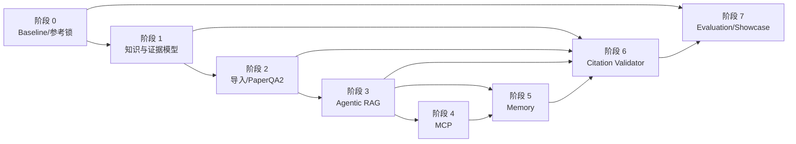

# Evidence-Governed Agentic RAG 开发计划

## 1. 文档定位

本目录是当前仓库向 **Evidence-Governed Agentic RAG Deep Research System** 演进的执行入口。原规划基于提交 `8c2b26ea1e582590d9653188a286c4fc14f6480d`；阶段 0 的实际执行起点为 `a86b588dcd011493651c24208b446872cb4d1228`，以 `tests/baseline/baseline_manifest.json` 为机器可读证据。五个参考仓库由 `doc/reference/refs.lock.json` 固定。

本目录最初由规划轮次创建；实际实施状态以本页阶段表、`feature_list.json` 和 `progress.md` 为准。`doc/overview.md` 是用户提供的总体研究计划；实际文件与需求文字中的 `docs/development_plan/overview.md` 路径不一致，本套文档不移动或改写该文件，并以 `doc/development_plan/` 作为执行目录。

## 2. 改造目标

保留现有 Supervisor—Researcher 双层 LangGraph 主架构和旧运行路径，通过默认关闭的配置开关逐步加入：

- 可版本化、可追溯的本地知识与证据模型；
- 由本项目接口隔离的 PaperQA2 文档检索内核；
- 本地优先、证据充分性驱动的 Agentic RAG；
- 受限 Filesystem MCP 与 proposal-only Knowledge MCP；
- Working、Episodic、Semantic、Procedural、User Preference 五层记忆；
- Claim—Evidence 绑定、引用验证、局部修复和程序化来源表；
- DeepEval smoke/full 评测、成本遥测与分阶段消融对比。

第一版坚持 Python 3.11+、Windows 原生与 conda 优先、SQLite/本地文件/PaperQA2 索引优先。所有持久化访问均经 Repository 或 Protocol 隔离，不引入 Neo4j、Graphiti、完整 GraphRAG、RAGFlow、R2R、Kafka、微服务或复杂前端。

## 3. 当前实现基线

当前代码的事实基线如下，详细证据见 [architecture_target.md](architecture_target.md)：

- 主图为 `clarify_with_user → write_research_brief → research_supervisor → final_report_generation`；Supervisor 和 Researcher 均为循环子图。
- Researcher 将 Web/MCP 工具结果压缩成自由文本 `compressed_research`；Supervisor 再把这些文本聚合为 `notes`。Writer 还接收 brief/messages，但 `notes` 是唯一研究 findings 通道，`raw_notes` 不进入 Writer。
- 阶段 2 已在阶段 1 的结构化身份与本地 Repository 上提供四类 candidate 导入、结构化 locator、内部 inspection 检索和受控 PaperQA raw-retrieval Adapter；这些能力仍未接入主图，`Claim` 与程序化来源编号仍待阶段 6。
- 当前主实现只接入 Tavily、OpenAI/Anthropic 原生搜索和单个 HTTP MCP 配置；尚无本地知识库、Filesystem MCP、Knowledge MCP 或长期记忆。
- 低成本自动测试现包括阶段 0 的 baseline/evaluation smoke、阶段 1 的 knowledge/evidence/storage contract suite、阶段 2 的 ingestion/retrieval/PaperQA 离线 suite，以及 `tests/test_research_limits.py`；LangSmith Deep Research Bench 仍会调用外部服务，不属于日常 smoke。
- 现有 `feature_list.json` 条目均为 `completed`，但代码仍存在配置文档漂移和恢复边界等已知风险，必须先在阶段 0 固定而不能在规划阶段静默修复。

## 4. 阶段导航与状态

状态含义沿用仓库规范：`not-started`、`in-progress`、`blocked`、`completed`。下表表示功能实施状态，不是文档编写状态。

| 阶段 | 文档 | 核心交付 | 当前状态 |
|---|---|---|---|
| 0 | [Baseline 与参考仓库](phase_0_baseline_and_references.md) | 固定行为、数据集、遥测、最小 DeepEval 骨架、参考版本锁 | `completed` |
| 1 | [知识与证据模型](phase_1_knowledge_evidence_models.md) | 领域模型、InMemory/SQLite Repository、版本/去重/Reducer | `completed` |
| 2 | [文档导入与 PaperQA2](phase_2_document_ingestion_and_paperqa.md) | 四类导入、PaperQA2 Adapter、可定位检索工具 | `completed` |
| 3 | [Agentic RAG 生命周期](phase_3_agentic_rag_lifecycle.md) | 本地优先、覆盖判断、候选验证、状态转换和审计 | `completed` |
| 4 | [MCP 集成](phase_4_mcp_integration.md) | 受限 Filesystem MCP、proposal-only Knowledge MCP、Windows 安全 | `not-started` |
| 5 | [分层记忆](phase_5_memory_system.md) | Checkpoint、Namespace、五类记忆和 Memory Write Gate | `not-started` |
| 6 | [引用验证与修复](phase_6_citation_validation.md) | 原子 Claim、蕴含/时效/权威验证、局部修复、来源注册表 | `not-started` |
| 7 | [完整评测与展示](phase_7_evaluation_and_showcase.md) | DeepEval 回归、消融实验、机器报告和 README 展示 | `not-started` |

## 5. 阶段依赖图

实施顺序必须严格为 0 到 7；下图同时标出能力依赖。即使某项技术依赖已具备，也不得跳过前一阶段验收。

阶段 4 在逻辑上可与部分记忆工作解耦，但为保证工具权限和 Namespace 的统一审计，本计划仍要求阶段 4 验收后才进入阶段 5。

## 6. 全局兼容与开关原则

以下名称是各阶段目标配置；阶段 1 的 `enable_structured_evidence` 已实现但仍默认关闭，其余按对应阶段状态为准：

| 阶段 | 默认关闭的目标开关 | 关闭时行为 |
|---|---|---|
| 0 | `enable_evaluation_telemetry` | 不附加评测 callback，不改变原图输入输出 |
| 1 | `enable_structured_evidence` | 继续只传递 `notes/raw_notes/compressed_research` |
| 2 | `enable_knowledge_base`、`enable_paperqa_retrieval` | 不导入或检索本地知识，沿用当前搜索工具 |
| 3 | `enable_knowledge_tools`、`enable_agentic_rag`、`enable_knowledge_writeback` | 三者均关时Researcher继续使用当前Web/MCP；仅knowledge tools开时是active-only legacy augmentation；Agentic开时切换唯一governed retrieval |
| 4 | `enable_filesystem_mcp`、`enable_knowledge_mcp` | 保留现有单 HTTP MCP 配置兼容路径 |
| 5 | `enable_memory`、`enable_memory_writes` | 不召回或写入长期记忆；无持久 Checkpoint 时沿用旧编译方式 |
| 6 | `citation_validation_mode=off` | 继续使用现有单步 `final_report_generation` |
| 7 | 仅评测 CLI/marker | 生产运行不自动启动评测或上传结果 |

任何开关开启失败，都应能在不破坏已有数据的情况下关闭并回到旧流程。数据库迁移不得作为关闭开关的前提，也不得自动删除旧数据。

## 7. 如何要求 Codex 执行一个阶段

1. 先确认上一个阶段的所有 `Tn-*` 验收项已通过，并在 `feature_list.json`、`progress.md`、`session-handoff.md` 留有 evidence。
2. 打开目标 `phase_*.md`，复制末尾“本阶段 Codex 执行指令”的完整代码块。
3. 将该代码块原样发送给 Codex；如需改变范围，明确写在同一条消息中。
4. Codex 只能执行该阶段，必须完成测试、状态更新和工作树复核后停止。

阶段 3 已完成；只有在用户明确下达下一阶段指令后，才可复制 [phase_4_mcp_integration.md](phase_4_mcp_integration.md#16-本阶段-codex-执行指令) 第 16 节，不得自动进入阶段 4。

## 8. 如何验收一个阶段

- 逐项核对阶段文档第 12 节的稳定编号，任何一项失败即不能将阶段标为 `completed`。
- 执行第 13 节命令；外部模型、搜索、LangSmith 或 LLM Judge 命令必须有明确费用授权。
- 将命令、退出码、测试数量、结果文件路径和未执行原因记录到 `progress.md`，并把功能 evidence 写入 `feature_list.json`。
- 验证所有新增功能关闭时，旧流程的输入输出协议和已有低成本测试仍通过。
- 按 [execution_protocol.md](execution_protocol.md) 完成独立提交或保留可审核变更，然后停止，不得自动进入下一阶段。

## 9. 规划证据与未决决策

本计划的当前项目证据来自 `AGENTS.md`、`README.md`、`pyproject.toml`、`langgraph.json`、`src/open_deep_research/*.py`、`tests/`、`feature_list.json`、`progress.md`、`session-handoff.md` 和 `docs/codebase/`。参考仓库证据和许可证见 [reference_repositories.md](reference_repositories.md)。

以下问题不在规划阶段擅自决定，进入相应阶段时必须显式确认或用可替换配置隔离：

- `allow_clarification`、`print_process_info` 及模型字段的运行默认值与 UI/状态文档存在漂移；
- PaperQA2 发布版本已固定；生产 embedding/provider、索引代际和 contextual 模型仍待后续阶段按配置隔离；
- 来源权威等级、时间有效期和置信度阈值的领域规则；
- 本地运行时的可信 `tenant_id/user_id/project_id` 来源；
- 可选live baseline以及阶段7必需的full eval/LLM Judge费用预算；
- Windows 上 Node/npm、Filesystem MCP 进程隔离与目录 ACL 的可用条件；
- 敏感资料保留期限和导入/记忆数据清理政策。
