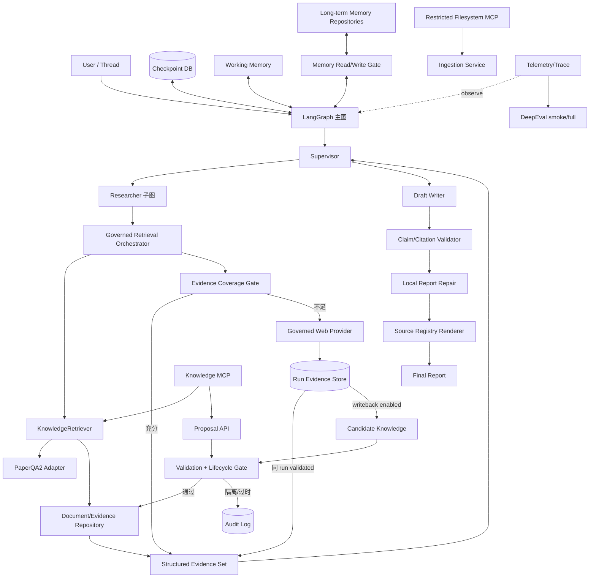

# 当前架构与目标架构

## 1. 设计结论

目标不是重写现有 Deep Research Agent，而是在 Supervisor—Researcher 外围和关键边界增加结构化证据、受治理检索、记忆与验证能力。LangGraph 负责运行编排；本项目的领域模型和 Repository 负责事实身份、生命周期与审计；PaperQA2 只负责科学文档索引和证据召回；任何第三方 Agent loop 都不得嵌入 Researcher。

## 2. 当前架构（代码事实）

### 2.1 主图

`src/open_deep_research/deep_researcher.py` 当前构建如下状态图：

```text
START
  → clarify_with_user
      ├─ 需要澄清 → END
      └─ 继续 → write_research_brief
                 → research_supervisor（子图）
                 → final_report_generation
                 → END
```

- `clarify_with_user` 可由 `Configuration.allow_clarification` 跳过。
- `write_research_brief` 把消息整理为一个 `research_brief`，并初始化 `supervisor_messages`。
- `research_supervisor` 是编译后的子图节点。
- `final_report_generation` 将 `research_brief`、会话 `messages` 和 `notes` 放入 final prompt；其中 `notes` 是唯一研究 findings 通道，函数不直接消费 `raw_notes`。

### 2.2 Supervisor 子图

```text
START → supervisor → supervisor_tools
                    ├─ 继续研究 → supervisor
                    └─ ResearchComplete/无调用/超限 → END
```

Supervisor 模型绑定 `ConductResearch`、`ResearchComplete` 和 `think_tool`。`supervisor_tools` 将最多 `max_concurrent_research_units` 个 `ConductResearch` 用 `asyncio.gather` 并行下发给 Researcher；每个 Researcher 返回的 `compressed_research` 被包装为与原 tool call 对应的 `ToolMessage`。结束时，`get_notes_from_tool_calls` 收集 Supervisor 历史中的所有 `ToolMessage` 内容作为 `notes`。

当前完成判断由模型调用`ResearchComplete`、无tool call或迭代上限共同决定。它不是Requirement覆盖率或证据充分性的程序化判断；且`supervisor_tools`会在执行任何工具前检测`ResearchComplete`，所以它若与`ConductResearch`同轮出现会直接结束并丢弃待执行研究。Researcher也存在completion与普通工具同轮时的提前结束风险。

### 2.3 Researcher 子图

```text
START → researcher → researcher_tools
                       ├─ 继续 → researcher
                       └─ ResearchComplete/无调用/超限 → compress_research → END
```

Researcher 每轮通过 `get_all_tools` 获得搜索、MCP、`think_tool`、`ResearchComplete`。普通工具调用按 `max_concurrent_researcher_tool_calls` 并行执行；结果作为 `ToolMessage` 追加到 `researcher_messages`。`compress_research` 再把完整消息轨迹压缩为自由文本 `compressed_research`，并把 AI/Tool 内容拼成 `raw_notes`。

### 2.4 当前状态与信息流

状态定义在 `src/open_deep_research/state.py`：

- `AgentState`：`messages`、`supervisor_messages`、`research_brief`、`raw_notes`、`notes`、`final_report`；
- `SupervisorState`：Supervisor 消息、brief、notes/raw_notes、研究轮次；
- `ResearcherState`：Researcher 消息、工具轮次、topic、压缩研究和原始笔记；
- `ResearcherOutputState`：只输出 `compressed_research`、`raw_notes`；
- `override_reducer`：识别 override sentinel，否则执行列表/字符串加法。

实际数据流为：

```text
Web/MCP 结果
  → Researcher ToolMessage
  → researcher_messages
  → 自由文本 compressed_research
  → Supervisor ConductResearch ToolMessage
  → notes
  → Writer

Researcher AI/Tool 轨迹
  → raw_notes
  → 当前主要供评测/诊断，不直接供 Writer
```

因此当前 `notes`、`raw_notes`、`ToolMessage` 是运行消息，不是稳定证据记录。一个 ToolMessage 可能同时包含来源、总结、思考或错误文本，不能被当作可引用 Evidence。

### 2.5 当前工具、限制与恢复

- 当前主实现支持 Tavily、OpenAI 原生 Web Search、Anthropic 原生 Web Search和 `None`；`pyproject.toml` 中其他搜索依赖不代表主图已接入。
- Tavily 在单次工具调用内按 URL 去重，输出带局部 `SOURCE n` 的文本；没有跨 Researcher 或跨运行的 Source 身份。
- MCP 只配置单个 HTTP URL/白名单/auth，虽使用 `MultiServerMCPClient`，实际硬编码一个 `streamable_http` server；失败时返回空工具列表。
- 默认并发限制为 3 个 Researcher、3 个 Researcher tool call、3 个 Tavily query，每 query 3 个结果；Supervisor 和 Researcher 默认最大迭代均为 5。
- 模型配置字段为`summarization_model`、`research_model`、`compression_model`、`final_report_model`；`research_model`同时用于澄清、brief、Supervisor和Researcher，不只是Researcher。Python runtime default来自对应环境变量，未设置时可能为`None`，UI metadata中的模型名只是提示而非可靠fallback。
- 对应最大输出 token 默认分别为 4,096、10,000、8,192、10,000；`max_content_length` 默认 20,000 字符。当前没有跨步骤总 token/cost budget。
- structured/model retry配置默认 `max_structured_output_retries=1`；网页摘要 timeout为180秒，失败回退原文。final report token超限最多4次总尝试（初次加3次 findings截断重试）。
- 当前无持久Checkpoint、跨Researcher semaphore或结构化部分结果恢复。
- 单普通工具异常会转成错误文本，MCP连接失败会返回空工具，网页摘要失败会回退原文；但Supervisor异常分支中的`or True`会吞掉任意Researcher batch异常，compression token裁剪后无真实重试，未知工具名可能在安全包装外抛错。这些先由阶段0固定：前两项及completion丢任务在阶段3修复，未知工具安全错误在阶段4修复，并各有回归验收。

## 3. 目标架构



## 4. 核心数据链与身份

目标引用链固定为：

```text
Requirement
  → Claim
  → Evidence
  → Chunk
  → DocumentVersion
  → Source
```

- `Requirement` 是brief经阶段3 RequirementExtractor/Normalizer固化的可验收研究要求；同一Requirement可对应多个Claim，Supervisor completion受其覆盖门禁。
- `Claim` 是报告中的原子、可检查陈述；最终正文引用绑定 Claim，而不是整段主题。
- `Evidence` 是对某 Claim/Requirement 有直接支持或反驳作用的证据上下文，保存定位、有效时间、置信度、检索/验证信息。
- `Chunk` 是不可变文档版本内的定位单元；PDF 保存页码范围，Markdown 保存标题路径，HTML 保存 DOM/标题路径或快照定位。
- `DocumentVersion` 是一次内容快照，内容Hash变化即新增版本，不覆盖旧版本；六态lifecycle只属于Version。
- `Evidence`另有`pending/validated/rejected` validation status；可引用资格由active Version + validated Evidence + Source/时间/soft-delete规则派生。
- `Source` 是来源身份，如canonical URL、本地受控文件或历史查询记录；与具体内容版本分离。内部文件路径/storage ref与公开display URI分离。
- `ContentBlob`按KnowledgeScope和SHA-256保存不可变原始bytes；不同Source可共享同scope Blob但保持独立来源链，跨scope不泄漏dedupe。
- `KnowledgeScope`定义tenant/project/可选owner/visibility，知识Repository和MCP读写必须显式带可信access context。

所有ID都由程序生成并保持跨并行Researcher唯一；显示用来源编号仅在最终渲染时根据稳定`(source_id, version_id)` citation key生成，同Version多locator可合并，不同Version不可混号。

## 5. 四类状态的边界

| 状态类别 | 所有者 | 生命周期 | 不得承担的职责 |
|---|---|---|---|
| LangGraph 运行状态 | `state.py` + Checkpointer | 单次 Thread/运行，可恢复 | 不作为长期事实库或来源注册表 |
| 运行期证据 | `RunEvidenceStore` + `EvidenceResolver` | 按run隔离，至少存活到报告结束；Checkpoint只保存引用 | 不进入跨run知识搜索，不称为active，不替代canonical Repository |
| 知识与证据 | Repository + SQLite/PaperQA 索引 | 跨运行、版本化、软失效 | 不保存完整对话或模型内部思考 |
| 长期记忆 | Memory Repository/Store | 按 tenant/user/project/type 隔离 | 无 Evidence 的研究事实不得成为 Semantic Memory |
| 审计与提议 | Audit/Proposal Repository | 追加式、可追踪 | Agent/MCP 不得绕过 Gate 直接硬删除或强制激活 |

PaperQA2索引是从ContentBlob/Chunk重建的派生数据，不是Source/Version/Evidence的唯一事实源；SQLite Repository中的领域记录才是第一版权威元数据。Checkpoint DB、知识DB、记忆DB应使用独立文件，避免锁竞争并便于回退。Checkpointer/Store连接通过managed async lifespan setup并关闭，不向图返回生命周期失效的裸连接。

## 6. 组件职责

### LangGraph

- 保留主图、Supervisor 和 Researcher 编排；
- 管理 reducer、子图、interrupt/checkpoint/thread 恢复；
- 通过少量节点或工具挂接新服务；
- 不拥有知识生命周期和证据业务规则。

### PaperQA2

- 负责 PDF/文本索引、检索候选、Evidence Context 和 contextual summarization；
- Adapter 仅调用文档加入、索引和 evidence retrieval 公共能力；
- 不调用 PaperQA2 完整 `aquery`/Agent loop，不负责 Supervisor 规划、Web 搜索或最终回答。

### LangMem

- 参考 typed memory、namespace、search 和 functional extraction；
- 可作为 Memory proposal generator 或 Store adapter；
- 不允许其直接 `put/delete` 绕过 Memory Write Gate，也不负责 Working Memory checkpoint。

### MCP

- Filesystem MCP 只在 Allowed Roots 内暴露经过裁剪的工具；读源目录与可写 staging 必须隔离；
- Knowledge MCP 只调用项目 Repository/Service；写操作仅创建 proposal；
- tool annotations 是提示，不是授权，实际权限由 server 白名单、路径 realpath 校验和 OS ACL 共同保证。

### DeepEval

- 阶段 0 提供可选 trace/baseline 容器和确定性 smoke；
- 阶段 7 运行 Agent/RAG/自定义 Citation/Memory/Cost 指标；
- 不作为生产审计存储，不让外部上传成为本地运行前提。

### 检索开关与工具绑定

- `enable_knowledge_base/enable_paperqa_retrieval`只控制Repository/Adapter是否可用，本身不把candidate或工具暴露给Researcher。
- `enable_knowledge_tools=True, enable_agentic_rag=False`是active+validated-only `knowledge_augmented_legacy`：知识工具与legacy Web并存，不承诺local-first或writeback。
- `enable_agentic_rag=True`切换为单一governed retrieval入口，内部执行active→local candidate Gate→Web缺口；不再暴露legacy/native搜索旁路。
- 三者均关闭时精确保持当前工具集合。这三个模式也是阶段7 Baseline/PaperQA/Agentic消融的可机械配置边界。

## 7. 目标模块边界

以下是预计演进方向，不要求一次创建；每个阶段只创建该阶段需要的最小模块：

```text
src/open_deep_research/
├── deep_researcher.py          # 仅保留图节点与最小路由
├── configuration.py            # 向后兼容的配置开关
├── state.py                    # 运行状态与 reducer
├── storage/
│   ├── sqlite.py
│   ├── blob_repository.py
│   └── migrations/
├── knowledge/
│   ├── models.py
│   ├── repositories.py
│   ├── sqlite_repository.py
│   ├── ingestion/
│   ├── retrieval/
│   ├── lifecycle/
│   ├── validation/
│   └── paperqa_adapter.py
├── evidence/
│   ├── models.py
│   ├── repositories.py
│   ├── run_store.py
│   ├── reducers.py
│   ├── claims.py
│   └── citation_validator.py
├── research/
│   ├── requirements.py
│   └── completion_gate.py
├── runtime/
│   ├── context.py
│   ├── checkpointer.py
│   └── graph_factory.py
├── memory/
│   ├── models.py
│   ├── repositories.py
│   ├── recall.py
│   └── write_gate.py
├── mcp/
│   ├── config.py
│   ├── client.py
│   ├── filesystem_policy.py
│   └── staging.py
├── mcp_servers/
│   └── knowledge_server.py
├── reporting/
│   ├── models.py
│   ├── pipeline.py
│   └── rendering.py
├── tools/
│   ├── knowledge.py
│   ├── governed_retrieval.py
│   └── memory.py
└── evaluation/
    ├── models.py
    ├── telemetry.py
    └── adapters.py
```

`pyproject.toml` 继续使用显式 package 列表；阶段 1 已登记 `knowledge`、`evidence`、`storage` 及 migrations 子包，并由 editable-install/out-of-tree import smoke 验证。后续阶段新增子包时仍须同步登记和验收。

## 8. 关键运行数据流

### 8.1 本地优先检索

1. brief后先生成稳定RequirementSet/ResearchPlan；Supervisor仍下发明确的`ConductResearch` topic，结束前由Requirement coverage gate检查。
2. Researcher的governed retrieval使用相关Requirement/查询上下文调用`KnowledgeRetriever`。
3. Coverage Gate 使用直接性、来源权威、时间有效性、冲突和覆盖率作程序化判断。
4. 证据充分则不向Web工具发起调用；不足时只生成缺口查询。Agentic RAG仅允许orchestrator-capable WebSearchProvider；当前provider-native server-side search配置fail closed。
5. Web结果先写按run隔离的RunEvidenceStore并验证；writeback开启才复制为canonical candidate，经过Gate后可active；失败则quarantined，旧版本则stale/superseded/archived。
6. writeback关闭时当前报告仍可通过EvidenceResolver使用同run `validated_for_run`证据，但新run不可搜索；Checkpoint只保存store引用，TTL/清理由维护策略审计。写回失败不应伪装成active或已缓存。

### 8.2 报告与引用

1. Writer 使用结构化 Evidence Set 生成 draft，并可保留旧 `notes` 兼容输入。
2. Claim Extractor 拆分原子陈述。
3. Validator 检索每个 Claim 的直接 Evidence，给出 `fully_supported`、`partially_supported`、`unsupported`、`contradicted`、`not_checkable`。
4. Temporal/Authority 规则对旧版本、企业自述和无依据数字降级。
5. Repair 只修改失败 Claim 所在局部，不重写已通过段落。
6. Source Registry从稳定`(source_id, version_id)`程序化生成编号、正文引用和来源表，并只渲染公开URI/locator。

### 8.3 记忆

1. Working Memory 由 Checkpointer 保存 Thread 状态、brief、计划、Requirement 覆盖、工具结果和 Agent 状态。
2. 长期记忆只通过 proposal → Memory Write Gate → promote/reject 流程写入。
3. Semantic Memory 必须绑定 Source/Evidence/valid time/confidence；Preference 必须来源于用户明确表达。
4. Episodic Memory 需任务质量门槛；Procedural Memory 需多次成功、回归验证或人工批准，单次成功只能形成候选。
5. 召回时默认过滤 stale/quarantined/soft-deleted，并强制 Namespace 隔离。

## 9. 并发、事务与失败语义

- 并行 Researcher 返回结构化引用时使用稳定 ID 和去重 reducer，禁止按到达顺序分配来源编号。
- Repository 操作应具备幂等 key、显式事务、短事务和可重试的 SQLite busy 策略；不在持有 DB 事务时调用外部模型或网络。
- PaperQA索引写入和领域Repository写入采用可恢复的应用级流程：先原子保存ContentBlob并记录pending/import job与candidate Version，再生成索引；索引成功只标ready，阶段3验证后才可active。失败可重建而不丢原始版本。
- 网络、模型或写回失败必须区分：检索失败、无结果、验证失败和持久化失败，禁止用生成文本伪装搜索结果。
- 全局并发和 token/cost 预算应在运行上下文统一统计；第三方 callback 只作观测，不应改变业务结果。

## 10. 安全与隐私边界

- Filesystem Allowed Roots 使用 canonical path/realpath、边界分隔符、null-byte、symlink/parent 检查；Roots 为空或全无效时 fail closed。
- 本地只读源和可写import staging分进程，Windows ACL作为第二层防线；staging只暴露exclusive create wrapper，不绑定可覆盖文件的原始write/edit/move工具。
- MCP 和 Agent 不暴露 `hard_delete`、`force_promote`、`force_memory_write`；删除只有 soft-delete/失效提议。
- Namespace ID 来自可信运行身份而非模型参数；所有跨 namespace 查询默认拒绝。
- secret、真实 token、私有路径内容、敏感报告不得写入日志、fixture、知识库或规划 evidence。

## 11. 兼容与迁移原则

- 所有新增功能默认关闭；关闭时仍使用现有 `notes/raw_notes/compressed_research` 和单步 Writer。
- 结构化字段只做 additive 扩展，不在过渡期删除旧字段。
- Schema 版本和迁移记录必须存在；升级前备份，失败时可用旧代码读取旧 schema 或回到旧 DB 文件。
- 第一版仅 SQLite/本地文件；Repository Protocol 必须让未来 PostgreSQL 实现不改变图节点接口。
- 每个阶段只有通过独立验收后才可成为下一阶段前提。
